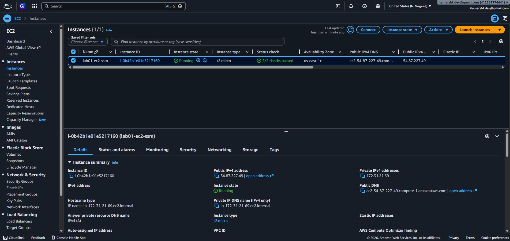
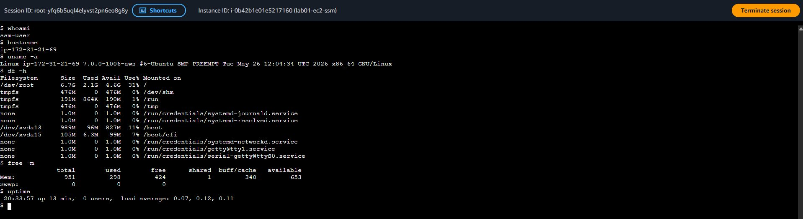

# AWS Cloud Engineering Lab

Practical project developed for the study, evolution, and demonstration of knowledge in:


- AWS EC2
- AWS SSM
- AWS IAM
- AWS VPC
- AWS Security Groups
- AWS Systems Manager
- AWS RDS
- AWS ECR
- AWS ECS
- AWS CloudWatch
- Containers
- Docker
- Docker Compose
- Terraform

Objective: To progressively build a cloud architecture similar to production environments focused on high performance.

## Structure designed for initial evolution:

```test

aws-cloud-engineering-lab/
│
├── README.md
│
├── docs/
│ ├── architecture/
│ ├── diagrams/
│ ├── screenshots/
│ ├── lessons-learned/
│ └── lab-notes/
│
├── labs/
│ ├── 01-ec2-and-ssm/
│ ├── 02-ec2-monitoring-with-cloudwatch-agent/
│ ├── 03-iam-roles-and-policies/
│ ├── 04-ebs-volumes-and-snapshots/
│ ├── 05-vpc-with-public-subnet/
│ ├── 06-vpc-with-private-subnet-and-nat-gateway/
│ ├── 07-docker-installation-on-ec2/
│ ├── 08-docker-compose-application/
│ ├── 09-nginx-reverse-proxy/
│ ├── 10-amazon-rds-postgresql/
│ ├── 11-amazon-s3-static-website-hosting/
│ ├── 12-aws-backup-strategy/
│ ├── 13-cloudwatch-logs/
│ ├── 14-cloudwatch-metrics/
│ ├── 15-cloudwatch-alarms/
│ ├── 16-sns-notifications/
│ ├── 17-amazon-ecr/
│ ├── 18-amazon-ecs-fargate/
│ ├── 19-ecs-service-management/
│ ├── 20-application-load-balancer/
│ ├── 21-terraform-ec2-deployment/
│ ├── 22-terraform-vpc-deployment/
│ ├── 23-terraform-ecs-deployment/
│ ├── 24-github-actions-build-pipeline/
│ ├── 25-gitHub-actions-deployment-pipeline/
│ └── 26-end-to-end-ci/cd-pipeline/
│
├── terraform/
│
└── scripts/

```

## Roadmap

# AWS Cloud Engineering Lab - Roadmap

## 🎯 Objective

This repository documents my hands-on journey through AWS Cloud Engineering, Infrastructure, Observability, Automation, Containers, and DevOps practices.

The goal is to build practical experience with real-world cloud environments while developing skills applicable to Cloud Engineering, DevOps, Platform Engineering, Site Reliability Engineering (SRE), and Infrastructure Operations roles.

---

# Phase 1 - AWS Foundations

## Lab 01 - EC2 Instance with SSM Access

* [X] Configure IAM Role


* [X] Create an EC2 instance



* [X] Configure AWS Systems Manager


* [X] Connect using Session Manager



* [ ] Document lessons learned

🚧 Documentation in Progress

The technical implementation of this lab has been successfully completed and validated.

A detailed step-by-step guide, architecture diagrams, command explanations, screenshots, validation evidence, lessons learned, and best practices will be added in the next update.

Stay tuned for the full walkthrough.

🚧 Documentação em Construção

A implementação técnica deste laboratório foi concluída e validada com sucesso.

O guia completo passo a passo, diagramas de arquitetura, explicações dos comandos, capturas de tela, evidências de validação e lições aprendidas serão adicionados na próxima atualização.


## Lab 02 - EC2 Monitoring with CloudWatch Agent

* [ ] Install CloudWatch Agent
* [ ] Collect CPU metrics
* [ ] Collect Memory metrics
* [ ] Collect Disk metrics
* [ ] Create CloudWatch Dashboard

## Lab 03 - IAM Roles and Policies

* [ ] Create IAM Users
* [ ] Create IAM Groups
* [ ] Create Custom Policies
* [ ] Apply Least Privilege Principle

## Lab 04 - EBS Volumes and Snapshots

* [ ] Create EBS Volume
* [ ] Attach Volume
* [ ] Create Snapshot
* [ ] Restore Snapshot

## Lab 05 - VPC with Public Subnet

* [ ] Create VPC
* [ ] Create Public Subnet
* [ ] Configure Internet Gateway
* [ ] Configure Route Tables

## Lab 06 - VPC with Private Subnet and NAT Gateway

* [ ] Create Private Subnet
* [ ] Configure NAT Gateway
* [ ] Validate Internet Access
* [ ] Test Secure Architecture

---

# Phase 2 - Containers

## Lab 07 - Docker Installation on EC2

* [ ] Install Docker
* [ ] Run First Container
* [ ] Container Lifecycle Management
* [ ] Security Best Practices

## Lab 08 - Docker Compose Application

* [ ] Deploy Multi-Container Application
* [ ] Configure Networks
* [ ] Configure Volumes
* [ ] Persist Data

## Lab 09 - NGINX Reverse Proxy

* [ ] Install NGINX
* [ ] Configure Reverse Proxy
* [ ] Test HTTP Routing
* [ ] Validate Application Access

---

# Phase 3 - Databases and Storage

## Lab 10 - Amazon RDS PostgreSQL

* [ ] Deploy PostgreSQL
* [ ] Configure Security Groups
* [ ] Connect from EC2
* [ ] Execute SQL Queries

## Lab 11 - Amazon S3 Static Website Hosting

* [ ] Create Bucket
* [ ] Enable Static Hosting
* [ ] Upload Website Files
* [ ] Configure Public Access

## Lab 12 - AWS Backup Strategy

* [ ] Define Backup Policy
* [ ] Backup EBS
* [ ] Backup RDS
* [ ] Test Recovery

---

# Phase 4 - Observability

## Lab 13 - CloudWatch Logs

* [ ] Create Log Groups
* [ ] Collect Application Logs
* [ ] Query Logs
* [ ] Analyze Events

## Lab 14 - CloudWatch Metrics

* [ ] Analyze Metrics
* [ ] Create Dashboards
* [ ] Monitor Resources
* [ ] Configure Custom Metrics

## Lab 15 - CloudWatch Alarms

* [ ] Create CPU Alarm
* [ ] Create Memory Alarm
* [ ] Configure Notifications
* [ ] Test Alerts

## Lab 16 - SNS Notifications

* [ ] Create SNS Topic
* [ ] Configure Email Notifications
* [ ] Integrate with CloudWatch
* [ ] Validate Alert Delivery

---

# Phase 5 - Container Services

## Lab 17 - Amazon ECR

* [ ] Create Repository
* [ ] Build Docker Image
* [ ] Push Image
* [ ] Pull Image

## Lab 18 - Amazon ECS Fargate

* [ ] Create ECS Cluster
* [ ] Configure Fargate
* [ ] Deploy Container
* [ ] Validate Service

## Lab 19 - ECS Service Management

* [ ] Create ECS Service
* [ ] Configure Desired Count
* [ ] Test Availability
* [ ] Review Logs

## Lab 20 - Application Load Balancer

* [ ] Create Load Balancer
* [ ] Configure Target Group
* [ ] Route Traffic
* [ ] Validate Health Checks

---

# Phase 6 - Infrastructure as Code

## Lab 21 - Terraform EC2 Deployment

* [ ] Install Terraform
* [ ] Create EC2 Infrastructure
* [ ] Apply Configuration
* [ ] Destroy Resources

## Lab 22 - Terraform VPC Deployment

* [ ] Create VPC Code
* [ ] Deploy Networking
* [ ] Validate Infrastructure
* [ ] Refactor Modules

## Lab 23 - Terraform ECS Deployment

* [ ] Create ECS Resources
* [ ] Deploy Containers
* [ ] Validate Automation
* [ ] Reuse Modules

---

# Phase 7 - DevOps and CI/CD

## Lab 24 - GitHub Actions Build Pipeline

* [ ] Create Workflow
* [ ] Build Application
* [ ] Validate Pipeline
* [ ] Review Logs

## Lab 25 - GitHub Actions Deployment Pipeline

* [ ] Configure AWS Credentials
* [ ] Deploy Infrastructure
* [ ] Validate Deployment
* [ ] Automate Releases

## Lab 26 - End-to-End CI/CD Pipeline

* [ ] Build Application
* [ ] Run Tests
* [ ] Publish Artifact
* [ ] Deploy Automatically
* [ ] Validate Production Workflow

---

# Future Labs

* [ ] AWS Lambda
* [ ] API Gateway
* [ ] EventBridge
* [ ] Step Functions
* [ ] AWS X-Ray
* [ ] OpenTelemetry on AWS
* [ ] Amazon EKS
* [ ] GitOps with ArgoCD
* [ ] Kubernetes on AWS
* [ ] Production-Grade Observability Stack

---

## Progress

Completed Labs: 0 / 26

Current Lab:

* 🚧 Lab 01 - EC2 Instance with SSM Access

