# Lab 01 - EC2 Instance with SSM Access

## Overview

This lab demonstrates how to deploy an Amazon EC2 instance and securely access it using AWS Systems Manager Session Manager without SSH keys or inbound SSH ports.

The objective is to follow modern AWS security best practices while gaining hands-on experience with EC2, IAM, and Systems Manager.

---

## Architecture


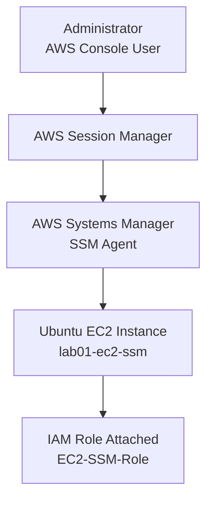
```mermaid
flowchart TD
    A[Administrator<br/>AWS Console User]
    B[AWS Session Manager]
    C[AWS Systems Manager<br/>SSM Agent]
    D[Ubuntu EC2 Instance<br/>lab01-ec2-ssm]
    E[IAM Role Attached<br/>EC2-SSM-Role]

    A --> B
    B --> C
    C --> D
    D --> E
```


---

## Learning Objectives

After completing this lab, you will be able to:

* Create an EC2 instance
* Configure IAM Roles
* Configure AWS Systems Manager
* Register a Managed Node
* Access Linux through Session Manager
* Validate system configuration
* Follow AWS security best practices

---

## Prerequisites

* AWS Account
* IAM User with AdministratorAccess
* AWS Region: us-east-1

---

## Step 1 - Create IAM Role

### Objective

Create an IAM Role that allows the EC2 instance to communicate securely with AWS Systems Manager (SSM).

This role will later be attached to the EC2 instance, enabling Session Manager access without using SSH keys or opening inbound ports.

---

### Why this step is necessary

AWS Systems Manager requires permissions to:

- Register the instance as a managed node
- Establish Session Manager connections
- Retrieve configuration data
- Communicate securely with AWS Systems Manager services

Without an IAM Role, the EC2 instance cannot authenticate to AWS APIs.

This approach follows AWS security best practices by using temporary credentials instead of static access keys.

---

### Step 1.1 – Open IAM Console

Navigate to:

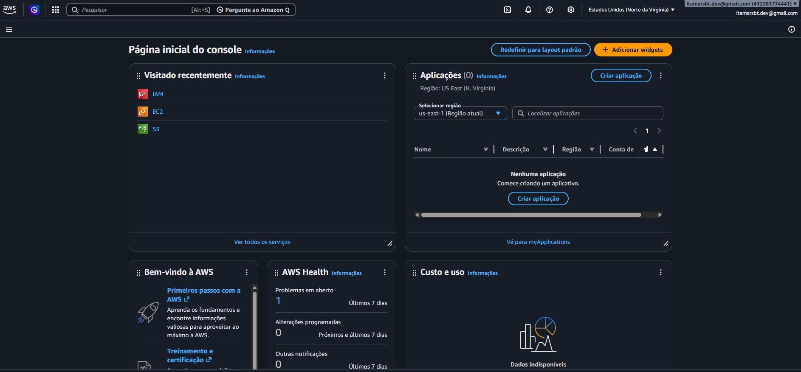

IAM → Roles

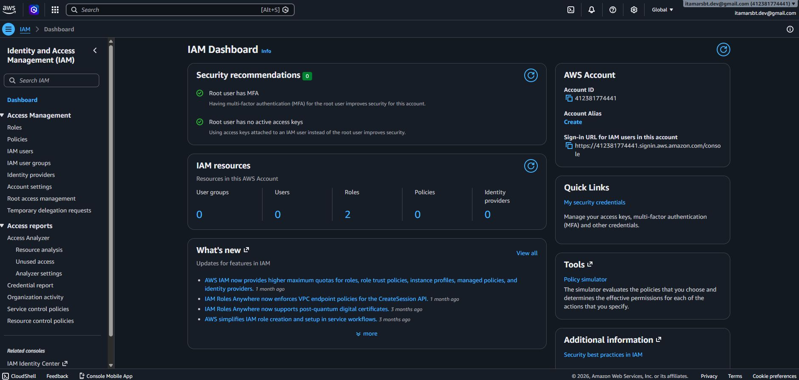

Click **Create role**.

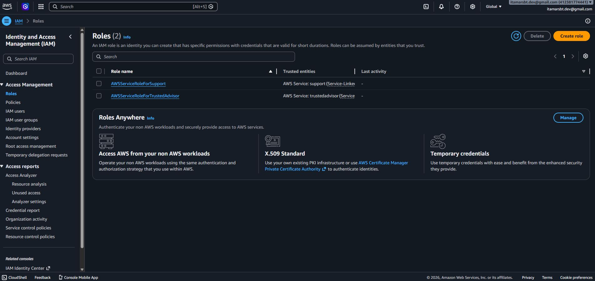

---

### Step 1.2 – Select Trusted Entity

Choose:

- Trusted entity type: AWS service

- Service: EC2

- Use case: EC2

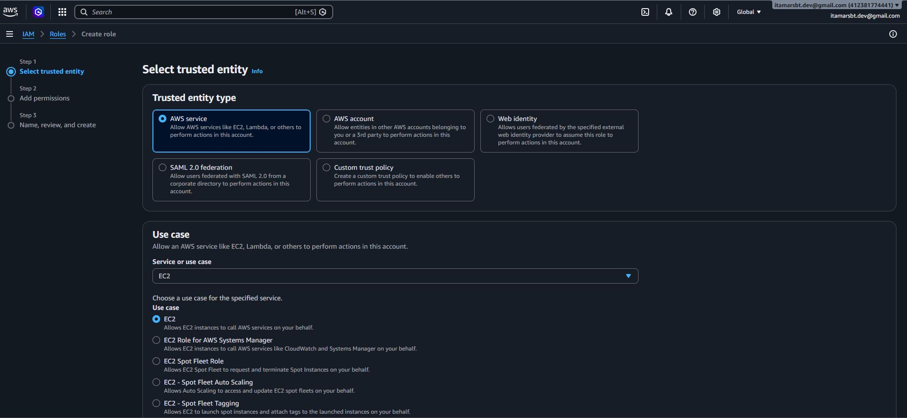


Click Next.

---

### Why EC2 Must Be Selected

This configuration establishes a trust relationship between AWS EC2 and IAM.

It allows EC2 instances to assume this role and receive temporary credentials automatically.

No usernames, passwords, or access keys are required.

---

Search for:

```bash
AmazonSSMManagedInstanceCore
```
Select the policy.

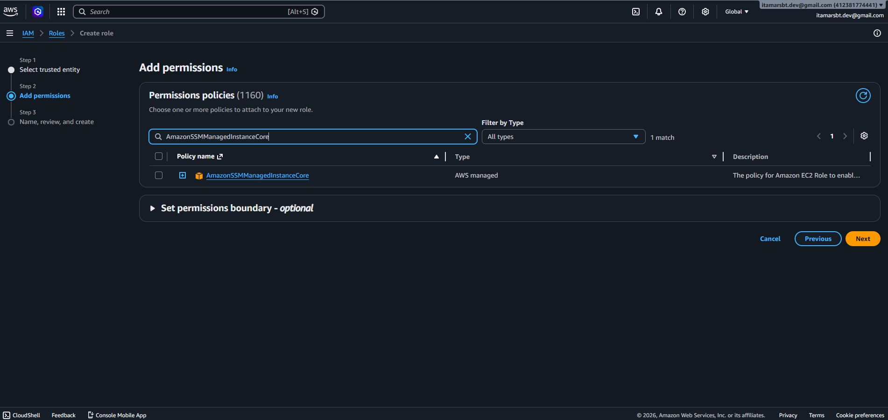


Click Next.

AmazonSSMManagedInstanceCore grants the minimum permissions required for:

- Session Manager
- Systems Manager Inventory
- Patch Manager
- Run Command
- Managed Instance registration

This follows the Principle of Least Privilege.

Role Name:

```bash
EC2-SSM-Role
```

Description:

```bash
Allows EC2 instances to communicate with AWS Systems Manager.
```

Review:

- Trusted entity: EC2
- Policy: AmazonSSMManagedInstanceCore
- Role name: EC2-SSM-Role

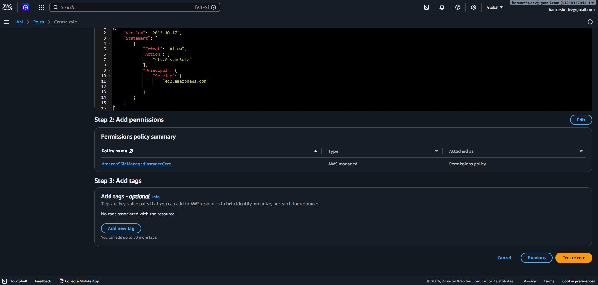

Click Create role.

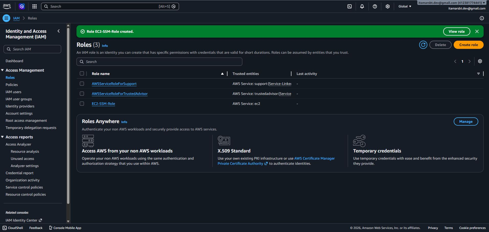


---

## Validation

Confirm that:

- Role name is visible in IAM.
- AmazonSSMManagedInstanceCore is attached.
- Trust relationship contains EC2 service.

Validation Result:

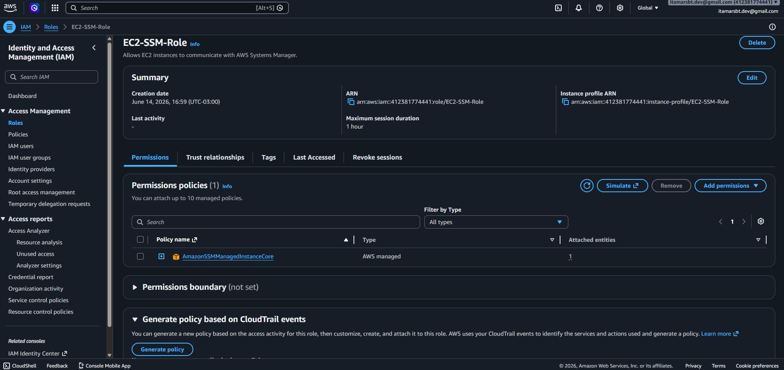


## AWS Best Practices Applied

✔ IAM Role instead of Access Keys

✔ Temporary AWS credentials

✔ Principle of Least Privilege

✔ Native AWS Systems Manager integration

✔ No hardcoded secrets

## Key Learnings

An IAM Role is the preferred mechanism for granting permissions to AWS resources.

Instead of embedding credentials inside servers, AWS automatically provides temporary credentials through the Instance Metadata Service (IMDS).

This significantly reduces operational complexity and security risks.

---

# Step 2 - Launch EC2 Instance

## Objective

In this step, we launch an Amazon EC2 instance running Ubuntu Server 26.04 LTS and associate it with the IAM Role created in Step 1.

This instance will later be managed through AWS Systems Manager Session Manager without requiring SSH access.

---

## Architecture

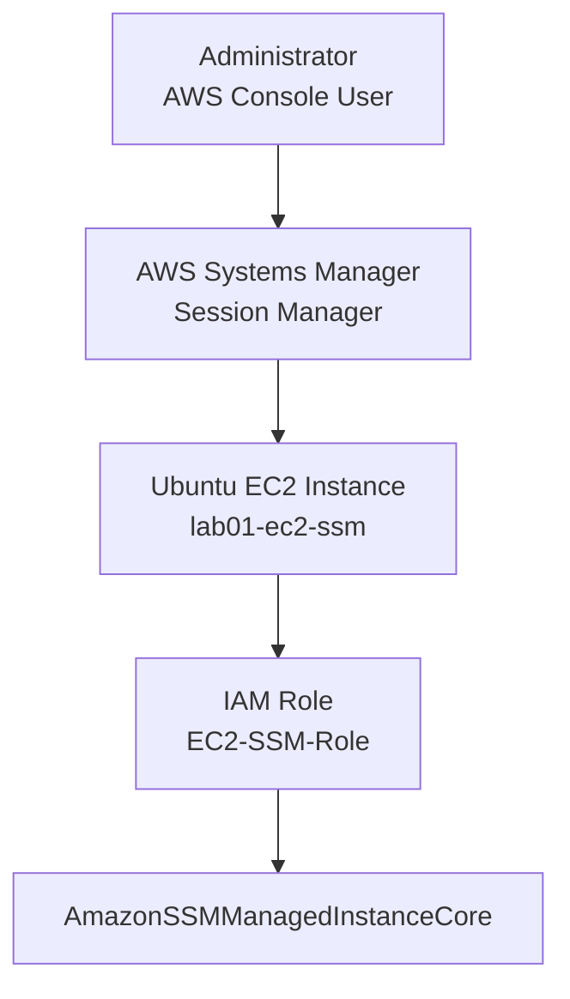
```mermaid
flowchart TD

    USER[Administrator<br/>AWS Console User]

    SSM[AWS Systems Manager<br/>Session Manager]

    EC2[Ubuntu EC2 Instance<br/>lab01-ec2-ssm]

    ROLE[IAM Role<br/>EC2-SSM-Role]

    POLICY[AmazonSSMManagedInstanceCore]

    USER --> SSM
    SSM --> EC2
    EC2 --> ROLE
    ROLE --> POLICY
```

---

## Step 2.1 – Open EC2 Console

Navigate to:
```Text
AWS Console
→ EC2
```

Click:
```Text
Launch Instance
```
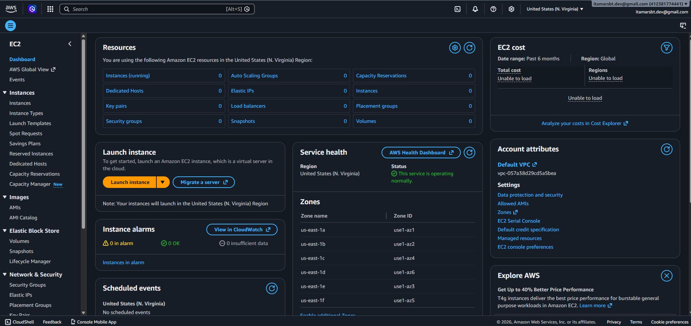

## Step 2.2 – Configure Instance Name

Under:
```Text
Name and tags
```

Enter:
```Text
lab01-ec2-ssm
```
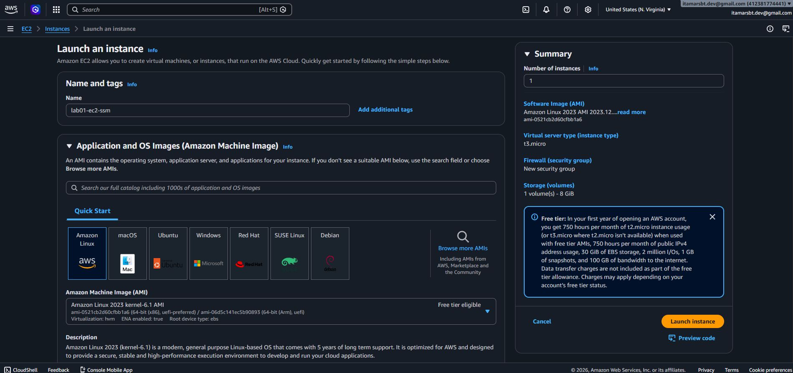

---
Why Naming Matters

Using descriptive names makes it easier to:

- Identify resources
- Track costs
- Troubleshoot environments
- Apply governance standards
---

## Step 2.3 – Select Ubuntu AMI

Choose:
```Text
Ubuntu Server 26.04 LTS
```
Architecture:
```Text
64-bit (x86)
```
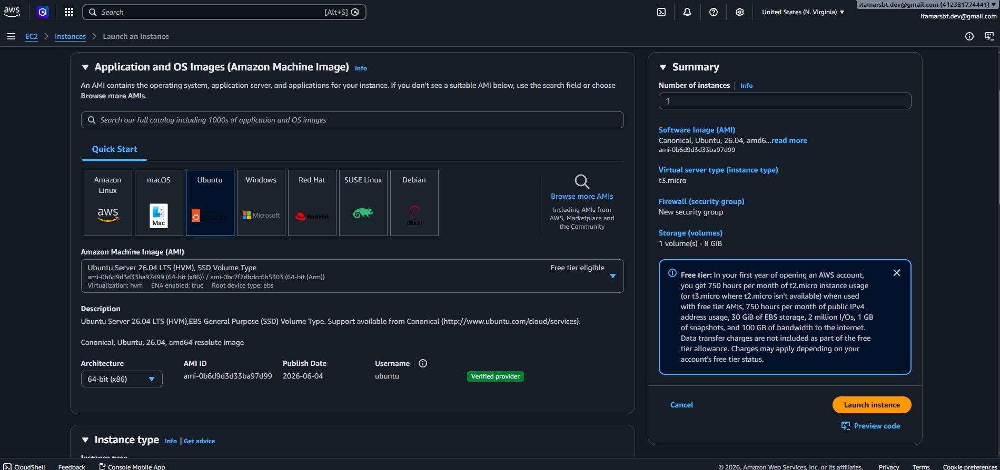

---
## Why Ubuntu?

Ubuntu is widely adopted across:

- Cloud Engineering
- DevOps
- Platform Engineering
- SRE
- Backend Development

It also integrates well with:

- Docker
- Kubernetes
- FastAPI
- Prometheus
- Grafana
- OpenTelemetry
---

## Step 2.4 – Select Instance Type

Choose:
```Text
t2.micro
```
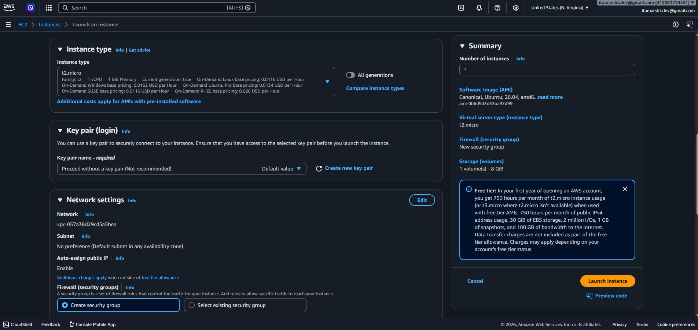

---
## Why t2.micro?

For this lab we only need:

- Ubuntu Linux
- SSM Agent
- AWS Systems Manager

The smallest instance size is sufficient.

---

## Step 2.5 – Skip SSH Key Pair

Under:
```Text
Key pair (login)
```
Select:
```Text
Proceed without a key pair
```


---

Why No SSH?

Traditional administration requires:

- Port 22 open
- SSH key management
- Bastion Hosts

In this lab we use:

```Text
AWS Systems Manager Session Manager
```

Which eliminates those requirements.

Benefits:

- No SSH exposure
- No key management
- Improved security posture

---

## Step 2.6 – Configure Networking

Keep:
```Text
Default VPC
Default Subnet
Auto Assign Public IP = Enable
```
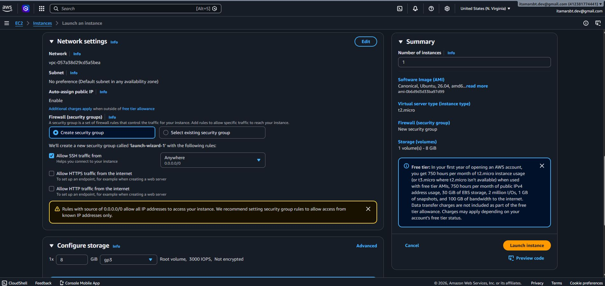

---

## Step 2.7 – Create Security Group

Create a new Security Group:
```Text
lab01-ssm-sg
```
Description:
```Text
Security Group for SSM managed instance
```
Remove:
```Text
Allow SSH traffic
```
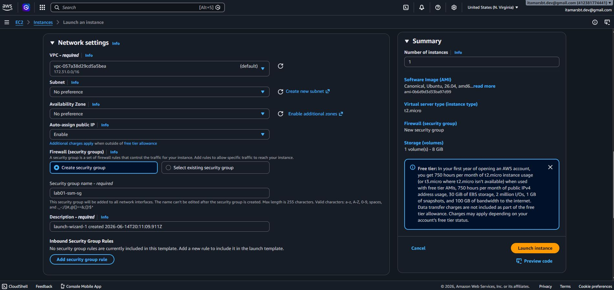

---

## Security Note

No inbound rules are required because access will occur through Systems Manager.

This follows the principle of reducing the attack surface.

Result:
```Text
Inbound Rules = 0
```

---

## Step 2.8 – Configure Storage

Keep:
```Text
8 GiB
gp3
```


---

## Step 2.9 – Attach IAM Role

Expand:
```Text
Advanced Details
```

Select:
```Text
IAM Instance Profile:
EC2-SSM-Role
```
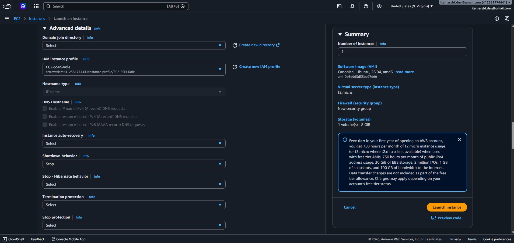

---

## Why This Role Is Required

This role allows the instance to:

- Register with Systems Manager
- Receive commands
- Open Session Manager connections

Without it, SSM will not work.

---

## Step 2.10 – Launch Instance

Click:
```Text
Launch Instance
```
Result:
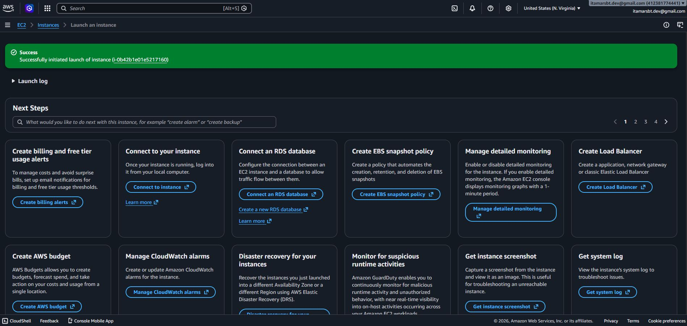

---

## Validation

Navigate to:
```Text
EC2
→ Instances
```
Verify:
```Text
Instance State = Running
Status Checks = 2/2 Passed
```


---

# Step 3 - Configure AWS Systems Manager

## Objective

In this step, we validate that the EC2 instance created in Step 2 was successfully registered in AWS Systems Manager as a managed node.

This confirms that the IAM Role, SSM Agent, network connectivity, and Systems Manager integration are working correctly.

---

## Step 3.1 - Open AWS Systems Manager

Navigate to:

```text
AWS Console
→ Systems Manager
```

AWS Systems Manager is used to manage, operate, and access cloud resources securely.
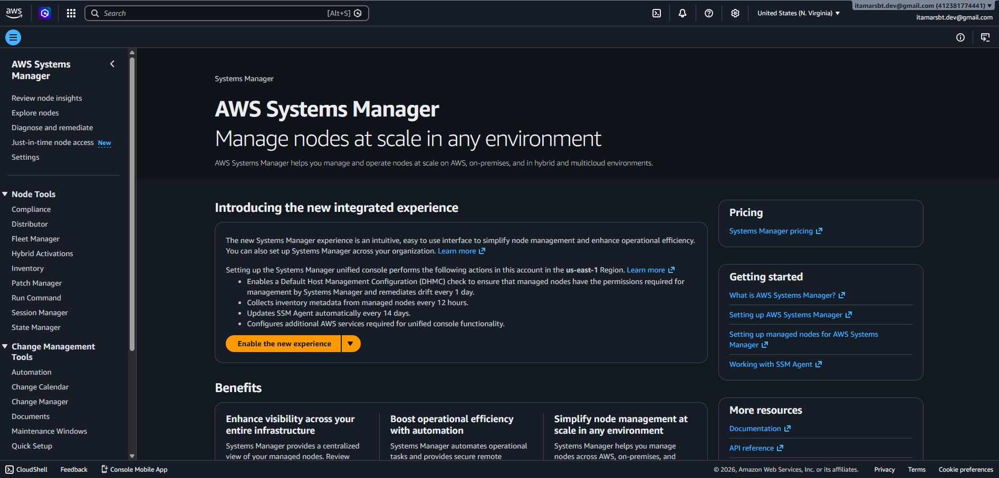

---

## Why Systems Manager?

AWS Systems Manager allows administrators to manage EC2 instances without directly exposing administrative access over the network.

In this lab, Systems Manager is required because we want to connect to the EC2 instance using Session Manager instead of SSH.

This helps reduce the attack surface by avoiding:

- SSH keys
- Open inbound SSH ports
- Bastion hosts
- Direct administrative exposure to the internet

---

## Step 3.2 - Open Fleet Manager

In the Systems Manager sidebar, navigate to:

```text
Node Tools
→ Fleet Manager
```

Fleet Manager provides visibility into managed nodes registered with AWS Systems Manager.

---

## Step 3.3 - Validate Managed Node Registration

In Fleet Manager, verify that the EC2 instance appears as a managed node.

Expected instance name:

```text
lab01-ec2-ssm
```
Expected node state:

```text
Running
```
Expected ping status:

```text
Online
```

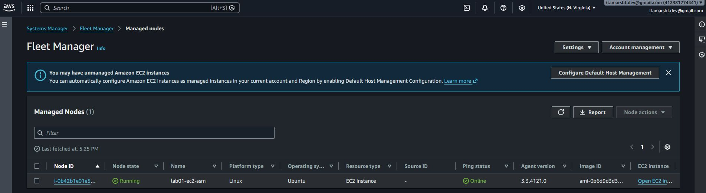

---

## What This Validation Means

If the instance appears as `Online`, it means that:

- The EC2 instance is running;
- The SSM Agent is active;
- The IAM Role is correctly attached;
- The `AmazonSSMManagedInstanceCore` policy is working;
- The instance can communicate with AWS Systems Manager.

This is a critical validation before attempting to connect using Session Manager.

---

## Step 3.4 - Open Managed Node Details

Click the managed node to inspect its details.

Validate the following information:

| Field            | Expected Value |
| ---------------- | -------------- |
| Name             | lab01-ec2-ssm  |
| Platform type    | Linux          |
| Operating system | Ubuntu         |
| Platform version | 26.04          |
| Node state       | Running        |
| Ping status      | Online         |
| Instance role    | EC2-SSM-Role   |
| Agent version    | 3.3.4121.0     |

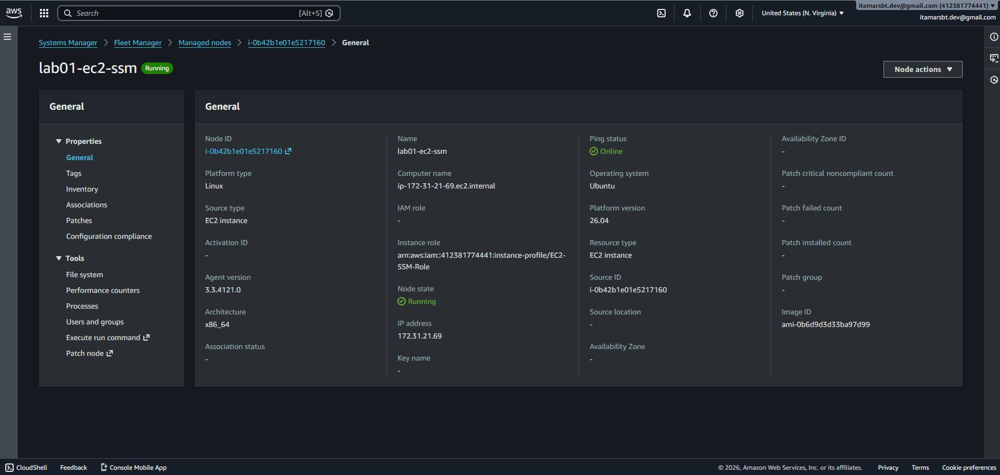

---

## Important Note

The IAM Role displayed in Systems Manager may appear as an instance profile ARN.

Example:

```text
arn:aws:iam::<account-id>:instance-profile/EC2-SSM-Role
```

This is expected.

An IAM instance profile is the mechanism AWS uses to attach an IAM Role to an EC2 instance.

---

# Step 4 - Connect Using Session Manager

## Objective

In this final step, we connect to the EC2 instance using AWS Systems Manager Session Manager.

This validates that:

- The EC2 instance is running
- The IAM Role is correctly configured
- The SSM Agent is operational
- Session Manager connectivity is working
- Administrative access can be performed without SSH

---

## Step 4.1 - Open the EC2 Console

Navigate to:

```text
AWS Console
→ EC2
→ Instances
```

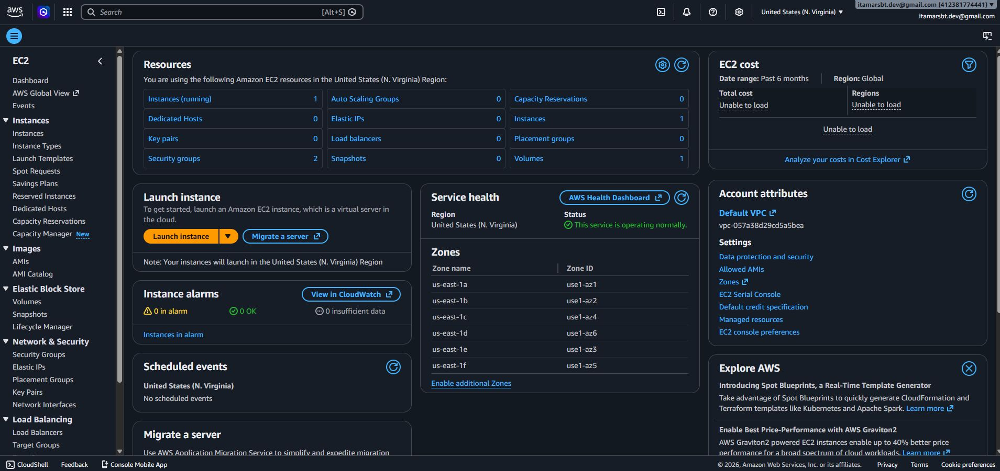

Select the instance created in this lab:

```text
lab01-ec2-ssm
```

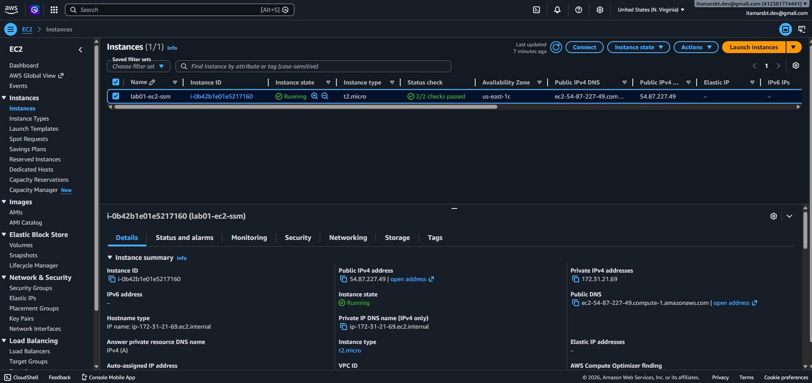

---

## Step 4.3 - Review Available Connection Methods

The default tab is typically:

```text
EC2 Instance Connect
```

This method requires direct network access to the instance.

Our objective is different.

We want to connect without:

- SSH keys
- Bastion Hosts
- Open inbound ports
- Direct public administration access

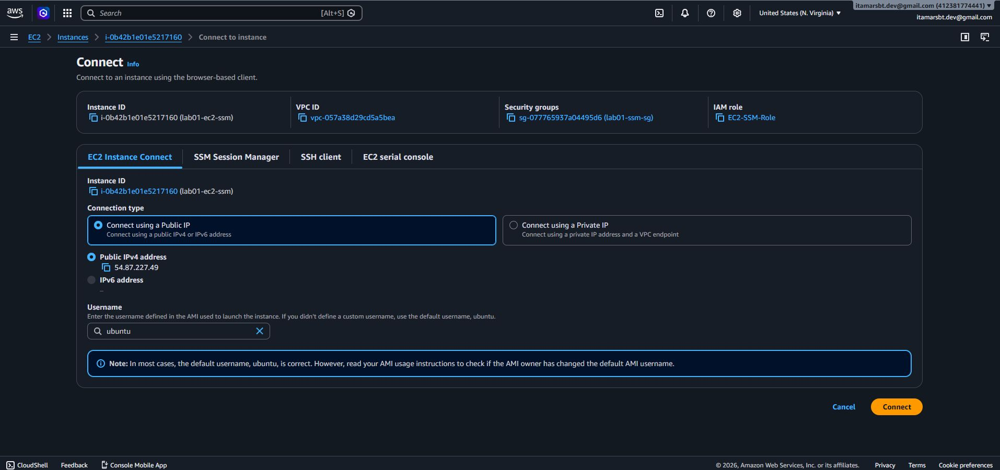

---

## Step 4.4 - Select SSM Session Manager

Switch to the:

```text
SSM Session Manager
```

Validate the following:

- Ping Status: `Online`
- Session Manager Status: `Connected`
- Agent Version: `Available`

These indicators confirm that the instance is ready to accept Systems Manager sessions.

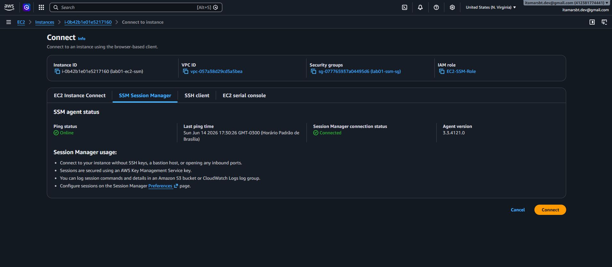

---

## Step 4.5 - Start a Session

Click:

```text
Connect
```

AWS will launch a browser-based shell session directly from the console.

No SSH key pair is required.

No inbound security group rule is required.

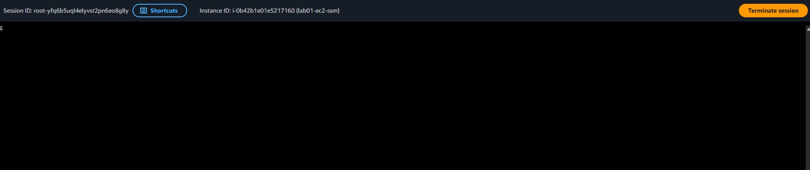

---

## Step 4.6 - Validate Instance Access

Execute the following commands:

```text
whoami
```
```text
hostname
```
```text
uname -a
```
```text
df -h
```
```text
free -m
```
```text
uptime
```

These commands validate:

- User identity
- Hostname
- Operating system
- Disk utilization
- Memory utilization
- System uptime


---


---
---

## Production Considerations

For simplicity, resource tagging was intentionally omitted in this lab.

In production environments, tags should be applied to all AWS resources to support:
- Cost allocation
- Governance
- Resource ownership
- Automation
- Compliance

## Why Session Manager Instead of SSH?

This lab intentionally avoids SSH access and follows a modern AWS operational model based on Systems Manager Session Manager.

Benefits include:

- No SSH key management
- No inbound SSH ports
- Reduced attack surface
- Centralized access control through IAM
- Improved auditing and governance

SSH remains an important and widely used administration method, but Session Manager represents a modern alternative commonly adopted in AWS environments.

Session Manager was chosen because it eliminates the need to expose port 22, reduces SSH key management, integrates with IAM, and improves access traceability. However, SSH remains widely used and necessary in various scenarios, especially outside the AWS ecosystem, such as in Azure or GCP environments.
