# Modern EC2 Monitoring with Amazon CloudWatch Agent


## Learning Objectives

By completing this lab, you will learn how to:

- Reuse an existing EC2 instance
- Install the Amazon CloudWatch Agent
- Configure the agent using a JSON configuration file
- Collect Memory metrics
- Collect Disk metrics
- Send custom metrics to Amazon CloudWatch
- Build a CloudWatch Dashboard
- Validate the collected metrics

## AWS Services

```text
| Service             | Purpose                               |
| ------------------- | ------------------------------------- |
| Amazon EC2          | Linux virtual machine                 |
| AWS Systems Manager | Secure shell access (Session Manager) |
| Amazon CloudWatch   | Metrics and Dashboard                 |
| IAM                 | Permissions for CloudWatch Agent      |
```


---

## Architecture

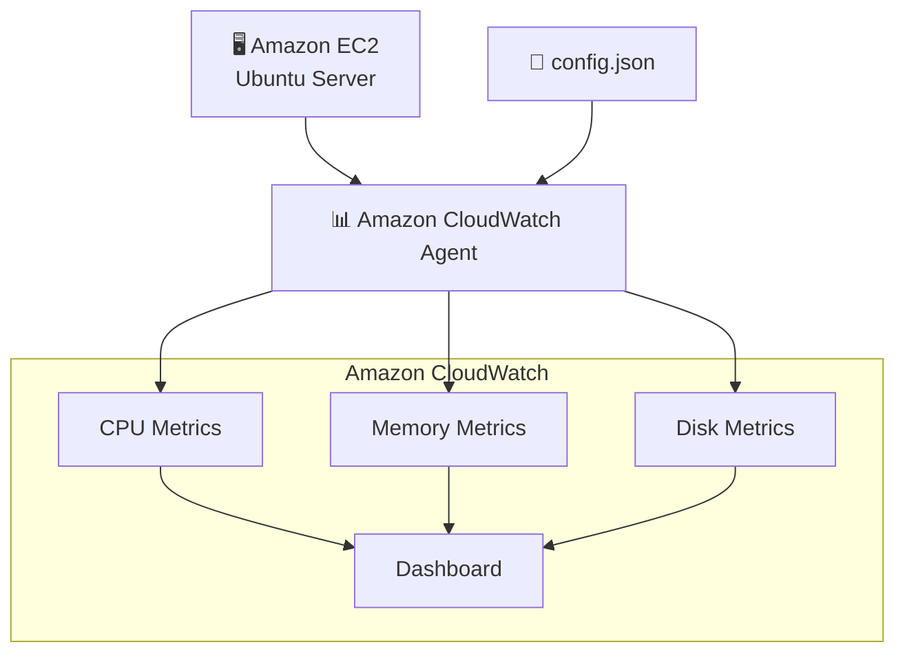
---

### Estimated Time

```text
20–30 minutes
```

---

### Estimated Cost
```text
Free Tier Eligible

t2.micro

CloudWatch custom metrics
≈ a few cents during the lab
```

---


## Prerequisites

Before starting this lab, make sure you have completed:

- ✅ Lab 01 – EC2 with Session Manager
- Existing Ubuntu EC2 instance
- IAM Role with:

```text
AmazonSSMManagedInstanceCore
```
and
```text
CloudWatchAgentServerPolicy
```

This instance is the same one created in Lab 01.


---

## Step 1 — Start the EC2 Instance

Start the EC2 instance created during Lab 01.

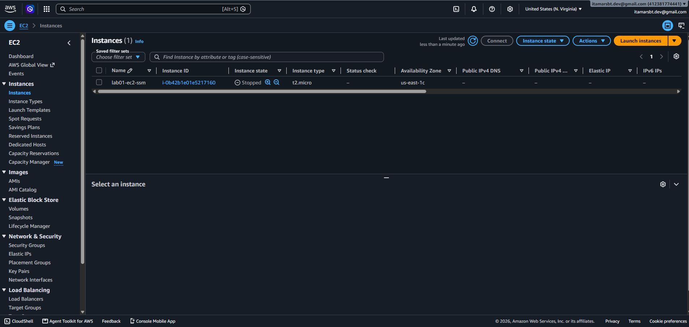

AND:

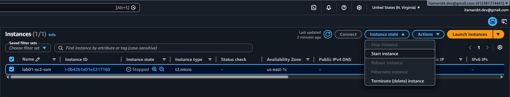

Expected state:

```text
Running
```

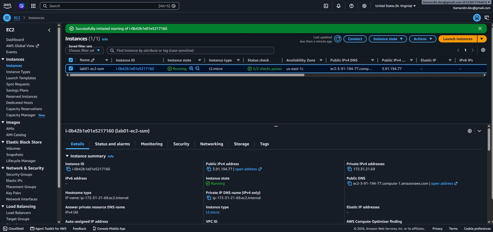

---

## Step 2 — Connect using Session Manager

```text
EC2

↓

Instance

↓

Connect

↓

Session Manager

↓

Connect
```

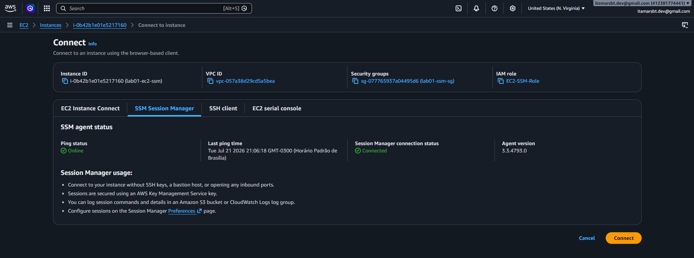


---

## Step 3 — Update Ubuntu

Run:

```text
sudo apt update
```

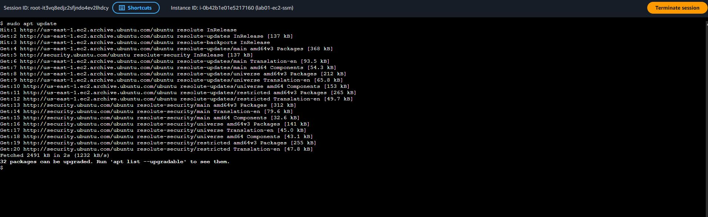


---

## Step 4 — Download the CloudWatch Agent

Instead of trying to install via apt, we will use the official AWS package, which is the most reliable method for Ubuntu:

```text
cd /tmp

wget https://amazoncloudwatch-agent.s3.amazonaws.com/ubuntu/amd64/latest/amazon-cloudwatch-agent.deb
```

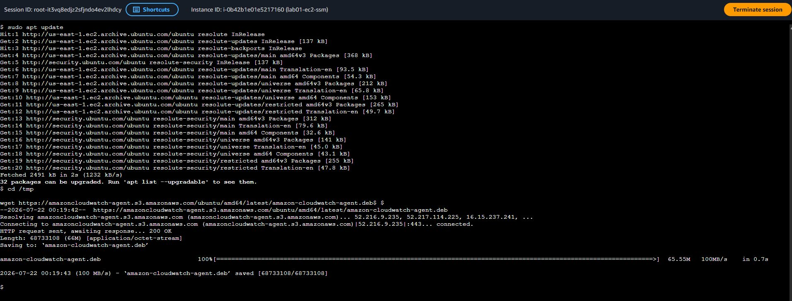

Check:

```text
ls -lh amazon-cloudwatch-agent.deb
```

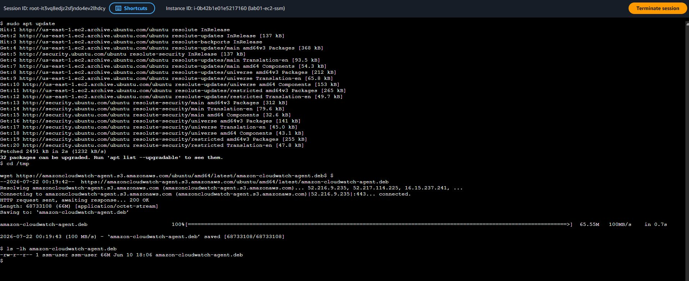


---

## Step 5 — Install the Agent

Type:

```text
sudo dpkg -i amazon-cloudwatch-agent.deb
```

Expected output:

```text
Setting up amazon-cloudwatch-agent...
```

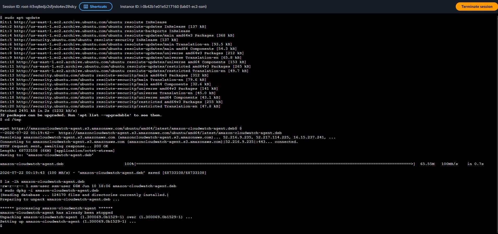


---

## Step 6 — Create the Configuration File

Now we will manually create the configuration file:

```text
sudo mkdir -p /opt/aws/amazon-cloudwatch-agent/etc
```

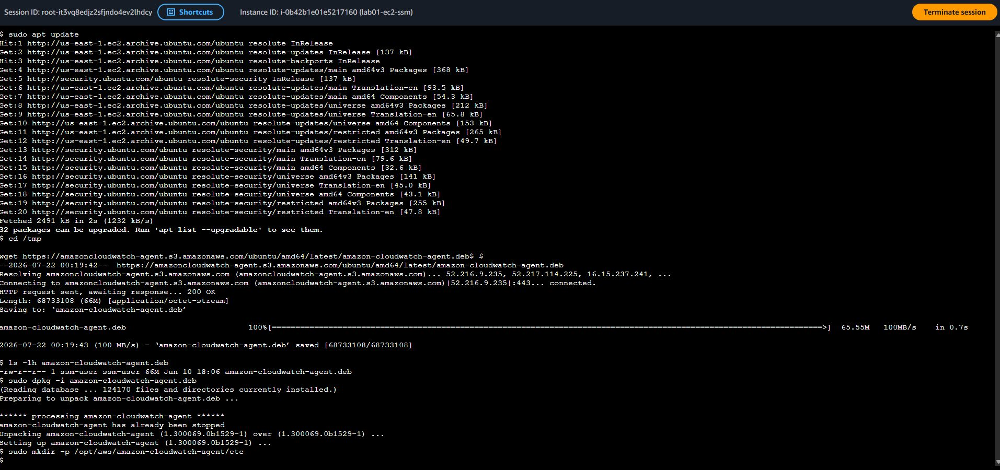


Open the editor:
```text
sudo nano /opt/aws/amazon-cloudwatch-agent/etc/config.json
```

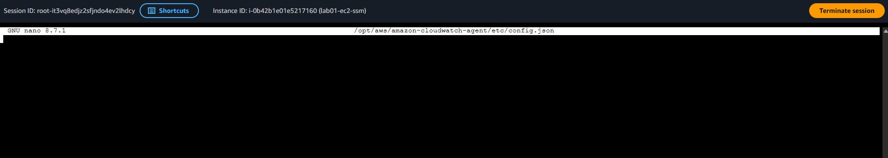


Paste the JSON content below:

```JSON
{
  "agent": {
    "metrics_collection_interval": 60,
    "run_as_user": "root"
  },
  "metrics": {
    "append_dimensions": {
      "InstanceId": "${aws:InstanceId}"
    },
    "metrics_collected": {
      "mem": {
        "measurement": [
          "mem_used_percent"
        ]
      },
      "disk": {
        "measurement": [
          "used_percent"
        ],
        "resources": [
          "/"
        ]
      }
    }
  }
}
```

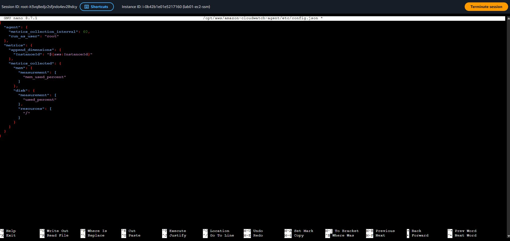


Save:

```text
CTRL + O

ENTER

CTRL + X
```

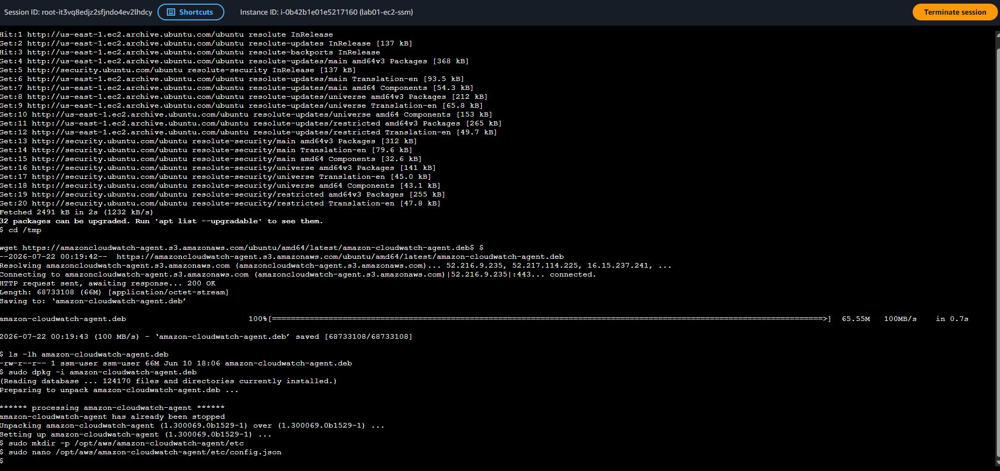


---

## Step 7 — Start the Agent

Type:

```text
sudo /opt/aws/amazon-cloudwatch-agent/bin/amazon-cloudwatch-agent-ctl \
-a fetch-config \
-m ec2 \
-c file:/opt/aws/amazon-cloudwatch-agent/etc/config.json \
-s
```


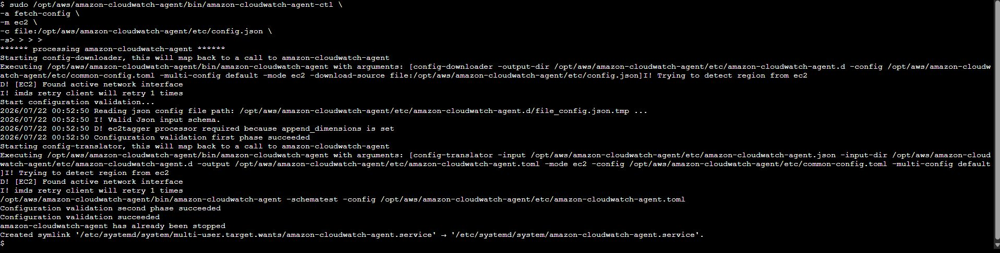


---

## Step 8 — Verify Agent Status

Type:

```text
sudo /opt/aws/amazon-cloudwatch-agent/bin/amazon-cloudwatch-agent-ctl \
-a status
```

Expected:

```text
{
  "status":"running"
}
```

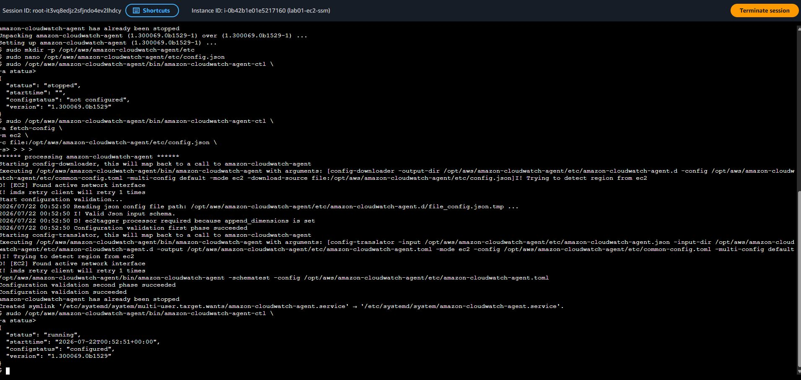


---

## Step 9 — Verify Metrics

Open:

```text
CloudWatch

↓

Metrics

↓

Classic metrics

↓

CWAgent
```

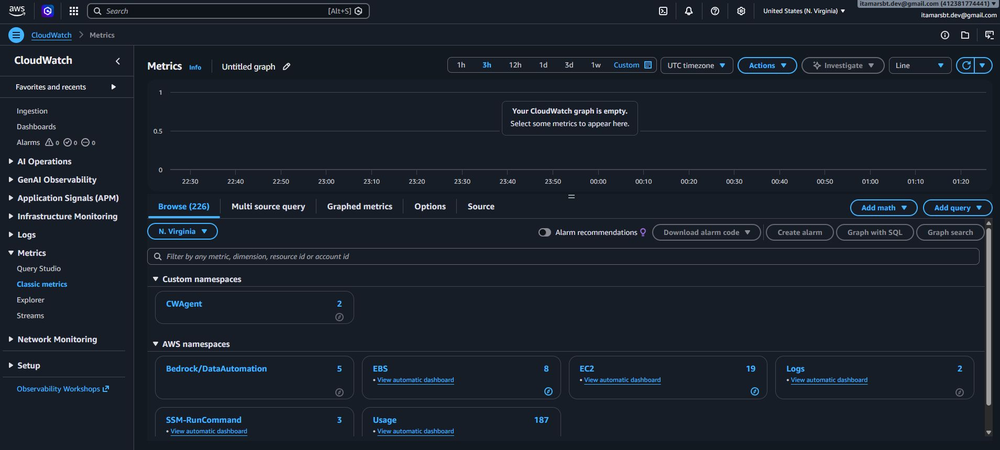

Verify:

```text
mem_used_percent

disk_used_percent
```

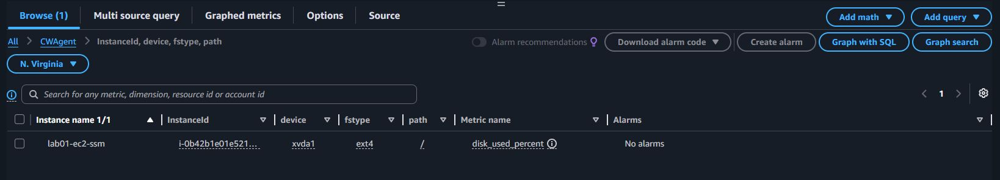

AND:

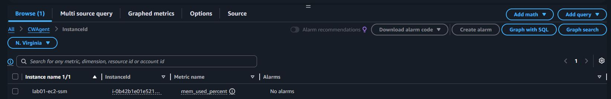


---


## Step 10 — Create Dashboard

Open:

```text
CloudWatch

↓

Dashboards

↓

Create Dashboard
```

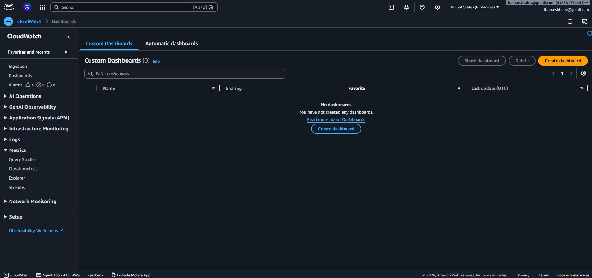


Suggested name:

```text
EC2_Monitoring_Dashboard
```

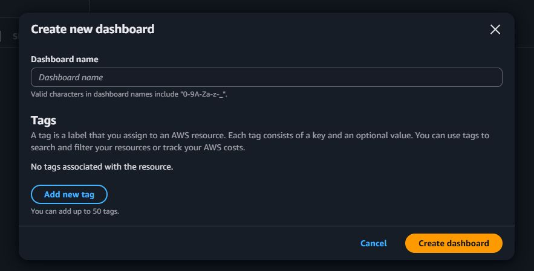


On the current screen:

- Data source: CloudWatch (already selected)
- Data type: Metrics (already selected)
- Widget type: Line (already selected)

Now click:

```text
Next
```

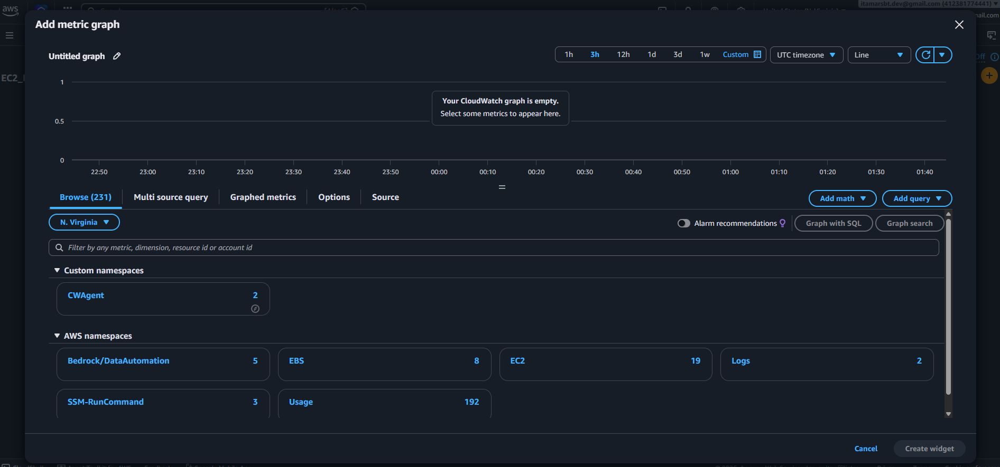

Click on:

```text
EC2
```

Choose the category:

```text
Per-Instance Metrics
```

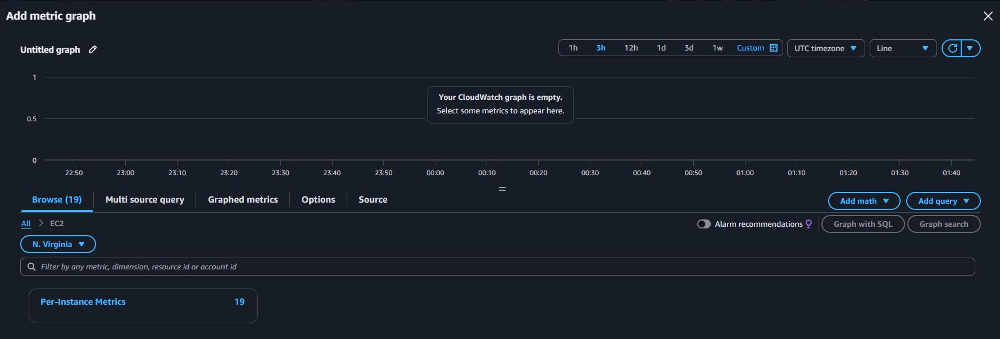


### Widget 1 — CPU Utilization %

In the list of metrics, look for:

```text
CPUUtilization
```

Check the box next to your instance (`lab01-ec2-ssm`).

You will see the graph appear immediately at the top.

Then click on:

```text
Create widget
```

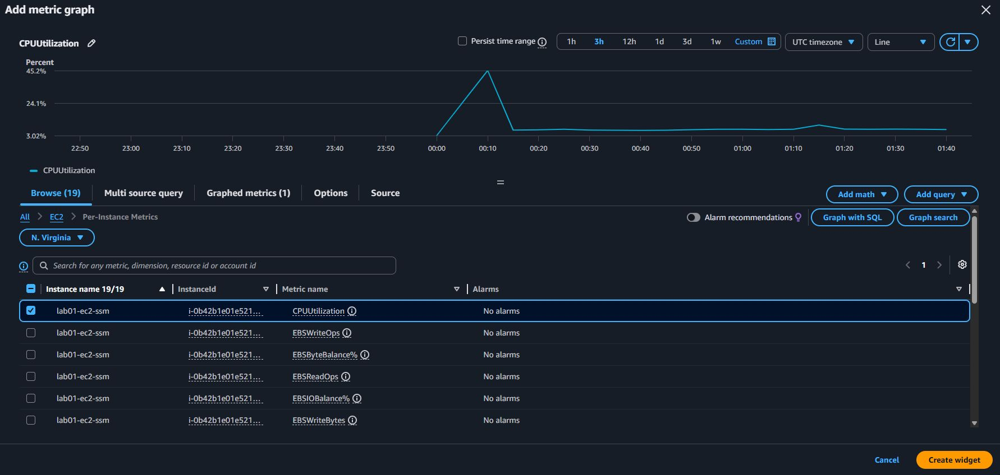


### Widget 2 — Memory Used %

After creating the first widget:

1. Click the + button on the Dashboard again.

2. Choose Metrics.

3. Click on CWAgent.

Now the screen should show two categories (the "2" that appears next to CWAgent).

Click on the second one.

Search for:

```text
mem_used_percent
```

Click on:

```text
Create widget
```

SCREENSHOT29


### Widget 3 — Disk Used %

Repeat the process:

```text
+
↓
Metrics
↓
CWAgent
```

Click on the other category.

Search for:

```text
disk_used_percent
```

Select the metric for the main disk (`/`).

Click on:

```text
Create widget
```

SCREENSHOT30


### Final result:

SCREENSHOT31


---


Lessons Learned

---
---

## Production Considerations

For simplicity, resource tagging was intentionally omitted in this lab.

In production environments, tags should be applied to all AWS resources to support:
- Cost allocation
- Governance
- Resource ownership
- Automation
- Compliance
