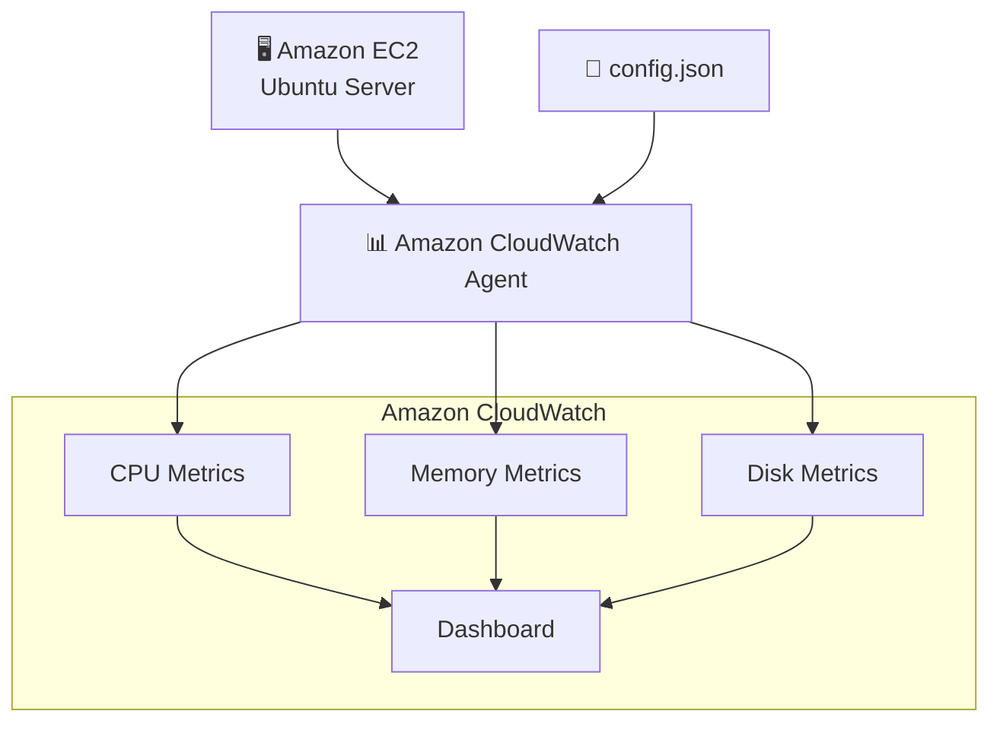

# Modern EC2 Monitoring with Amazon CloudWatch Agent


## Learning Objectives

By completing this lab, you will learn how to:

- Reuse an existing EC2 instance
- Install the Amazon CloudWatch Agent
- Configure the agent using a JSON configuration file
- Collect Memory metrics
- Collect Disk metrics
- Send custom metrics to Amazon CloudWatch
- Build a CloudWatch Dashboard
- Validate the collected metrics

## AWS Services

```text
| Service             | Purpose                               |
| ------------------- | ------------------------------------- |
| Amazon EC2          | Linux virtual machine                 |
| AWS Systems Manager | Secure shell access (Session Manager) |
| Amazon CloudWatch   | Metrics and Dashboard                 |
| IAM                 | Permissions for CloudWatch Agent      |
```


---

## Architecture


---

### Estimated Time

```text
20–30 minutes
```

---

### Estimated Cost
```text
Free Tier Eligible

t2.micro

CloudWatch custom metrics
≈ a few cents during the lab
```

---


## Prerequisites

Before starting this lab, make sure you have completed:

- ✅ Lab 01 – EC2 with Session Manager
- Existing Ubuntu EC2 instance
- IAM Role with:

```text
AmazonSSMManagedInstanceCore
```
and
```text
CloudWatchAgentServerPolicy
```

This instance is the same one created in Lab 01.


---

## Step 1 — Start the EC2 Instance

Start the EC2 instance created during Lab 01.

SCREENSHOT

Expected state:

```text
Running
```

SCREENSHOT

---

## Step 2 — Connect using Session Manager

```text
EC2

↓

Instance

↓

Connect

↓

Session Manager

↓

Connect
```

SCREENSHOT


---

## Step 3 — Update Ubuntu

Run:

```text
sudo apt update
```

SCREENSHOT


---

## Step 4 — Download the CloudWatch Agent

Instead of trying to install via apt, we will use the official AWS package, which is the most reliable method for Ubuntu:

```text
cd /tmp

wget https://amazoncloudwatch-agent.s3.amazonaws.com/ubuntu/amd64/latest/amazon-cloudwatch-agent.deb
```

SCREENSHOT

Check:

```text
ls -lh amazon-cloudwatch-agent.deb
```

SCREENSHOT


---

## Step 5 — Install the Agent

Type:

```text
sudo dpkg -i amazon-cloudwatch-agent.deb
```

Expected output:

```text
Setting up amazon-cloudwatch-agent...
```

SCREENSHOT


---

## Step 6 — Create the Configuration File

Now we will manually create the configuration file:

```text
sudo mkdir -p /opt/aws/amazon-cloudwatch-agent/etc
```

SCREENSHOT09


Open the editor:
```text
sudo nano /opt/aws/amazon-cloudwatch-agent/etc/config.json
```

SCREENSHOT10

Paste the JSON content below:

```JSON
{
  "agent": {
    "metrics_collection_interval": 60,
    "run_as_user": "root"
  },
  "metrics": {
    "append_dimensions": {
      "InstanceId": "${aws:InstanceId}"
    },
    "metrics_collected": {
      "mem": {
        "measurement": [
          "mem_used_percent"
        ]
      },
      "disk": {
        "measurement": [
          "used_percent"
        ],
        "resources": [
          "/"
        ]
      }
    }
  }
}
```

SCREENSHOT11


Save:

```text
CTRL + O

ENTER

CTRL + X
```

SCREENSHOT12


---

## Step 7 — Start the Agent

Type:

```text
sudo /opt/aws/amazon-cloudwatch-agent/bin/amazon-cloudwatch-agent-ctl \
-a fetch-config \
-m ec2 \
-c file:/opt/aws/amazon-cloudwatch-agent/etc/config.json \
-s
```


SCREENSHOT14


---

Step 8 — Verify Agent Status

Type:

```text
sudo /opt/aws/amazon-cloudwatch-agent/bin/amazon-cloudwatch-agent-ctl \
-a status
```

Expected:

```text
{
  "status":"running"
}
```

SCREENSHOT13

---

## Step 9 — Verify Metrics


---


Lessons Learned

---
---

## Production Considerations

For simplicity, resource tagging was intentionally omitted in this lab.

In production environments, tags should be applied to all AWS resources to support:
- Cost allocation
- Governance
- Resource ownership
- Automation
- Compliance
