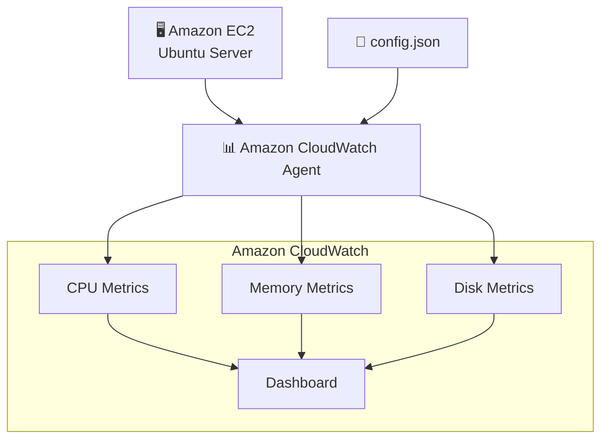

# Modern EC2 Monitoring with Amazon CloudWatch Agent


## Learning Objectives

By completing this lab, you will learn how to:

- Reuse an existing EC2 instance
- Install the Amazon CloudWatch Agent
- Configure the agent using a JSON configuration file
- Collect Memory metrics
- Collect Disk metrics
- Send custom metrics to Amazon CloudWatch
- Build a CloudWatch Dashboard
- Validate the collected metrics

## AWS Services

```text
| Service             | Purpose                               |
| ------------------- | ------------------------------------- |
| Amazon EC2          | Linux virtual machine                 |
| AWS Systems Manager | Secure shell access (Session Manager) |
| Amazon CloudWatch   | Metrics and Dashboard                 |
| IAM                 | Permissions for CloudWatch Agent      |
```


---

## Architecture


---

### Estimated Time

```text
20–30 minutes
```

---

### Estimated Cost
```text
Free Tier Eligible

t2.micro

CloudWatch custom metrics
≈ a few cents during the lab
```

---


## Prerequisites

Before starting this lab, make sure you have completed:

- ✅ Lab 01 – EC2 with Session Manager
- Existing Ubuntu EC2 instance
- IAM Role with:

```text
AmazonSSMManagedInstanceCore
```
and
```text
CloudWatchAgentServerPolicy
```

This instance is the same one created in Lab 01.


---

## Step 1 — Start the EC2 Instance

Start the EC2 instance created during Lab 01.

SCREENSHOT

Expected state:

```text
Running
```

SCREENSHOT

---

## Step 2 — Connect using Session Manager

```text
EC2

↓

Instance

↓

Connect

↓

Session Manager

↓

Connect
```

SCREENSHOT


---

## Step 3 — Update Ubuntu

Run:

```bash
</> Bash
sudo apt update
```

SCREENSHOT


---

Step 4
Create config.json

Step 5
Start CloudWatch Agent

Step 6
Verify Metrics

Step 7
Create Dashboard

Lessons Learned

---
---

## Production Considerations

For simplicity, resource tagging was intentionally omitted in this lab.

In production environments, tags should be applied to all AWS resources to support:
- Cost allocation
- Governance
- Resource ownership
- Automation
- Compliance
