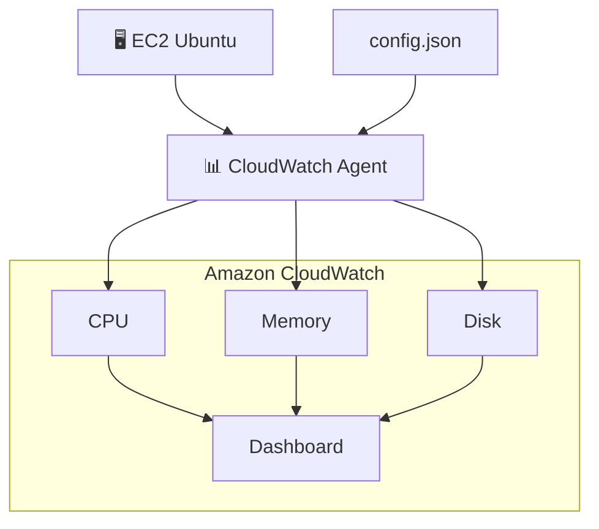

# Lab 02 - EC2 Monitoring with CloudWatch Agent


## Objective

### In this lab, you will learn how to:

- Install the Amazon CloudWatch Agent;
- Collect CPU metrics;
- Collect memory metrics;
- Collect disk metrics;
- Publish custom metrics to CloudWatch;
- Create a dashboard to monitor the instance;
- What you will learn.

### By the end of this lab, you will be able to:

- Monitor a Linux instance using CloudWatch;
- Collect metrics that are not available by default (Memory and Disk);
- Create dashboards for observability;
- Understand how these metrics are used by DevOps and SRE teams.


---

## Architecture



---

## Prerequisites

- AWS Account;
- EC2 Ubuntu Instance;
- IAM Role attached.

```text
AmazonSSMManagedInstanceCore
CloudWatchAgentServerPolicy
```

This instance is the same one created in Lab 01.

---

## Estimated Cost

For a single t3.micro instance within the Free Tier:

- EC2 Free Tier;
- Free basic CloudWatch;
- Dashboards may incur a small cost if the free limit is exceeded.

---

Step 1
Start EC2

Step 2
Connect using Session Manager

Step 3
Install CloudWatch Agent

Step 4
Create config.json

Step 5
Start CloudWatch Agent

Step 6
Verify Metrics

Step 7
Create Dashboard

Lessons Learned

---
---

## Production Considerations

For simplicity, resource tagging was intentionally omitted in this lab.

In production environments, tags should be applied to all AWS resources to support:
- Cost allocation
- Governance
- Resource ownership
- Automation
- Compliance
