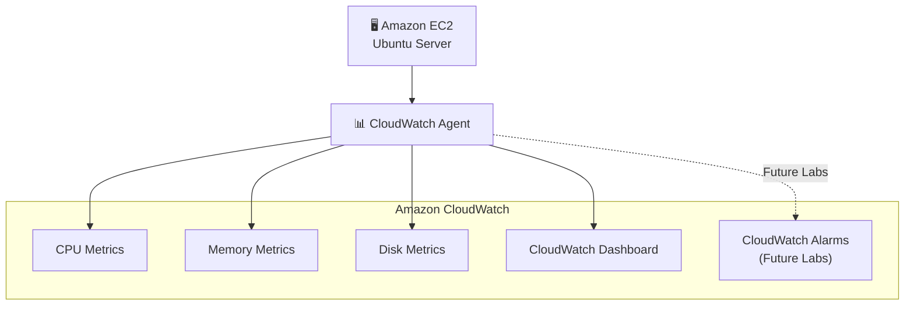

# Lab 02 - EC2 Monitoring with CloudWatch Agent

## Objective

### In this lab, you will learn how to:

- Install the Amazon CloudWatch Agent
- Collect CPU metrics
- Collect memory metrics
- Collect disk metrics
- Publish custom metrics to CloudWatch
- Create a dashboard to monitor the instance
- What you will learn

### By the end of this lab, you will be able to:

- Monitor a Linux instance using CloudWatch
- Collect metrics that are not available by default (Memory and Disk)
- Create dashboards for observability
- Understand how these metrics are used by DevOps and SRE teams

---

## Architecture

---
---

## Production Considerations

For simplicity, resource tagging was intentionally omitted in this lab.

In production environments, tags should be applied to all AWS resources to support:
- Cost allocation
- Governance
- Resource ownership
- Automation
- Compliance
