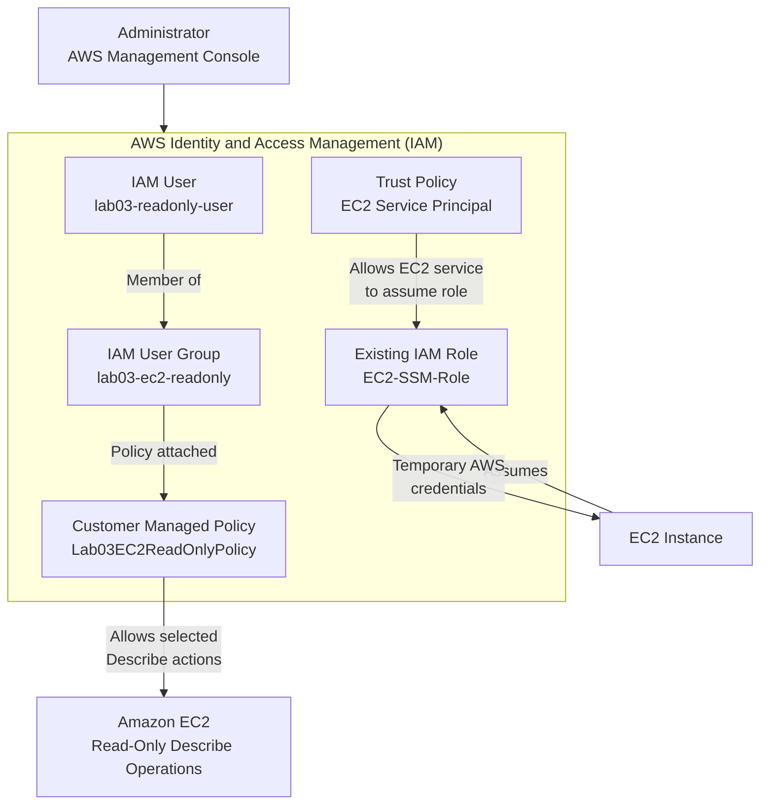

# Lab 03 — IAM Roles and Policies

> **AWS Cloud Engineering Lab — Manual Implementation**

This lab introduces the core concepts of **AWS Identity and Access Management (IAM)** through a hands-on implementation using the **AWS Management Console**.

The goal is to understand how AWS controls **authentication and authorization**, how permissions are assigned to users and workloads, and how the **Principle of Least Privilege** can be applied when designing access policies.

Unlike the Terraform version planned for a later stage of this repository, this lab is performed **manually through the AWS Management Console**.

---

## Table of Contents

- [Overview](#overview)
- [Architecture](#architecture)
- [Learning Objectives](#learning-objectives)
- [AWS Services](#aws-services)
- [Estimated Time](#estimated-time)
- [Estimated Cost](#estimated-cost)
- [Prerequisites](#prerequisites)
- [IAM Concepts](#iam-concepts)
  - [IAM Users](#iam-users)
  - [IAM User Groups](#iam-user-groups)
  - [IAM Policies](#iam-policies)
  - [IAM Roles](#iam-roles)
  - [Trust Policies](#trust-policies)
  - [Permissions Policies](#permissions-policies)
  - [Principle of Least Privilege](#principle-of-least-privilege)
- [Lab Resources](#lab-resources)
- [Step-by-Step Tutorial](#step-by-step-tutorial)
  - [Step 1 — Review the Existing EC2 IAM Role](#step-1--review-the-existing-ec2-iam-role)
  - [Step 2 — Create a Customer Managed Policy](#step-2--create-a-customer-managed-policy)
  - [Step 3 — Create an IAM User Group](#step-3--create-an-iam-user-group)
  - [Step 4 — Verify the Policy Attached to the Group](#step-4--verify-the-policy-attached-to-the-group)
  - [Step 5 — Create a Temporary IAM User](#step-5--create-a-temporary-iam-user)
  - [Step 6 — Add the User to the IAM Group](#step-6--add-the-user-to-the-iam-group)
  - [Step 7 — Validate Permissions](#step-7--validate-permissions)
  - [Step 8 — Review the Least Privilege Model](#step-8--review-the-least-privilege-model)
- [Validation](#validation)
- [Security Best Practices Applied](#security-best-practices-applied)
- [Cleanup](#cleanup)
- [Post-Cleanup Validation](#post-cleanup-validation)
- [Troubleshooting](#troubleshooting)
- [Key Learnings](#key-learnings)
- [Repository Files](#repository-files)

---

# Overview

AWS Identity and Access Management (**IAM**) provides the mechanisms used to control access to AWS resources.

IAM answers two fundamental security questions:

**Authentication**

> Who is making the request?

**Authorization**

> What is that identity allowed to do?

In this lab, a temporary IAM user will be created and assigned to an IAM user group.

A custom customer managed policy will then provide the group with a restricted set of read-only Amazon EC2 permissions.

The resulting permission chain will be:

```text
IAM User
   │
   ▼
IAM User Group
   │
   ▼
Customer Managed IAM Policy
   │
   ▼
Selected EC2 Describe Permissions
   │
   ▼
us-east-1
```

The lab also reviews the existing `EC2-SSM-Role` created in previous labs to demonstrate the difference between **IAM users** and **IAM roles**.

The temporary IAM user created in this lab is intended exclusively for educational purposes and will be removed during the cleanup procedure.

---

# Architecture

The following diagram represents the IAM architecture explored in this lab.



This architecture demonstrates two different IAM authorization models.

### Human identity

```text
IAM User
   ↓
IAM User Group
   ↓
IAM Policy
   ↓
AWS Permissions
```

### AWS workload identity

```text
EC2 Instance
   ↓
IAM Role
   ↓
Temporary Credentials
   ↓
AWS Permissions
```

---

# Learning Objectives

After completing this lab, you should be able to:

- Understand the purpose of AWS IAM.
- Explain the difference between authentication and authorization.
- Understand the difference between IAM users, groups, policies, and roles.
- Understand the purpose of IAM trust policies.
- Understand the purpose of IAM permissions policies.
- Create a customer managed IAM policy.
- Create an IAM user group.
- Assign permissions to users through groups.
- Create a temporary IAM user for laboratory purposes.
- Understand why IAM groups simplify permission management.
- Apply the Principle of Least Privilege.
- Validate allowed and denied IAM actions.
- Understand why IAM roles are preferred for AWS workloads.
- Recognize the risks associated with long-term access keys.
- Remove temporary IAM resources after completing a laboratory.

---

# AWS Services

This lab uses the following AWS services and features:

| Service / Feature | Purpose |
|---|---|
| AWS IAM | Identity and access management |
| IAM Users | Represents the temporary laboratory identity |
| IAM User Groups | Groups users that share permissions |
| IAM Policies | Defines allowed AWS actions |
| IAM Roles | Provides assumable identities for AWS workloads |
| IAM Policy Simulator | Helps evaluate IAM permissions |
| Amazon EC2 | Target service for the custom read-only permissions |

---

# Estimated Time

Approximately:

```text
45–75 minutes
```

The actual duration depends on familiarity with the AWS Management Console and IAM concepts.

---

# Estimated Cost

AWS IAM itself does not incur additional charges.

The IAM resources created in this lab therefore have an estimated cost of:

```text
$0.00
```

Existing AWS resources from previous labs may continue to generate charges independently of IAM.

> **Cost Awareness:** Always review the AWS Billing and Cost Management console when maintaining laboratory resources.

---

# Prerequisites

Before starting this lab, you should have:

- An active AWS account.
- Access to the AWS Management Console.
- Administrative permissions appropriate for creating laboratory IAM resources.
- Basic familiarity with the AWS Console.
- Completed or reviewed the previous EC2/SSM laboratory.
- An existing `EC2-SSM-Role` from the previous lab.
- A local copy of this GitHub repository.
- Visual Studio Code or another source-code editor.
- Basic understanding of JSON syntax.

Recommended AWS Region for the laboratory:

```text
us-east-1
```

> **Important:** IAM is primarily a global AWS service. However, the custom policy created in this lab restricts the permitted EC2 API requests to `us-east-1`.

---

# IAM Concepts

Before creating the resources, it is important to understand the IAM components used throughout the lab.

---

## IAM Users

An **IAM user** represents an identity inside an AWS account.

Historically, IAM users have been commonly used for people and applications requiring long-term credentials.

An IAM user can potentially have:

- Console credentials
- Access keys
- Group memberships
- Directly attached policies

However, modern AWS security guidance favors **federated access and temporary credentials whenever possible** rather than creating long-term IAM credentials for human users.

For this reason, the IAM user created in this lab is:

- Temporary
- Created only for educational purposes
- Not intended for production use
- Not provided with an access key
- Deleted during cleanup

User name:

```text
lab03-readonly-user
```

---

## IAM User Groups

An **IAM user group** is a collection of IAM users.

Instead of assigning identical policies individually to several users, permissions can be attached to a group.

Users that belong to that group inherit the permissions assigned to it.

Example:

```text
                ┌── User A
                │
Policy → Group ─┼── User B
                │
                └── User C
```

This makes permission administration easier and more consistent.

The group created in this lab will be:

```text
lab03-ec2-readonly
```

---

## IAM Policies

IAM policies are JSON documents that define permissions.

A policy typically describes:

```text
Effect
Action
Resource
Condition
```

A simplified policy statement could look like:

```json
{
  "Effect": "Allow",
  "Action": "ec2:DescribeInstances",
  "Resource": "*"
}
```

The statement means that the identity receiving this permission may call the `DescribeInstances` EC2 API operation.

Policies can be managed by AWS or created and managed by customers.

This lab creates a **customer managed policy** named:

```text
Lab03EC2ReadOnlyPolicy
```

---

## IAM Roles

An **IAM role** is an AWS identity that can be assumed by trusted principals.

Unlike an IAM user, a role does not normally represent a permanent identity with long-term credentials.

When a role is assumed, AWS provides **temporary security credentials**.

Roles are commonly used by:

- EC2 instances
- Lambda functions
- AWS services
- Federated users
- Cross-account access
- CI/CD workloads

The previous labs created the following role:

```text
EC2-SSM-Role
```

That role allows the EC2 workload to interact with AWS services without storing permanent AWS access keys on the instance.

---

## Trust Policies

A role contains a **trust policy**.

The trust policy answers:

> **Who is allowed to assume this role?**

For an EC2 service role, the trust relationship commonly contains the EC2 service principal:

```json
{
  "Effect": "Allow",
  "Principal": {
    "Service": "ec2.amazonaws.com"
  },
  "Action": "sts:AssumeRole"
}
```

Conceptually:

```text
Trust Policy
     │
     └── WHO can assume the role?
```

---

## Permissions Policies

Permissions policies answer a different question:

> **What can the identity do after receiving the permissions?**

Conceptually:

```text
Permissions Policy
        │
        └── WHAT actions are allowed?
```

Therefore:

```text
Trust Policy       → WHO can assume the role?

Permissions Policy → WHAT the identity can do
```

Understanding this distinction is fundamental when working with IAM roles.

---

## Principle of Least Privilege

The **Principle of Least Privilege** means granting only the permissions required to perform a specific task.

For example, instead of granting:

```text
AdministratorAccess
```

this lab grants only selected EC2 read operations.

The laboratory permission model is:

```text
Only Amazon EC2
       +
Only selected Describe operations
       +
Only requests targeting us-east-1
```

The user will **not** receive permissions such as:

```text
ec2:RunInstances
ec2:TerminateInstances
ec2:StopInstances
ec2:StartInstances
```

The user will also not receive unrelated permissions such as:

```text
s3:DeleteBucket
iam:CreateUser
lambda:DeleteFunction
```

---

# Lab Resources

The following resources will be created:

| Resource | Name | Purpose |
|---|---|---|
| Customer Managed Policy | `Lab03EC2ReadOnlyPolicy` | Selected EC2 read-only permissions |
| IAM User Group | `lab03-ec2-readonly` | Permission assignment |
| IAM User | `lab03-readonly-user` | Temporary laboratory identity |

The following existing resource will only be reviewed:

| Resource | Name |
|---|---|
| IAM Role | `EC2-SSM-Role` |

> **Important:** Do not delete the `EC2-SSM-Role` during this lab. It belongs to the previous EC2/SSM and monitoring laboratories.

---

# Step-by-Step Tutorial

---

# Step 1 — Review the Existing EC2 IAM Role

## Objective

Review the `EC2-SSM-Role` created in the previous labs and understand:

- IAM role permissions
- Trust relationships
- AWS service principals
- Temporary workload credentials
- Difference between roles and users

No IAM configuration will be modified during this step.

### Navigate to IAM

Open:

```text
AWS Management Console
        ↓
IAM
        ↓
Roles
```

Search for:

```text
EC2-SSM-Role
```

Open the role.

### Screenshot — Existing IAM Role

Capture the role overview.

Save as:

```text
screenshots/Lab03_Clipboard_01.jpg
```

Add the screenshot below after completing the step:

```markdown

```

<!-- Screenshot placeholder: Lab03_Clipboard_01.jpg -->

---

## Review Role Permissions

Open the **Permissions** section.

Review the policies currently attached to the role.

Depending on the previous labs, these may include:

```text
AmazonSSMManagedInstanceCore
CloudWatchAgentServerPolicy
```

Do not modify the policies.

### Screenshot — Role Permissions

Save as:

```text
screenshots/Lab03_Clipboard_02.jpg
```

Add:

```markdown

```

<!-- Screenshot placeholder: Lab03_Clipboard_02.jpg -->

---

## Review the Trust Relationship

Open:

```text
Trust relationships
```

Review the trust policy.

The important concept is the service principal:

```text
ec2.amazonaws.com
```

This relationship allows the EC2 service to assume the role.

### Screenshot — Trust Relationship

Save as:

```text
screenshots/Lab03_Clipboard_03.jpg
```

Add:

```markdown

```

<!-- Screenshot placeholder: Lab03_Clipboard_03.jpg -->

---

## Step 1 Validation

Verify that:

- `EC2-SSM-Role` exists.
- The expected permissions policies are attached.
- The trust relationship references EC2.
- No changes were made to the existing role.

Status:

- [ ] Step 1 completed

---

# Step 2 — Create a Customer Managed Policy

## Objective

Create a custom IAM policy that allows only selected read-only EC2 API operations.

Navigate to:

```text
IAM
 ↓
Policies
 ↓
Create policy
```

Select the **JSON** policy editor.

---

## Custom IAM Policy

Create the following file in the repository:

```text
policies/lab03-ec2-read-only-policy.json
```

Use:

```json
{
  "Version": "2012-10-17",
  "Statement": [
    {
      "Sid": "AllowSelectedEC2ReadOnlyActions",
      "Effect": "Allow",
      "Action": [
        "ec2:DescribeInstances",
        "ec2:DescribeInstanceStatus",
        "ec2:DescribeVolumes",
        "ec2:DescribeSnapshots",
        "ec2:DescribeSecurityGroups",
        "ec2:DescribeVpcs",
        "ec2:DescribeSubnets",
        "ec2:DescribeRouteTables",
        "ec2:DescribeTags"
      ],
      "Resource": "*",
      "Condition": {
        "StringEquals": {
          "aws:RequestedRegion": "us-east-1"
        }
      }
    }
  ]
}
```

Copy the same JSON document into the AWS policy editor.

---

## Understanding the Policy

### Version

```json
"Version": "2012-10-17"
```

Defines the IAM policy language version.

It does **not** represent the date when this laboratory policy was created.

### Statement ID

```json
"Sid": "AllowSelectedEC2ReadOnlyActions"
```

Provides a human-readable identifier for the policy statement.

### Effect

```json
"Effect": "Allow"
```

Specifies that the listed actions are allowed.

### Actions

The policy explicitly lists selected EC2 read operations:

```text
DescribeInstances
DescribeInstanceStatus
DescribeVolumes
DescribeSnapshots
DescribeSecurityGroups
DescribeVpcs
DescribeSubnets
DescribeRouteTables
DescribeTags
```

No EC2 write or destructive actions are granted.

### Resource

```json
"Resource": "*"
```

Many EC2 `Describe` operations do not support resource-level permissions.

For those API operations, IAM requires the statement to use:

```text
Resource: "*"
```

This does not automatically mean that the policy grants broad administrative access.

The permitted API actions themselves remain explicitly restricted.

### Region Condition

The condition:

```json
"Condition": {
  "StringEquals": {
    "aws:RequestedRegion": "us-east-1"
  }
}
```

restricts the allowed API requests to the selected AWS Region:

```text
us-east-1
```

This provides an additional restriction to the laboratory policy.

---

## Policy Review

Before creating the policy:

- Review the JSON syntax.
- Review any warnings or validation findings presented by AWS.
- Confirm that no write or destructive EC2 actions are included.

### Screenshot — Policy Editor

Save as:

```text
screenshots/Lab03_Clipboard_04.jpg
```

Add:

```markdown

```

<!-- Screenshot placeholder: Lab03_Clipboard_04.jpg -->

---

## Create the Policy

Use:

```text
Policy name:
Lab03EC2ReadOnlyPolicy
```

Description:

```text
Provides limited read-only access to selected Amazon EC2 resources in us-east-1 for Lab 03.
```

Create the policy.

### Screenshot — Policy Created

Save as:

```text
screenshots/Lab03_Clipboard_05.jpg
```

Add:

```markdown

```

<!-- Screenshot placeholder: Lab03_Clipboard_05.jpg -->

---

## Step 2 Validation

Verify that:

```text
Lab03EC2ReadOnlyPolicy
```

appears under the customer managed IAM policies.

Status:

- [ ] Step 2 completed

---

# Step 3 — Create an IAM User Group

## Objective

Create a group that will receive the custom EC2 read-only policy.

Navigate to:

```text
IAM
 ↓
User groups
 ↓
Create group
```

Group name:

```text
lab03-ec2-readonly
```

During group creation, locate and select:

```text
Lab03EC2ReadOnlyPolicy
```

Create the group.

The resulting relationship should be:

```text
lab03-ec2-readonly
        │
        ▼
Lab03EC2ReadOnlyPolicy
```

### Screenshot — User Group

Save as:

```text
screenshots/Lab03_Clipboard_06.jpg
```

Add:

```markdown

```

<!-- Screenshot placeholder: Lab03_Clipboard_06.jpg -->

---

## Step 3 Validation

Verify:

- Group name is `lab03-ec2-readonly`.
- The group exists.
- The custom policy is associated with the group.

Status:

- [ ] Step 3 completed

---

# Step 4 — Verify the Policy Attached to the Group

Open:

```text
IAM
 ↓
User groups
 ↓
lab03-ec2-readonly
 ↓
Permissions
```

Confirm that:

```text
Lab03EC2ReadOnlyPolicy
```

is attached.

The permission inheritance model is now:

```text
IAM Group
    │
    ▼
Customer Managed Policy
    │
    ▼
Selected EC2 Read Permissions
```

### Screenshot — Group Permissions

Save as:

```text
screenshots/Lab03_Clipboard_07.jpg
```

Add:

```markdown

```

<!-- Screenshot placeholder: Lab03_Clipboard_07.jpg -->

---

## Step 4 Validation

Verify that the group receives permissions through:

```text
Lab03EC2ReadOnlyPolicy
```

Status:

- [ ] Step 4 completed

---

# Step 5 — Create a Temporary IAM User

## Objective

Create a temporary IAM user for demonstrating group-based authorization.

Navigate to:

```text
IAM
 ↓
Users
 ↓
Create user
```

User name:

```text
lab03-readonly-user
```

This identity exists exclusively for this laboratory.

Do **not** create an access key.

Do not store any AWS secret credentials in this repository.

> **Security Note:** Long-term IAM user credentials should generally be avoided when temporary credentials or federated access can be used. This user exists only to demonstrate IAM concepts and will be deleted during cleanup.

Create the user.

### Screenshot — IAM User Created

Save as:

```text
screenshots/Lab03_Clipboard_08.jpg
```

Add:

```markdown

```

<!-- Screenshot placeholder: Lab03_Clipboard_08.jpg -->

---

## Step 5 Validation

Verify that:

```text
lab03-readonly-user
```

exists.

Confirm that no access key was created for the user.

Status:

- [ ] Step 5 completed

---

# Step 6 — Add the User to the IAM Group

Navigate to:

```text
IAM
 ↓
User groups
 ↓
lab03-ec2-readonly
 ↓
Users
 ↓
Add users
```

Select:

```text
lab03-readonly-user
```

Add the user.

The complete permission chain should now be:

```text
lab03-readonly-user
        │
        │ Member of
        ▼
lab03-ec2-readonly
        │
        │ Attached policy
        ▼
Lab03EC2ReadOnlyPolicy
        │
        │ Allows
        ▼
Selected EC2 Describe Actions
        │
        ▼
us-east-1
```

### Screenshot — User Membership

Save as:

```text
screenshots/Lab03_Clipboard_09.jpg
```

Add:

```markdown

```

<!-- Screenshot placeholder: Lab03_Clipboard_09.jpg -->

---

## Step 6 Validation

Verify:

- `lab03-readonly-user` is a member of `lab03-ec2-readonly`.
- The group has `Lab03EC2ReadOnlyPolicy`.
- The user does not have unnecessary directly attached policies.

Status:

- [ ] Step 6 completed

---

# Step 7 — Validate Permissions

## Objective

Verify that the IAM permission model allows the intended read-only operations while rejecting actions outside the policy.

Where available in the current IAM console, use the IAM policy simulation/evaluation tools to evaluate the permissions associated with:

```text
lab03-readonly-user
```

The validation should demonstrate both:

```text
ALLOW
```

and:

```text
DENY
```

results.

---

## Test 1 — Describe EC2 Instances

Test:

```text
ec2:DescribeInstances
```

Expected:

```text
ALLOWED
```

because this operation is explicitly included in the custom policy.

### Screenshot — Allowed Action

Save as:

```text
screenshots/Lab03_Clipboard_10.jpg
```

Add:

```markdown

```

<!-- Screenshot placeholder: Lab03_Clipboard_10.jpg -->

---

## Test 2 — Terminate EC2 Instances

Test:

```text
ec2:TerminateInstances
```

Expected:

```text
DENIED
```

The custom policy does not grant permission to terminate EC2 instances.

### Screenshot — TerminateInstances Denied

Save as:

```text
screenshots/Lab03_Clipboard_11.jpg
```

Add:

```markdown

```

<!-- Screenshot placeholder: Lab03_Clipboard_11.jpg -->

---

## Test 3 — Run EC2 Instances

Test:

```text
ec2:RunInstances
```

Expected:

```text
DENIED
```

The custom policy does not grant permission to launch instances.

### Screenshot — RunInstances Denied

Save as:

```text
screenshots/Lab03_Clipboard_12.jpg
```

Add:

```markdown

```

<!-- Screenshot placeholder: Lab03_Clipboard_12.jpg -->

---

## Test 4 — Unrelated AWS Service

If supported by the selected validation method, test an unrelated operation such as:

```text
s3:DeleteBucket
```

Expected:

```text
DENIED
```

No Amazon S3 permissions were granted.

This demonstrates that the policy does not provide permissions outside its intended scope.

---

## Step 7 Validation

Expected authorization model:

| Action | Expected Result | Reason |
|---|---|---|
| `ec2:DescribeInstances` | ALLOWED | Explicitly allowed |
| `ec2:DescribeVolumes` | ALLOWED | Explicitly allowed |
| `ec2:TerminateInstances` | DENIED | Not granted |
| `ec2:RunInstances` | DENIED | Not granted |
| `s3:DeleteBucket` | DENIED | No S3 permissions |

Status:

- [ ] Step 7 completed

---

# Step 8 — Review the Least Privilege Model

The completed IAM architecture demonstrates the Principle of Least Privilege.

The temporary user does **not** receive:

```text
AdministratorAccess
```

It does **not** receive:

```text
PowerUserAccess
```

It does **not** receive unrestricted EC2 permissions.

Instead:

```text
IAM User
   │
   ▼
IAM Group
   │
   ▼
Custom Policy
   │
   ▼
Selected EC2 Describe Operations
   │
   ▼
us-east-1
```

The design reduces unnecessary permissions and limits the potential impact of compromised credentials.

### Screenshot — Final IAM Configuration

Capture a final view that clearly demonstrates the completed IAM configuration.

Save as:

```text
screenshots/Lab03_Clipboard_13.jpg
```

Add:

```markdown

```

<!-- Screenshot placeholder: Lab03_Clipboard_13.jpg -->

---

## Step 8 Validation

Confirm that:

- The user receives permissions through group membership.
- The group receives permissions from the custom policy.
- The custom policy contains only required EC2 read operations.
- Write and destructive operations are not granted.
- No access key was created.
- The existing EC2 role remains unchanged.

Status:

- [ ] Step 8 completed

---

# Validation

Before cleaning up the environment, verify the complete laboratory configuration.

## IAM User

Expected:

```text
lab03-readonly-user
```

Requirements:

- [ ] User exists.
- [ ] User belongs to the expected group.
- [ ] No unnecessary direct policies are attached.
- [ ] No access key was created.

---

## IAM User Group

Expected:

```text
lab03-ec2-readonly
```

Requirements:

- [ ] Group exists.
- [ ] Laboratory user is a member.
- [ ] Custom policy is attached.

---

## Customer Managed Policy

Expected:

```text
Lab03EC2ReadOnlyPolicy
```

Requirements:

- [ ] Policy exists.
- [ ] Only selected EC2 `Describe` actions are allowed.
- [ ] Region restriction is configured.
- [ ] No destructive actions are allowed.

---

## Existing IAM Role

Expected:

```text
EC2-SSM-Role
```

Requirements:

- [ ] Role still exists.
- [ ] Existing permissions remain intact.
- [ ] Trust relationship remains configured for EC2.
- [ ] Role was not modified unnecessarily.

---

## Authorization Tests

Expected:

```text
Describe operations → ALLOWED

Write operations → DENIED

Destructive operations → DENIED

Unrelated services → DENIED
```

Final validation:

- [ ] Lab validation completed

---

# Security Best Practices Applied

This laboratory demonstrates several important IAM security practices.

## 1. Least Privilege

Only the permissions required by the laboratory are granted.

---

## 2. Group-Based Permission Management

Permissions are assigned through an IAM user group instead of unnecessarily attaching the same policy directly to individual users.

---

## 3. Customer Managed Policy

A dedicated policy clearly documents the permissions required by the laboratory.

---

## 4. Explicit Action Selection

Instead of:

```json
"Action": "ec2:*"
```

the policy explicitly identifies the required operations.

---

## 5. Regional Restriction

The policy uses:

```json
"aws:RequestedRegion": "us-east-1"
```

to restrict permitted requests to the laboratory Region.

---

## 6. No Access Keys

The temporary IAM user does not require programmatic credentials.

No:

```text
Access Key ID
Secret Access Key
```

is generated for this lab.

---

## 7. Roles for AWS Workloads

The EC2 instance uses:

```text
EC2-SSM-Role
```

instead of storing permanent AWS credentials inside the operating system.

---

## 8. Temporary Laboratory Identity

The IAM user exists only to demonstrate IAM concepts.

It will be removed after validation.

---

## 9. No Credentials in Git

Never commit:

```text
AWS_ACCESS_KEY_ID
AWS_SECRET_ACCESS_KEY
AWS_SESSION_TOKEN
passwords
private credentials
```

to a Git repository.

---

# Cleanup

After completing all screenshots and validation, remove the temporary resources created specifically for Lab 03.

> **Important:** Do not delete `EC2-SSM-Role`.

The recommended cleanup sequence is:

```text
Remove user from group
        ↓
Delete IAM user
        ↓
Detach policy from group
        ↓
Delete IAM user group
        ↓
Delete customer managed policy
```

---

## Cleanup Step 1 — Remove User from Group

Navigate to:

```text
IAM
 ↓
User groups
 ↓
lab03-ec2-readonly
 ↓
Users
```

Remove:

```text
lab03-readonly-user
```

---

## Cleanup Step 2 — Delete Temporary IAM User

Navigate to:

```text
IAM
 ↓
Users
 ↓
lab03-readonly-user
```

Delete the user.

---

## Cleanup Step 3 — Detach the Custom Policy

Navigate to:

```text
IAM
 ↓
User groups
 ↓
lab03-ec2-readonly
 ↓
Permissions
```

Detach:

```text
Lab03EC2ReadOnlyPolicy
```

---

## Cleanup Step 4 — Delete IAM User Group

Delete:

```text
lab03-ec2-readonly
```

---

## Cleanup Step 5 — Delete Customer Managed Policy

Navigate to:

```text
IAM
 ↓
Policies
```

Locate:

```text
Lab03EC2ReadOnlyPolicy
```

Delete the policy.

---

## Cleanup Step 6 — Preserve Existing EC2 Role

Confirm that:

```text
EC2-SSM-Role
```

still exists.

This resource belongs to previous labs and should remain available for later exercises.

---

# Post-Cleanup Validation

After cleanup, verify that the Lab 03 temporary resources no longer exist.

Expected:

| Resource | Expected State |
|---|---|
| `lab03-readonly-user` | Deleted |
| `lab03-ec2-readonly` | Deleted |
| `Lab03EC2ReadOnlyPolicy` | Deleted |
| `EC2-SSM-Role` | Preserved |

### Screenshot — Post-Cleanup Validation

Save as:

```text
screenshots/Lab03_Clipboard_14.jpg
```

Add:

```markdown

```

<!-- Screenshot placeholder: Lab03_Clipboard_14.jpg -->

Cleanup status:

- [ ] Lab resources removed
- [ ] Existing EC2 role preserved
- [ ] Cleanup validated

---

# Troubleshooting

## Custom Policy Does Not Appear When Creating the Group

### Possible Cause

The policy list may be filtered or the console may not yet display the newly created policy.

### Resolution

Search specifically for:

```text
Lab03EC2ReadOnlyPolicy
```

Confirm that you are viewing **customer managed policies**.

Refresh the console if necessary.

---

## Policy JSON Reports an Error

### Possible Causes

Common JSON errors include:

- Missing commas
- Extra commas
- Missing quotation marks
- Incorrect braces
- Invalid action names

### Resolution

Compare the AWS Console policy with:

```text
policies/lab03-ec2-read-only-policy.json
```

Verify that the JSON documents are identical.

---

## DescribeInstances Is Denied

### Possible Causes

Check whether:

- The user belongs to the correct group.
- The group has the custom policy attached.
- `ec2:DescribeInstances` exists in the policy.
- The simulated/requested Region is `us-east-1`.
- Another policy or organizational control introduces an explicit deny.

Remember:

```text
Explicit DENY
```

takes precedence over:

```text
ALLOW
```

in AWS authorization evaluation.

---

## User Has More Permissions Than Expected

Check:

```text
User
 ↓
Permissions
```

and:

```text
User
 ↓
Groups
```

The laboratory user should not have unrelated policies directly attached.

Also review all group memberships.

---

## Policy Cannot Be Deleted

A customer managed policy generally cannot be deleted while it remains attached to an IAM identity.

Detach it from:

```text
lab03-ec2-readonly
```

before attempting deletion.

---

## IAM Role Does Not Show the Expected Policies

The existing role may depend on which previous labs were completed.

Review:

```text
EC2-SSM-Role
```

and compare the attached policies with the configuration used in previous labs.

Do not attach or remove policies merely to make the screenshots match this README.

The objective of Step 1 is to **inspect the existing role**, not modify it.

---

## IAM Console Looks Different

AWS periodically updates the Management Console interface.

Button names, menu locations, or visual layouts may differ slightly from the screenshots documented in this repository.

Focus on the IAM resources and configuration concepts rather than reproducing the interface pixel-for-pixel.

---

# Key Learnings

This lab demonstrated that AWS IAM authorization is based on relationships between identities and policies rather than simply assigning unrestricted permissions to users.

The primary permission chain implemented was:

```text
IAM User
   ↓
IAM User Group
   ↓
Customer Managed Policy
   ↓
AWS API Permissions
```

The lab also demonstrated the workload authorization model:

```text
AWS Workload
   ↓
IAM Role
   ↓
Temporary Credentials
   ↓
AWS API Permissions
```

Important lessons include:

### IAM Users Represent Identities

IAM users can represent identities inside an AWS account, but long-term credentials should be avoided when modern temporary credential mechanisms are available.

### IAM Groups Simplify Permission Management

Groups allow permissions to be managed centrally and inherited by multiple IAM users.

### IAM Policies Define Authorization

Policies determine which AWS API operations an identity can perform.

### IAM Roles Are Designed to Be Assumed

Roles provide temporary credentials and are fundamental for secure AWS workload authentication.

### Trust and Permissions Are Different

```text
Trust Policy
     ↓
Who can assume the role?
```

while:

```text
Permissions Policy
        ↓
What can the identity do?
```

### Least Privilege Reduces Risk

Permissions should be limited to the actions required for a task.

Instead of:

```text
Allow everything
```

this lab implements:

```text
Allow only selected EC2 read operations
```

### An Allow Does Not Grant Unrelated Permissions

The custom policy grants only the actions explicitly permitted.

Operations outside the policy remain denied unless another applicable policy grants them.

### IAM Configuration Should Be Validated

Testing both successful and denied actions helps confirm that the authorization model behaves as intended.

### AWS Credentials Should Never Be Stored in Source Control

Access keys, passwords, tokens, and other credentials must never be committed to GitHub.

---

# Repository Files

The final Lab 03 directory structure is:

```text
03-iam-roles-and-policies/
│
├── README.md
│
├── policies/
│   └── lab03-ec2-read-only-policy.json
│
└── screenshots/
    ├── Lab03_Clipboard_01.jpg
    ├── Lab03_Clipboard_02.jpg
    ├── Lab03_Clipboard_03.jpg
    ├── Lab03_Clipboard_04.jpg
    ├── Lab03_Clipboard_05.jpg
    ├── Lab03_Clipboard_06.jpg
    ├── Lab03_Clipboard_07.jpg
    ├── Lab03_Clipboard_08.jpg
    ├── Lab03_Clipboard_09.jpg
    ├── Lab03_Clipboard_10.jpg
    ├── Lab03_Clipboard_11.jpg
    ├── Lab03_Clipboard_12.jpg
    ├── Lab03_Clipboard_13.jpg
    └── Lab03_Clipboard_14.jpg
```

---

# Lab Status

Manual implementation:

- [ ] Step 1 — Review existing IAM role
- [ ] Step 2 — Create customer managed policy
- [ ] Step 3 — Create IAM user group
- [ ] Step 4 — Verify policy attached to group
- [ ] Step 5 — Create temporary IAM user
- [ ] Step 6 — Add user to IAM group
- [ ] Step 7 — Validate permissions
- [ ] Step 8 — Review least privilege
- [ ] Validation completed
- [ ] Cleanup completed

---

## Next Lab

**Lab 04 — EBS Volumes and Snapshots**

The next laboratory will explore persistent block storage for Amazon EC2, including:

- Creating EBS volumes
- Attaching volumes to EC2 instances
- Creating snapshots
- Restoring data from snapshots

---

> This laboratory is part of the **AWS Cloud Engineering Lab**, a hands-on repository focused on developing practical AWS cloud infrastructure, operations, security, monitoring, and Infrastructure as Code skills.
