# Lab 03 — Modern AWS Identity, IAM Roles, and Least-Privilege Policies

> **AWS Cloud Engineering Lab — Manual Implementation**

This lab explores modern AWS identity and access management practices with a focus on **temporary credentials**, **IAM roles**, **least-privilege policies**, **workload identity**, and the current AWS model for **workforce access**.

The implementation intentionally avoids creating IAM users, IAM user groups, long-term access keys, or permanent credentials as part of the laboratory workflow.

Instead, the lab uses the existing EC2 workload from previous labs to examine role-based access and creates a dedicated laboratory IAM role and customer managed policy to study trust relationships, permissions, policy validation, and authorization behavior.

---

## Table of Contents

- [Overview](#overview)
- [Why This Lab Uses a Modern Identity Model](#why-this-lab-uses-a-modern-identity-model)
- [Architecture](#architecture)
- [Learning Objectives](#learning-objectives)
- [AWS Services and Features](#aws-services-and-features)
- [Estimated Time](#estimated-time)
- [Estimated Cost](#estimated-cost)
- [Prerequisites](#prerequisites)
- [Core Identity Concepts](#core-identity-concepts)
  - [Human and Workforce Identities](#human-and-workforce-identities)
  - [Workload Identities](#workload-identities)
  - [IAM Roles](#iam-roles)
  - [Temporary Credentials](#temporary-credentials)
  - [Trust Policies](#trust-policies)
  - [Permissions Policies](#permissions-policies)
  - [IAM Users](#iam-users)
  - [Least Privilege](#least-privilege)
  - [IAM Access Analyzer](#iam-access-analyzer)
- [Lab Resources](#lab-resources)
- [Step-by-Step Implementation](#step-by-step-implementation)
  - [Step 1 — Review the Modern AWS Identity Model](#step-1--review-the-modern-aws-identity-model)
  - [Step 2 — Inspect the Existing EC2 Workload Role](#step-2--inspect-the-existing-ec2-workload-role)
  - [Step 3 — Verify Role-Based Identity from the EC2 Instance](#step-3--verify-role-based-identity-from-the-ec2-instance)
  - [Step 4 — Create a Least-Privilege Customer Managed Policy](#step-4--create-a-least-privilege-customer-managed-policy)
  - [Step 5 — Validate the Policy with IAM Access Analyzer](#step-5--validate-the-policy-with-iam-access-analyzer)
  - [Step 6 — Create a Dedicated EC2 IAM Role](#step-6--create-a-dedicated-ec2-iam-role)
  - [Step 7 — Attach the Least-Privilege Policy to the Role](#step-7--attach-the-least-privilege-policy-to-the-role)
  - [Step 8 — Evaluate Allowed and Denied Actions](#step-8--evaluate-allowed-and-denied-actions)
  - [Step 9 — Compare Workforce and Workload Access](#step-9--compare-workforce-and-workload-access)
- [Validation](#validation)
- [Security Best Practices Applied](#security-best-practices-applied)
- [Cleanup](#cleanup)
- [Post-Cleanup Validation](#post-cleanup-validation)
- [Troubleshooting](#troubleshooting)
- [Key Learnings](#key-learnings)
- [Repository Structure](#repository-structure)
- [Next Lab](#next-lab)

---

# Overview

AWS Identity and Access Management (**IAM**) provides the authorization foundation used to control access to AWS services and resources.

Modern AWS identity design separates two major categories of identities:

```text
Human / Workforce Identities
        │
        ├── Federation
        ├── IAM Identity Center
        ├── Permission Sets / IAM Roles
        └── Temporary Credentials

Workload Identities
        │
        ├── IAM Roles
        ├── Trust Policies
        ├── Permissions Policies
        └── Temporary Credentials
```

This laboratory focuses primarily on the **workload identity model**, because the repository already contains an EC2 instance that uses the `EC2-SSM-Role` created in previous labs.

The lab also explains the modern AWS model for human access so that IAM users and long-term credentials are not presented as the default architecture for workforce access.

The practical implementation will:

1. Inspect the existing EC2 IAM role.
2. Verify that the EC2 workload is using a role-based identity.
3. Create a least-privilege customer managed policy.
4. Validate the policy using IAM Access Analyzer.
5. Create a dedicated EC2 service role.
6. Attach the policy to the role.
7. Evaluate expected allowed and denied actions.
8. Compare workload identity with modern workforce access.

No IAM user or access key is required.


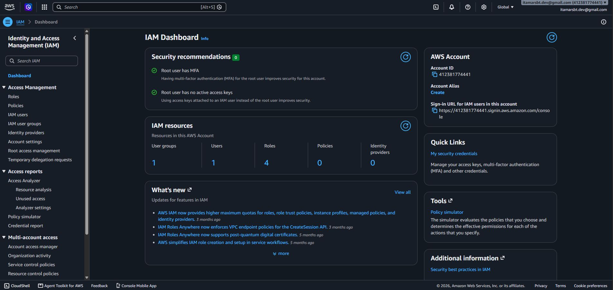


---

# Why This Lab Uses a Modern Identity Model

Traditional IAM tutorials often use the following model:

```text
IAM User
   │
   ▼
IAM Group
   │
   ▼
IAM Policy
   │
   ▼
AWS Resources
```

IAM users and groups remain valid AWS IAM concepts and may still exist in legacy environments or specific use cases.

However, they are **not the preferred default model for modern workforce access**.

For human users, modern AWS environments generally use:

```text
Human User
    │
    ▼
Identity Provider / IAM Identity Center
    │
    ▼
Permission Assignment
    │
    ▼
IAM Role
    │
    ▼
Temporary Credentials
    │
    ▼
AWS Resources
```

For AWS workloads such as EC2:

```text
EC2 Instance
    │
    ▼
IAM Role
    │
    ▼
Temporary Credentials
    │
    ▼
AWS APIs
```

This laboratory therefore treats IAM users as an important IAM concept to understand, but does **not** create one as the primary learning workflow.

---

# Architecture

The following diagram represents the identity models studied in this lab.

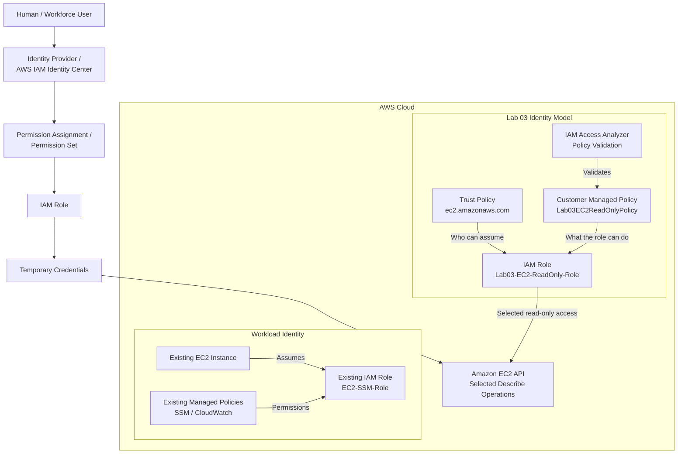

The lab studies two separate identity concerns:

### Workforce Access

```text
Human
  ↓
Federated Identity
  ↓
Role
  ↓
Temporary Credentials
```

### Workload Access

```text
AWS Workload
  ↓
IAM Role
  ↓
Temporary Credentials
```

The common security principle is the same:

> Prefer temporary credentials and role-based access over long-term static credentials whenever possible.

---

# Learning Objectives

After completing this lab, you should be able to:

- Explain the difference between authentication and authorization.
- Distinguish human identities from workload identities.
- Explain why temporary credentials are preferred over long-term credentials.
- Understand the role of AWS IAM Identity Center in modern workforce access.
- Explain why IAM roles are preferred for AWS workloads.
- Understand the relationship between EC2 instance profiles and IAM roles.
- Explain the difference between a trust policy and a permissions policy.
- Create a customer managed IAM policy.
- Apply the Principle of Least Privilege.
- Use IAM conditions to restrict permissions.
- Validate IAM policies using IAM Access Analyzer.
- Create an EC2 service role.
- Evaluate expected allowed and denied actions.
- Recognize where IAM users may still appear without treating them as the default workforce model.
- Remove temporary laboratory IAM resources safely.

---

# AWS Services and Features

| Service / Feature | Purpose |
|---|---|
| AWS IAM | Identity and access management |
| IAM Roles | Temporary role-based identities |
| IAM Policies | Defines authorization permissions |
| IAM Trust Policies | Defines who or what may assume a role |
| IAM Access Analyzer | Policy validation and security findings |
| AWS STS | Temporary security credential service |
| Amazon EC2 | Existing workload and target API service |
| EC2 Instance Profile | Makes an IAM role available to an EC2 instance |
| AWS Systems Manager | Secure access to the existing EC2 instance |
| IAM Identity Center | Modern centralized workforce access model |

---

# Estimated Time

Approximately:

```text
45–60 minutes
```

The actual duration depends on familiarity with IAM, EC2, and the AWS Management Console.

---

# Estimated Cost

The IAM resources created in this lab do not normally incur additional charges.

Estimated Lab 03 IAM cost:

```text
$0.00
```

The existing EC2 instance and other resources from previous labs may continue to generate charges independently.

> Always review **AWS Billing and Cost Management** when maintaining cloud laboratory environments.

---

# Prerequisites

Before starting this lab, you should have:

- An active AWS account.
- Access to the AWS Management Console.
- Administrative or delegated permissions sufficient to manage the IAM resources used by the lab.
- Completed or reviewed **Lab 01 — EC2 Instance with SSM Access**.
- Completed or reviewed **Lab 02 — EC2 Monitoring with CloudWatch Agent**.
- An existing EC2 instance from the previous labs.
- An existing IAM role named:

```text
EC2-SSM-Role
```

- Access to the instance through **AWS Systems Manager Session Manager**.
- Basic understanding of JSON syntax.

Recommended Region for regional resources:

```text
us-east-1
```

> **Important:** IAM is primarily a global AWS service. The least-privilege policy created in this lab uses an IAM condition to restrict supported EC2 API requests to `us-east-1`.


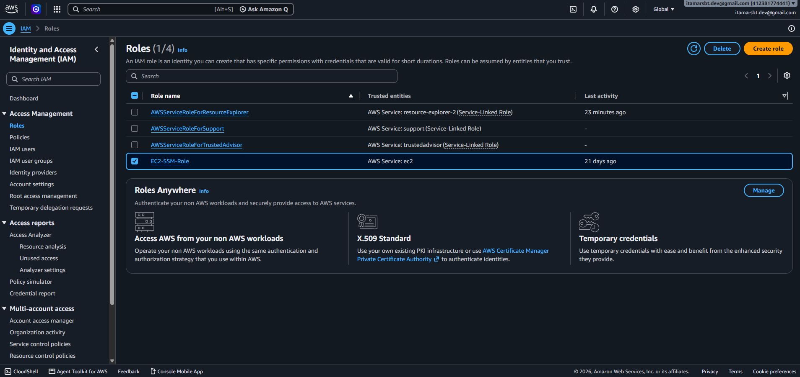


---

# Core Identity Concepts

## Human and Workforce Identities

A **human identity** represents a person who needs access to AWS.

Examples include:

- Cloud engineers
- Developers
- System administrators
- Security engineers
- Operators
- Auditors

In modern AWS environments, human users should generally access AWS through **federation** and receive **temporary credentials**.

A common architecture uses:

```text
Corporate / External Identity Provider
             │
             ▼
      IAM Identity Center
             │
             ▼
       Permission Set
             │
             ▼
          IAM Role
             │
             ▼
    Temporary Credentials
```

IAM Identity Center provides centralized access management and can integrate with external identity providers.

Permission sets define the permissions that workforce identities receive when accessing AWS accounts.


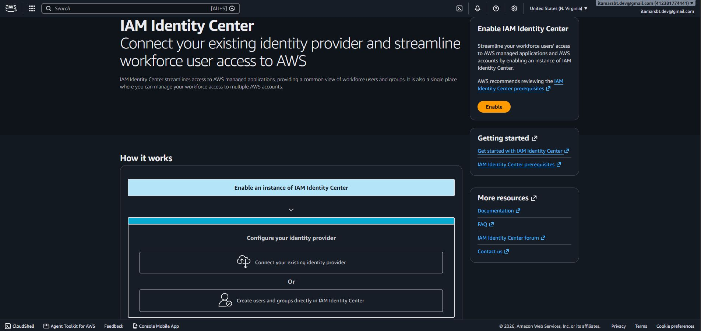


---

## Workload Identities

A **workload identity** represents software or infrastructure that needs to call AWS APIs.

Examples include:

- EC2 instances
- Lambda functions
- ECS tasks
- EKS workloads
- CI/CD pipelines
- Applications running outside AWS

Whenever possible, workloads should use mechanisms that provide **temporary credentials** rather than static access keys.

For EC2:

```text
EC2 Instance
     │
     ▼
Instance Profile
     │
     ▼
IAM Role
     │
     ▼
Temporary Credentials
```

The workload can use those credentials to call AWS APIs according to the policies attached to the role.

---

## IAM Roles

An **IAM role** is an AWS identity that can be assumed by a trusted principal.

Roles do not have permanent credentials attached to them.

When a role is assumed, AWS Security Token Service (**STS**) provides temporary security credentials for the role session.

Common role use cases include:

- EC2 workload access
- Lambda execution
- ECS task roles
- Cross-account access
- Federated workforce access
- CI/CD pipelines
- External workloads through role-based mechanisms

---

## Temporary Credentials

Temporary security credentials contain:

```text
Access Key ID
Secret Access Key
Session Token
Expiration
```

Unlike long-term IAM user access keys, temporary credentials have a limited lifetime.

Applications running on supported AWS compute services can usually obtain and refresh temporary credentials automatically.

This reduces the need to:

- Create permanent access keys.
- Store secrets in configuration files.
- Rotate static credentials manually.
- Commit credentials accidentally to source control.

---

## Trust Policies

A role's **trust policy** determines:

> **WHO or WHAT is allowed to assume this role?**

For an EC2 service role, the trusted principal is commonly:

```text
ec2.amazonaws.com
```

Example:

```json
{
  "Version": "2012-10-17",
  "Statement": [
    {
      "Effect": "Allow",
      "Principal": {
        "Service": "ec2.amazonaws.com"
      },
      "Action": "sts:AssumeRole"
    }
  ]
}
```

Conceptually:

```text
Trust Policy
     │
     └── WHO can assume the role?
```

---

## Permissions Policies

A permissions policy determines:

> **WHAT can the identity do after receiving the permissions?**

For example:

```json
{
  "Effect": "Allow",
  "Action": "ec2:DescribeInstances",
  "Resource": "*"
}
```

Conceptually:

```text
Permissions Policy
        │
        └── WHAT actions are allowed?
```

Therefore:

```text
Trust Policy       → WHO / WHAT can assume the role

Permissions Policy → WHAT the role is allowed to do
```

These are separate authorization decisions.

---

## IAM Users

An **IAM user** is a persistent identity within an AWS account.

IAM users can have long-term credentials such as:

- Console passwords
- Access keys

IAM users remain supported and may be necessary for specific use cases.

However, this lab does not create an IAM user because modern workforce access should normally use federation and temporary credentials when possible.

IAM users should therefore be understood as:

```text
Important IAM concept
        │
        ├── Still supported
        ├── Present in legacy environments
        ├── Required for some specific use cases
        └── Not the preferred default for workforce access
```

---

## Least Privilege

The **Principle of Least Privilege** means granting only the permissions required for a specific task.

Instead of:

```text
AdministratorAccess
```

or:

```json
"Action": "*"
```

this laboratory creates a policy containing only selected EC2 read operations.

The policy model is:

```text
Amazon EC2 only
       +
Selected Describe actions only
       +
us-east-1 condition
```

No EC2 write or destructive permissions are intentionally granted.

---

## IAM Access Analyzer

IAM Access Analyzer provides tools that help evaluate IAM policies and access configurations.

In this lab, it is used to validate the customer managed policy before relying on it.

Policy validation can identify:

- Syntax errors
- Security warnings
- General warnings
- Suggestions
- Policy elements that may not behave as expected

Policy validation is an important complement to manual policy review.


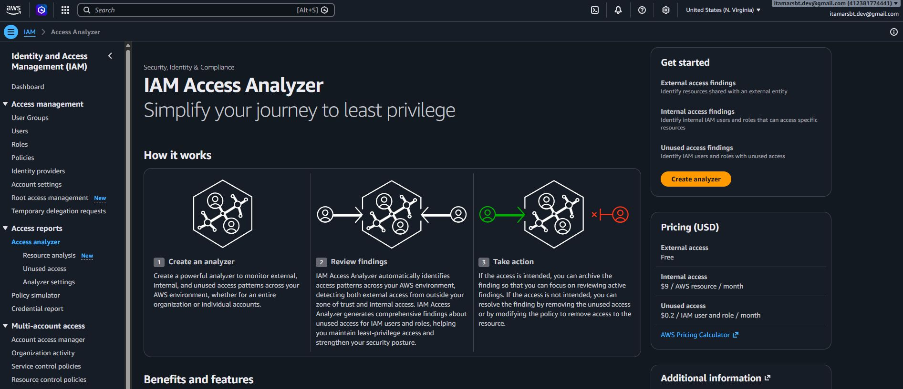


---

# Lab Resources

The following temporary resources will be created:

| Resource | Name | Purpose |
|---|---|---|
| Customer Managed Policy | `Lab03EC2ReadOnlyPolicy` | Least-privilege EC2 read permissions |
| IAM Role | `Lab03-EC2-ReadOnly-Role` | Demonstrates EC2 workload identity |
| Trust Policy File | `lab03-ec2-role-trust-policy.json` | Documents the EC2 trust relationship |
| Permissions Policy File | `lab03-ec2-read-only-policy.json` | Reusable policy artifact |

The following existing resource will only be inspected:

| Resource | Name |
|---|---|
| IAM Role | `EC2-SSM-Role` |
| EC2 Instance | Existing Lab 01/02 instance |


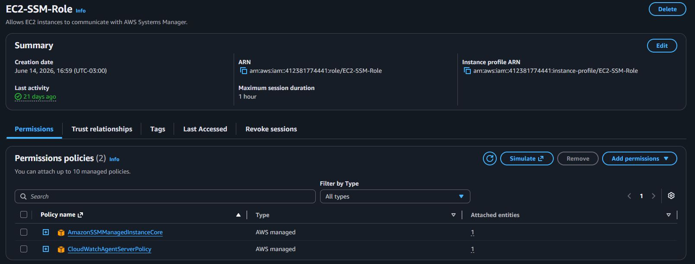

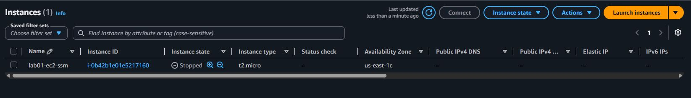


> **Do not delete or replace `EC2-SSM-Role`.** It is part of previous laboratories and may be required later.


---

# Step-by-Step Implementation

# Step 1 — Review the Modern AWS Identity Model

Before changing any IAM configuration, establish the identity model used throughout this lab.

The laboratory intentionally distinguishes:

```text
HUMANS
  │
  └── Federation / IAM Identity Center
          │
          └── IAM Roles
                 │
                 └── Temporary Credentials
```

from:

```text
WORKLOADS
   │
   └── IAM Roles
          │
          └── Temporary Credentials
```

The practical portion of this lab will focus on **workload identity**, while IAM Identity Center will be reviewed as the preferred modern workforce-access architecture.

No IAM user or long-term access key is required.


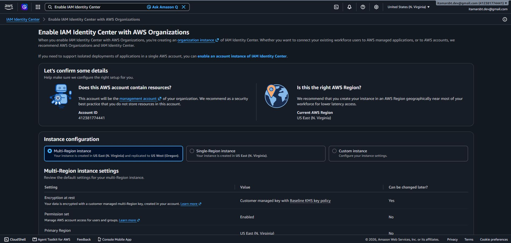


---

# Step 2 — Inspect the Existing EC2 Workload Role

Navigate to:

```text
AWS Management Console
        ↓
IAM
        ↓
Roles
```

Search for:

```text
EC2-SSM-Role
```

Open the role.


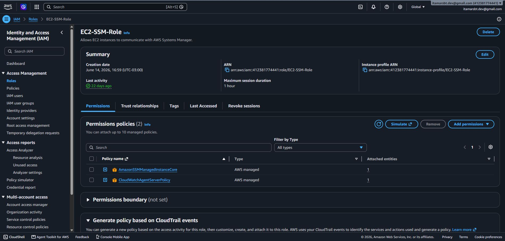


## Review Attached Permissions

Open the **Permissions** section.

Depending on the previous labs, policies may include:

```text
AmazonSSMManagedInstanceCore
CloudWatchAgentServerPolicy
```

These policies determine what the EC2 workload can do after receiving the role credentials.

Do not modify the role.


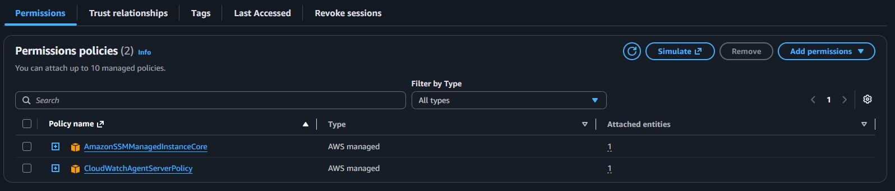


## Review the Trust Relationship

Open:

```text
Trust relationships
```

The trust policy should identify EC2 as a trusted service principal.

Look for:

```text
ec2.amazonaws.com
```

This means the role is designed to be assumed by the EC2 service.

The relationship is:

```text
EC2
 │
 │ sts:AssumeRole
 ▼
EC2-SSM-Role
 │
 ▼
Temporary Role Credentials
```

This is the workload identity pattern used by the existing EC2 instance.


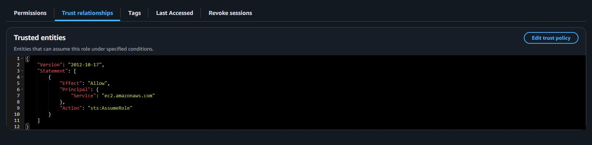


---

# Step 3 — Verify Role-Based Identity from the EC2 Instance

Open the existing EC2 instance through **AWS Systems Manager Session Manager**.

The objective is to verify that the instance has a role available through the EC2 Instance Metadata Service without exposing credential values.

## Query the Instance Profile Role Name

Run:

```bash
TOKEN=$(curl -sS -X PUT \
  -H "X-aws-ec2-metadata-token-ttl-seconds: 21600" \
  http://169.254.169.254/latest/api/token)
```

Then:

```bash
curl -sS \
  -H "X-aws-ec2-metadata-token: $TOKEN" \
  http://169.254.169.254/latest/meta-data/iam/security-credentials/
```

Expected output:

```text
EC2-SSM-Role
```

This demonstrates that the EC2 instance has access to an IAM role through its instance profile.

> **Security Note:** Do not request, display, copy, save, or commit the credential values returned by the deeper `/iam/security-credentials/<role-name>` metadata endpoint. The role name alone is sufficient for this laboratory.


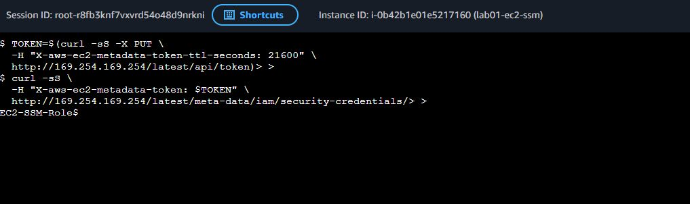


## Optional — Verify the AWS Caller Identity

If the AWS CLI is already installed on the instance, run:

```bash
aws sts get-caller-identity
```

The result should reference an assumed-role session associated with `EC2-SSM-Role`.

Do not install or configure static credentials merely to perform this optional check.

The important principle is:

```text
No ~/.aws static access keys required
              │
              ▼
EC2 role credentials are provided automatically
```

---

# Step 4 — Create a Least-Privilege Customer Managed Policy

Navigate to:

```text
IAM
 ↓
Policies
 ↓
Create policy
```


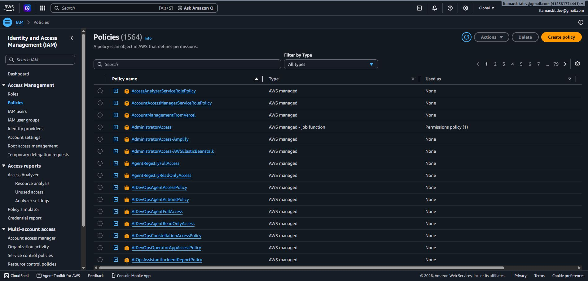


Choose the **JSON** policy editor.

Use:

```json
{
  "Version": "2012-10-17",
  "Statement": [
    {
      "Sid": "AllowSelectedEC2ReadOnlyActions",
      "Effect": "Allow",
      "Action": [
        "ec2:DescribeInstances",
        "ec2:DescribeInstanceStatus",
        "ec2:DescribeVolumes",
        "ec2:DescribeSnapshots",
        "ec2:DescribeSecurityGroups",
        "ec2:DescribeVpcs",
        "ec2:DescribeSubnets",
        "ec2:DescribeRouteTables",
        "ec2:DescribeTags"
      ],
      "Resource": "*",
      "Condition": {
        "StringEquals": {
          "aws:RequestedRegion": "us-east-1"
        }
      }
    }
  ]
}
```

A repository copy is maintained at:

```text
policies/lab03-ec2-read-only-policy.json
```


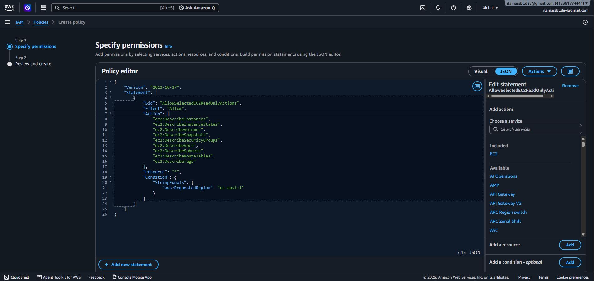


Click:
```text
Next
```


## Policy Design

### Explicit Actions

Only selected EC2 read operations are allowed.

The policy does **not** include:

```text
ec2:RunInstances
ec2:StartInstances
ec2:StopInstances
ec2:TerminateInstances
```

### Resource

The statement uses:

```json
"Resource": "*"
```

because many EC2 `Describe` APIs do not support resource-level permissions.

The scope is still restricted by the explicit list of allowed actions.

### Regional Condition

The condition:

```json
"aws:RequestedRegion": "us-east-1"
```

adds another authorization constraint.

The intended permission model is therefore:

```text
Selected EC2 read APIs
          +
       us-east-1
```


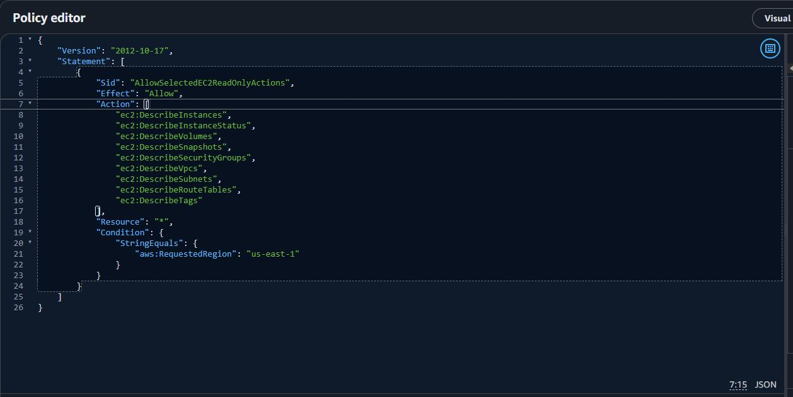


---

# Step 5 — Validate the Policy with IAM Access Analyzer

Before creating the policy, review the policy validation results shown by the IAM console.

IAM Access Analyzer policy validation checks the document against IAM policy grammar and security best practices.

Review all findings.

Pay particular attention to:

```text
ERROR
SECURITY_WARNING
WARNING
SUGGESTION
```

If an error appears, do not proceed until it is understood and corrected.

After reviewing the findings, create the policy using:

```text
Policy name:
Lab03EC2ReadOnlyPolicy
```

Suggested description:

```text
Least-privilege policy for selected Amazon EC2 read operations in us-east-1 used by AWS Cloud Engineering Lab 03.
```


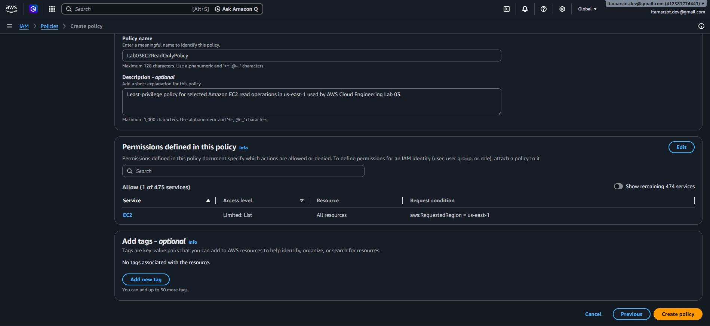


After creation, confirm that the policy appears under **Customer managed policies**.

> Policy validation helps identify problems, but it does not replace authorization testing or broader security review.


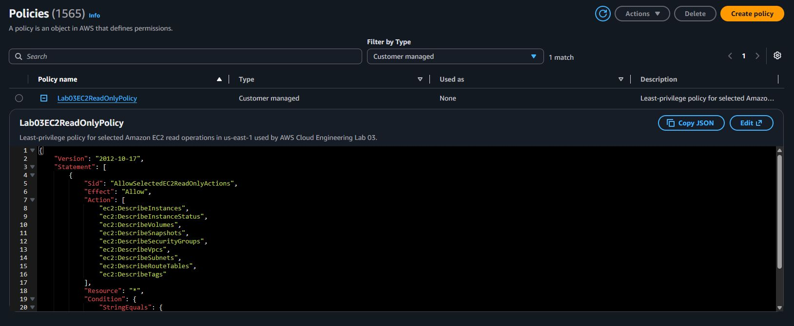


---

# Step 6 — Create a Dedicated EC2 IAM Role

Create a laboratory role that demonstrates workload identity without modifying the running instance from previous labs.

Navigate to:

```text
IAM
 ↓
Roles
 ↓
Create role
```

Select:

```text
Trusted entity type:
AWS service
```

Choose:

```text
Service or use case:
EC2
```


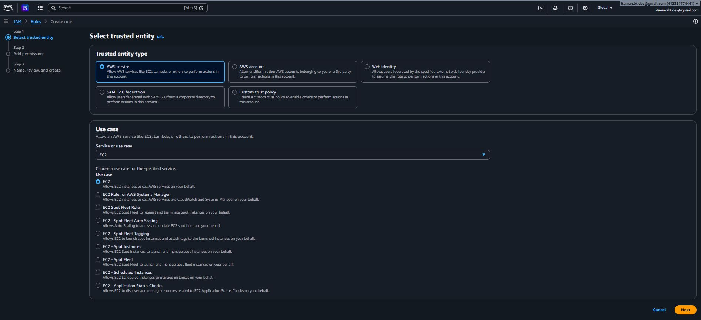


The resulting trust relationship should allow:

```text
ec2.amazonaws.com
```

to assume the role.

Use the role name:

```text
Lab03-EC2-ReadOnly-Role
```

Suggested description:

```text
Educational EC2 workload role used to demonstrate trust policies, temporary credentials, and least-privilege authorization in Lab 03.
```

The equivalent trust policy is maintained in:

```text
policies/lab03-ec2-role-trust-policy.json
```

The important relationship is:

```text
EC2 Service Principal
        │
        │ Allowed by trust policy
        ▼
Lab03-EC2-ReadOnly-Role
```

> This role is intentionally **not attached to the existing Lab 01/02 EC2 instance**. Replacing the instance profile could disrupt SSM or monitoring access. The existing `EC2-SSM-Role` remains unchanged.


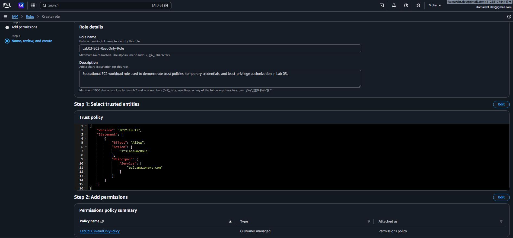


---

# Step 7 — Attach the Least-Privilege Policy to the Role

Open:

```text
IAM
 ↓
Roles
 ↓
Lab03-EC2-ReadOnly-Role
 ↓
Permissions
```


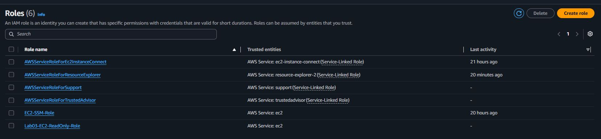


Attach:

```text
Lab03EC2ReadOnlyPolicy
```


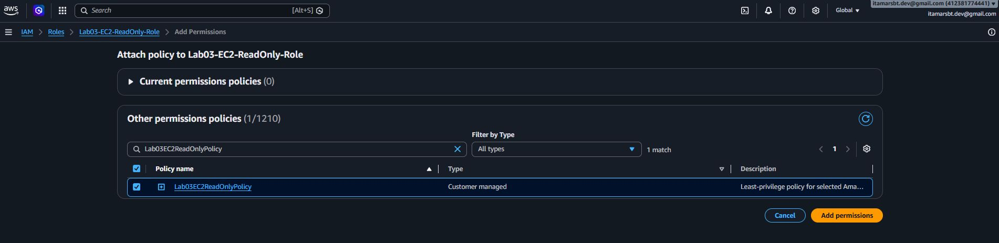


The role now contains two separate security relationships:

```text
Trust Policy
     │
     └── EC2 may assume the role
```

and:

```text
Permissions Policy
        │
        └── Role may perform selected EC2 Describe actions
```

The complete authorization model is:

```text
EC2
 │
 │ Trust relationship
 ▼
Lab03-EC2-ReadOnly-Role
 │
 │ Permissions policy
 ▼
Lab03EC2ReadOnlyPolicy
 │
 ▼
Selected EC2 Describe APIs
 │
 ▼
us-east-1
```


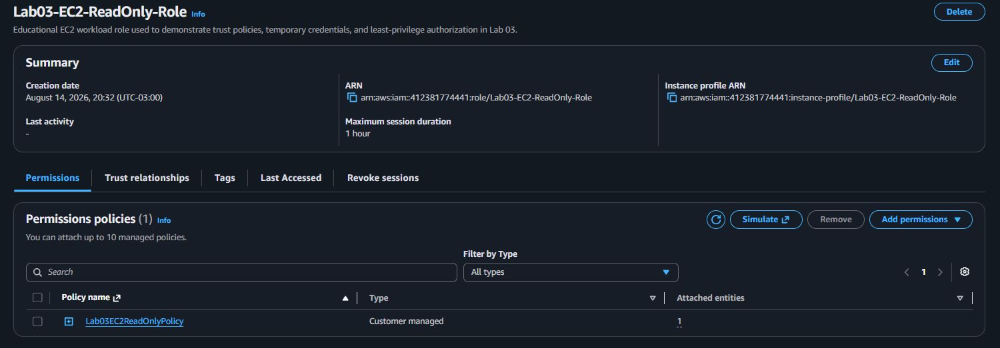


---

# Step 8 — Evaluate Allowed and Denied Actions

Where available, use the **IAM Policy Simulator** or another appropriate IAM policy evaluation workflow to inspect the permissions associated with:

```text
Lab03-EC2-ReadOnly-Role
```

When evaluating the regional condition, ensure the simulation context reflects:

```text
aws:RequestedRegion = us-east-1
```

The expected authorization model is:

| Action | Expected Result | Reason |
|---|---|---|
| `ec2:DescribeInstances` | ALLOWED | Explicitly granted |
| `ec2:DescribeVolumes` | ALLOWED | Explicitly granted |
| `ec2:DescribeSecurityGroups` | ALLOWED | Explicitly granted |
| `ec2:RunInstances` | DENIED | Not granted |
| `ec2:StopInstances` | DENIED | Not granted |
| `ec2:TerminateInstances` | DENIED | Not granted |
| `s3:DeleteBucket` | DENIED | No S3 permission |

A request outside `us-east-1` should not satisfy the regional condition for the actions controlled by this policy.

This demonstrates:

```text
Explicitly allowed action
          │
          ▼
        ALLOW
```

while:

```text
Permission not granted
          │
          ▼
     IMPLICIT DENY
```

An applicable **explicit deny** from another policy layer would override an allow.

---

# Step 9 — Compare Workforce and Workload Access

The final implementation step compares the role created in this lab with the modern AWS workforce model.

## Workload Access Implemented in This Lab

```text
EC2 Workload
     │
     ▼
IAM Role
     │
     ▼
Temporary Credentials
     │
     ▼
AWS APIs
```

## Modern Workforce Access

A common modern model is:

```text
Employee / Engineer
        │
        ▼
Identity Provider
        │
        ▼
AWS IAM Identity Center
        │
        ▼
Permission Set
        │
        ▼
IAM Role
        │
        ▼
Temporary Credentials
        │
        ▼
AWS Account / Resources
```

You may open the **IAM Identity Center** console to review the service and its concepts.

However, enabling or redesigning IAM Identity Center is **not required by this lab**.

Why?

An organization instance of IAM Identity Center is the recommended architecture for centralized AWS account access and is closely related to AWS Organizations and broader account governance.

That configuration should be designed intentionally rather than enabled only to complete a small IAM exercise.

The important learning objective is to recognize that modern workforce access is different from creating a permanent IAM user.

---

# Validation

Before cleanup, verify the complete Lab 03 configuration.

## Existing Workload Role

Confirm:

- `EC2-SSM-Role` still exists.
- Its trust relationship allows EC2 to assume the role.
- Existing SSM and monitoring permissions remain unchanged.
- The running EC2 instance remains accessible through Session Manager.

## Instance Identity

Confirm:

- IMDSv2 can return the attached role name.
- The role name is `EC2-SSM-Role`.
- No static AWS credentials were created for the instance.

## Customer Managed Policy

Confirm:

- `Lab03EC2ReadOnlyPolicy` exists.
- Only selected EC2 `Describe` actions are allowed.
- No write or destructive EC2 permissions are included.
- The `aws:RequestedRegion` condition is configured for `us-east-1`.
- IAM Access Analyzer policy validation was reviewed.

## Laboratory Role

Confirm:

- `Lab03-EC2-ReadOnly-Role` exists.
- Its trust relationship uses the EC2 service principal.
- `Lab03EC2ReadOnlyPolicy` is attached.
- The role was not attached to or substituted for `EC2-SSM-Role`.

## Authorization Model

Expected:

```text
Selected EC2 Describe actions → ALLOWED

EC2 write actions             → DENIED

EC2 destructive actions       → DENIED

Unrelated service actions     → DENIED
```

## Workforce Model

Confirm that you can explain why:

```text
IAM Identity Center / Federation
```

is generally preferred for human workforce access, while:

```text
IAM Roles
```

are used for AWS workloads such as EC2.

---

# Security Best Practices Applied

## 1. Temporary Credentials

The lab emphasizes temporary credentials for both human and workload access models.

No long-term access key is created.

---

## 2. Workload Roles Instead of Embedded Credentials

EC2 workloads use IAM roles rather than credentials stored in:

```text
Source code
Environment files
Shell scripts
Configuration files
Git repositories
```

---

## 3. Federation for Human Access

IAM users are not used as the default workforce model.

The lab presents federation and IAM Identity Center as the modern architecture for human access.

---

## 4. Least Privilege

The customer managed policy grants only the actions required by the exercise.

It does not use:

```json
"Action": "*"
```

or:

```json
"Action": "ec2:*"
```

---

## 5. Explicit Action Selection

The policy explicitly identifies permitted API operations.

This makes the authorization scope easier to understand, review, and audit.

---

## 6. Conditions as Additional Guardrails

The policy uses:

```json
"aws:RequestedRegion": "us-east-1"
```

to further restrict supported requests.

---

## 7. Separate Trust from Permissions

The lab explicitly separates:

```text
WHO may assume the role
```

from:

```text
WHAT the role may do
```

This distinction is fundamental to secure role design.

---

## 8. Policy Validation

IAM Access Analyzer policy validation is reviewed before relying on the policy.

This adds automated policy analysis to manual review.

---

## 9. Preserve Existing Production-Like Dependencies

The lab does not replace the instance profile on the running EC2 instance merely to demonstrate another IAM role.

This avoids unnecessarily disrupting:

- Systems Manager access
- CloudWatch Agent permissions
- Existing laboratory dependencies

---

## 10. No Credentials in Source Control

Never commit:

```text
AWS_ACCESS_KEY_ID
AWS_SECRET_ACCESS_KEY
AWS_SESSION_TOKEN
Passwords
Private keys
Authentication tokens
```

to GitHub.

The repository stores **policy definitions**, not credentials.

---

# Cleanup

Only resources created specifically for Lab 03 should be removed.

Preserve:

```text
EC2-SSM-Role
```

and the existing EC2 instance.

Recommended cleanup order:

```text
Lab03-EC2-ReadOnly-Role
        │
        ▼
Detach Lab03EC2ReadOnlyPolicy
        │
        ▼
Delete Lab03-EC2-ReadOnly-Role
        │
        ▼
Delete Lab03EC2ReadOnlyPolicy
```

## Cleanup Step 1 — Detach the Policy

Navigate to:

```text
IAM
 ↓
Roles
 ↓
Lab03-EC2-ReadOnly-Role
 ↓
Permissions
```

Detach:

```text
Lab03EC2ReadOnlyPolicy
```

## Cleanup Step 2 — Delete the Laboratory Role

Delete:

```text
Lab03-EC2-ReadOnly-Role
```

## Cleanup Step 3 — Delete the Customer Managed Policy

Navigate to:

```text
IAM
 ↓
Policies
```

Locate:

```text
Lab03EC2ReadOnlyPolicy
```

Delete it.

## Cleanup Step 4 — Preserve Existing Resources

Confirm that:

```text
EC2-SSM-Role
```

still exists and that the EC2 instance remains accessible through Session Manager.

---

# Post-Cleanup Validation

Expected final state:

| Resource | Expected State |
|---|---|
| `Lab03-EC2-ReadOnly-Role` | Deleted |
| `Lab03EC2ReadOnlyPolicy` | Deleted |
| `EC2-SSM-Role` | Preserved |
| Existing EC2 instance | Preserved |

Repository policy files remain because they are documentation and reusable artifacts:

```text
policies/lab03-ec2-read-only-policy.json
policies/lab03-ec2-role-trust-policy.json
```

---

# Troubleshooting

## EC2-SSM-Role Is Missing

If the role does not exist, review Lab 01 before continuing.

Do not create a different role merely to force the current instructions to match.

The Lab 03 workflow assumes the previous EC2/SSM environment exists.

---

## Session Manager Does Not Connect

Check:

- The EC2 instance is running.
- SSM Agent is running.
- `EC2-SSM-Role` is still attached through the instance profile.
- `AmazonSSMManagedInstanceCore` remains available to the instance.
- Network connectivity required by Systems Manager is available.

Do not replace the existing instance profile during Lab 03.

---

## IMDSv2 Query Returns an Error

Verify that:

- The command is running inside the EC2 instance.
- The token request completed successfully.
- The metadata endpoint is reachable.
- IMDS is enabled for the instance.

Use IMDSv2 rather than intentionally downgrading the laboratory to IMDSv1.

---

## IAM Access Analyzer Reports a Finding

Do not automatically ignore validation findings.

Read:

- Finding type
- Affected policy element
- Suggested remediation
- Security impact

Some findings may be informational, while others may require a policy change.

---

## Policy Cannot Be Attached

Confirm that:

```text
Lab03EC2ReadOnlyPolicy
```

was successfully created and that you are viewing customer managed policies.

Also confirm that your current administrative identity has permission to attach policies to roles.

---

## Policy Simulator Shows an Unexpected Deny

Verify:

- The correct role is selected.
- The action exists in the policy.
- The policy is attached.
- The simulation context includes `aws:RequestedRegion = us-east-1` when required.
- No explicit deny applies.

Remember:

```text
Explicit DENY
     │
     ▼
Overrides ALLOW
```

---

## Policy Simulator Shows More Access Than Expected

A principal can receive permissions from multiple policy sources.

Review:

- Identity-based policies
- Permissions boundaries
- Session policies
- Resource policies
- Service control policies where applicable

The final effective permission is determined by AWS policy evaluation logic, not by a single policy viewed in isolation.

---

## IAM Identity Center Is Not Configured

That is acceptable for this laboratory.

The practical lab does not require enabling IAM Identity Center.

The service is included to teach the modern workforce identity architecture.

Organization-level identity design should be intentional and should not be enabled only for a disposable lab exercise.

---

## AWS Console Looks Different

AWS periodically changes console navigation and visual layout.

Focus on the underlying resources and concepts rather than reproducing the interface pixel-for-pixel.

The architectural relationships remain:

```text
Workload → IAM Role → Temporary Credentials → Permissions
```

and:

```text
Federated Human → Role → Temporary Credentials → Permissions
```

---

# Key Learnings

## Modern AWS Identity Is Role-Centric

Both workforce and workload access increasingly rely on role-based temporary credentials.

The identity source differs, but the security objective is similar.

---

## Human and Workload Identities Are Different

Human access commonly begins with federation:

```text
Human
 ↓
Identity Provider
 ↓
IAM Identity Center
 ↓
Role
```

Workload access begins with the AWS service or application:

```text
EC2
 ↓
IAM Role
```

---

## Temporary Credentials Reduce Long-Term Secret Exposure

Temporary credentials expire.

This reduces the security burden associated with permanent access keys.

---

## IAM Roles Have Two Different Security Dimensions

A role must answer:

```text
WHO / WHAT may assume me?
```

and:

```text
WHAT may I do after being assumed?
```

Trust policies answer the first question.

Permissions policies answer the second.

---

## Least Privilege Is an Iterative Engineering Practice

Least privilege is not simply choosing a policy named `ReadOnly`.

It requires understanding the actual API actions a workload needs and restricting permissions accordingly.

---

## Automated Policy Validation Adds Value

IAM Access Analyzer can identify syntax and security issues that may be missed during manual review.

Policy validation should be part of the policy-development workflow.

---

## IAM Users Still Matter — But Context Matters More

Cloud engineers must understand IAM users because they exist in AWS and in real environments.

However:

```text
Understand IAM users
        ≠
Use IAM users as the default modern workforce architecture
```

---

## Existing Dependencies Should Not Be Modified Without Need

A good laboratory should not break an existing working environment merely to demonstrate another concept.

This lab therefore creates a separate IAM role rather than replacing `EC2-SSM-Role`.

---

## Identity Design Is Part of Cloud Architecture

Identity is not an isolated administrative task.

IAM decisions affect:

- Security
- Operations
- Automation
- CI/CD
- Incident response
- Governance
- Multi-account architecture
- Compliance

Understanding IAM architecture is therefore a core cloud engineering skill.

---

# Repository Structure

The updated Lab 03 structure is intentionally compact:

```text
03-iam-roles-and-policies/
│
├── README.md
│
├── policies/
│   ├── lab03-ec2-read-only-policy.json
│   └── lab03-ec2-role-trust-policy.json
│
└── screenshots/
    └── ...
```

## `README.md`

Contains:

- Identity architecture
- IAM concepts
- Workload identity implementation
- Policy design
- Access Analyzer validation
- Authorization testing
- Security practices
- Cleanup
- Troubleshooting
- Key learnings

## `policies/`

Contains reusable policy artifacts.

### `lab03-ec2-read-only-policy.json`

Defines the selected least-privilege EC2 read permissions used by the laboratory role.

### `lab03-ec2-role-trust-policy.json`

Documents the trust relationship that allows the EC2 service to assume the laboratory role.

## `screenshots/`

Contains selected screenshots used to document the completed implementation.

Screenshots are supporting evidence only.

They are **not required to reproduce the laboratory**, and the README does not instruct readers to capture, rename, or store screenshots while following the tutorial.

---

# Next Lab

## Lab 04 — EBS Volumes and Snapshots

The next laboratory explores persistent block storage for Amazon EC2.

Topics include:

- Creating EBS volumes
- Attaching volumes to EC2 instances
- Preparing Linux storage
- Mounting filesystems
- Creating EBS snapshots
- Understanding backup and restore workflows
- Restoring data from snapshots
- Applying storage lifecycle and cleanup practices

---

> This laboratory is part of the **AWS Cloud Engineering Lab**, a hands-on repository focused on practical AWS infrastructure, operations, security, observability, automation, and Infrastructure as Code skills.
