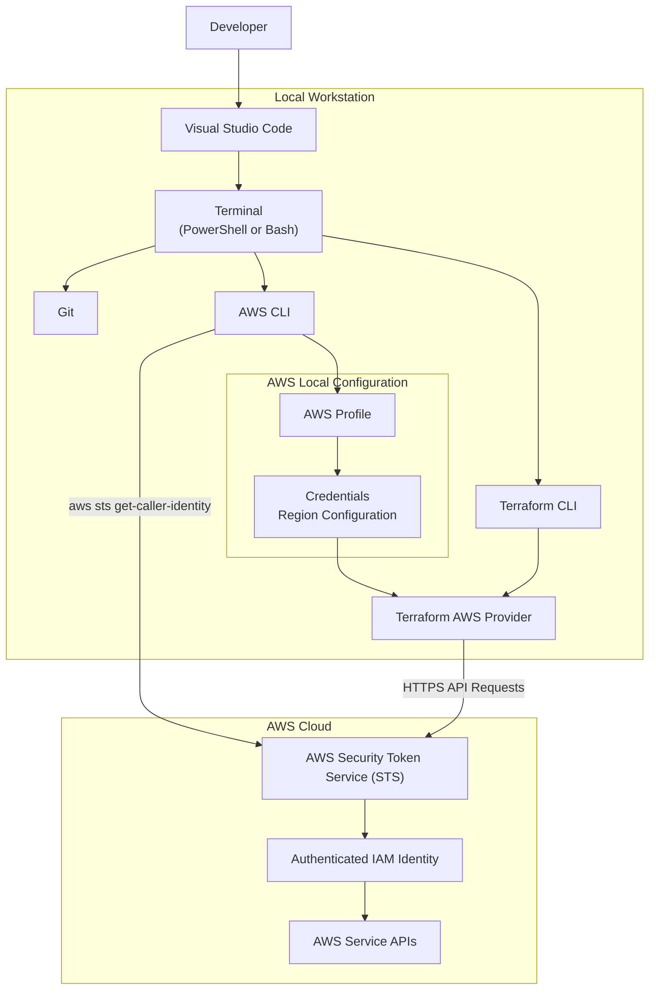
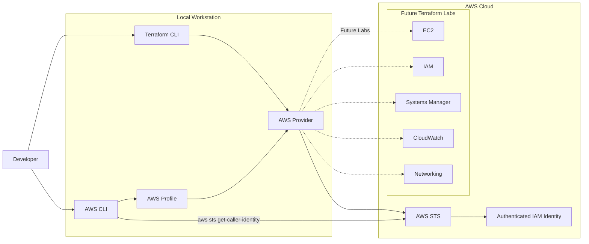

# Lab 00 — Terraform Workstation Setup and AWS Authentication

Prepare your local development environment to provision AWS infrastructure securely using Terraform.

---

## Overview

Before Terraform can provision infrastructure on AWS, your local workstation must be properly prepared. This laboratory guides you through the installation of the required tools, the configuration of AWS authentication, and the validation of your local environment.

Unlike the other laboratories in this repository, **Lab 00 does not create any AWS resources**. Its purpose is to establish a secure and reliable foundation for all subsequent Terraform laboratories.

By the end of this laboratory, your workstation will be fully configured to communicate securely with AWS using the AWS CLI and the Terraform AWS Provider.

---

## Learning Objectives

After completing this laboratory, you will be able to:

- Install and verify the required software for Terraform development.
- Understand the role of Git, Visual Studio Code, Terraform CLI, and AWS CLI.
- Configure a secure AWS CLI profile.
- Validate your AWS identity before provisioning infrastructure.
- Understand how Terraform authenticates with AWS.
- Apply security best practices when managing AWS credentials.
- Prepare your workstation for all subsequent laboratories in this repository.

---

## Laboratory Architecture

This laboratory focuses on preparing the local development environment. The following diagram illustrates how Terraform authenticates and communicates with AWS during infrastructure provisioning.



And **"Future Terraform Labs"**:




---

## Estimated Time

Approximately **30 to 45 minutes**.

The actual duration depends on whether the required software is already installed and whether an AWS account has already been configured.

---

## Estimated AWS Cost

**Estimated cost: USD $0.00**

This laboratory does **not** provision AWS infrastructure and therefore does not generate charges in your AWS account.

---

## Prerequisites

Before starting this laboratory, ensure that you have:

- An active AWS account.
- Permission to create or use an existing IAM user.
- Internet access.
- Administrative privileges on your local computer to install software.
- A GitHub account (recommended for future laboratories).

---

## Required Software

This laboratory requires the following software:

| Software | Purpose |
|----------|---------|
| **Git** | Version control system used to clone repositories, track changes, and collaborate with other developers. |
| **Visual Studio Code** | Source code editor used to create, edit, and manage Terraform projects. |
| **Terraform CLI** | Infrastructure as Code (IaC) tool used to define, provision, and manage AWS infrastructure. |
| **AWS CLI** | Command-line interface used to authenticate with AWS and interact with AWS services. |

> **Note:**
>
> All software installed in this laboratory will be reused throughout the remaining Terraform laboratories in this repository.

---

## Stage 1 — Install the Required Software

Before Terraform can provision infrastructure on AWS, your workstation must contain the required development tools.

In this stage, you will install and validate the software required for the entire Terraform learning path.

The tools should be installed in the following order:

1. Git
2. Visual Studio Code
3. Terraform CLI
4. AWS CLI

---

### Step 1 — Install Git

Git is the distributed version control system used throughout this repository.

It allows you to:

- Clone GitHub repositories.
- Track changes to your code.
- Create branches.
- Collaborate with other developers.
- Synchronize local and remote repositories.

Download Git from the official website:

https://git-scm.com/

After the installation, open a terminal and verify the installation:

```powershell
git --version
```

Expected output:

```text
git version 2.xx.x.windows.x
```

Your installed version may be different.


---

### Step 2 — Install Visual Studio Code

Visual Studio Code (VS Code) will be used as the primary development environment throughout this repository.

Although Terraform projects can be edited using any text editor, VS Code provides features that improve productivity, including:

- Syntax highlighting
- Automatic formatting
- Integrated terminal
- Git integration
- Terraform extensions
- AWS Toolkit

Download Visual Studio Code from the official website:

https://code.visualstudio.com/

After installation, verify that VS Code opens correctly.


---

### Step 3 — Install Terraform CLI

Terraform is an Infrastructure as Code (IaC) tool developed by HashiCorp.

Instead of manually creating infrastructure through the AWS Management Console, Terraform allows infrastructure to be described as code.

This approach provides several advantages:

- Repeatability
- Version control
- Automation
- Consistency
- Documentation
- Reduced human error

Download Terraform from the official website:

https://developer.hashicorp.com/terraform/downloads

After installation, verify the installed version:

```powershell
terraform version
```

Expected output:

```text
Terraform v1.x.x
```

The installed version may differ from the version shown above.


