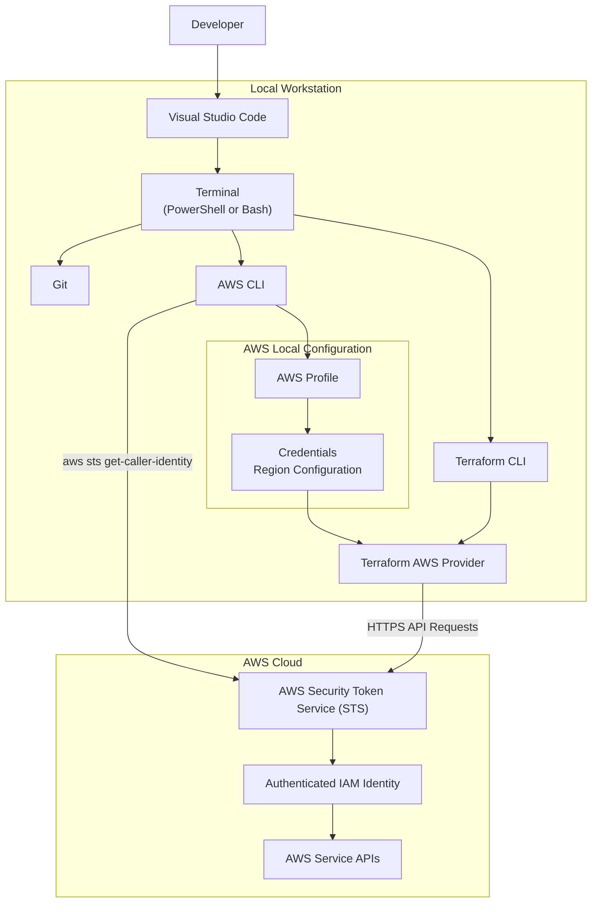
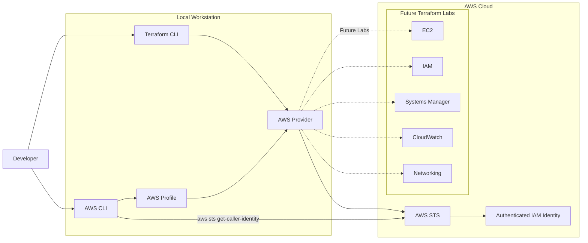
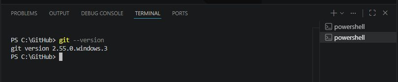
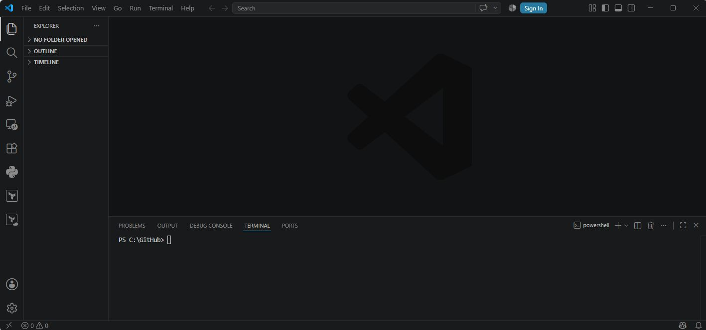
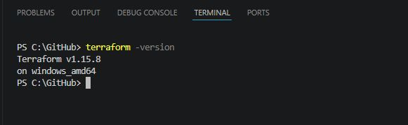
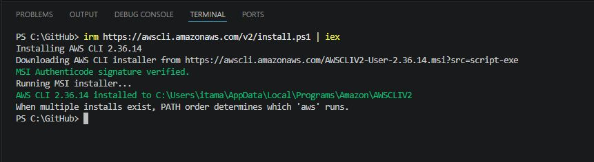
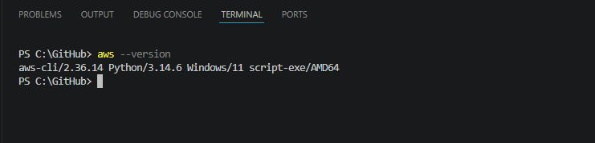
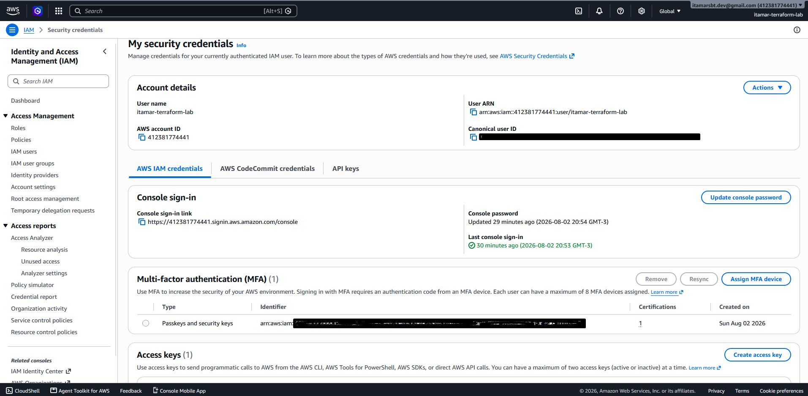

# Lab 00 — Terraform Workstation Setup and AWS Authentication

Prepare your local development environment to provision AWS infrastructure securely using Terraform.

---

## Overview

Before Terraform can provision infrastructure on AWS, your local workstation must be properly prepared. This laboratory guides you through the installation of the required tools, the configuration of AWS authentication, and the validation of your local environment.

Unlike the other laboratories in this repository, **Lab 00 does not create any AWS resources**. Its purpose is to establish a secure and reliable foundation for all subsequent Terraform laboratories.

By the end of this laboratory, your workstation will be fully configured to communicate securely with AWS using the AWS CLI and the Terraform AWS Provider.

---

## Learning Objectives

After completing this laboratory, you will be able to:

- Install and verify the required software for Terraform development.
- Understand the role of Git, Visual Studio Code, Terraform CLI, and AWS CLI.
- Configure a secure AWS CLI profile.
- Validate your AWS identity before provisioning infrastructure.
- Understand how Terraform authenticates with AWS.
- Apply security best practices when managing AWS credentials.
- Prepare your workstation for all subsequent laboratories in this repository.

---

## Laboratory Architecture

This laboratory focuses on preparing the local development environment. The following diagram illustrates how Terraform authenticates and communicates with AWS during infrastructure provisioning.



And **"Future Terraform Labs"**:




---

## Estimated Time

Approximately **30 to 45 minutes**.

The actual duration depends on whether the required software is already installed and whether an AWS account has already been configured.

---

## Estimated AWS Cost

**Estimated cost: USD $0.00**

This laboratory does **not** provision AWS infrastructure and therefore does not generate charges in your AWS account.

---

## Prerequisites

Before starting this laboratory, ensure that you have:

- An active AWS account.
- Permission to create or use an existing IAM user.
- Internet access.
- Administrative privileges on your local computer to install software.
- A GitHub account (recommended for future laboratories).

---

## Required Software

This laboratory requires the following software:

| Software | Purpose |
|----------|---------|
| **Git** | Version control system used to clone repositories, track changes, and collaborate with other developers. |
| **Visual Studio Code** | Source code editor used to create, edit, and manage Terraform projects. |
| **Terraform CLI** | Infrastructure as Code (IaC) tool used to define, provision, and manage AWS infrastructure. |
| **AWS CLI** | Command-line interface used to authenticate with AWS and interact with AWS services. |

> **Note:**
>
> All software installed in this laboratory will be reused throughout the remaining Terraform laboratories in this repository.

---

## Stage 1 — Install the Required Software

Before Terraform can provision infrastructure on AWS, your workstation must contain the required development tools.

In this stage, you will install and validate the software required for the entire Terraform learning path.

The tools should be installed in the following order:

1. Git
2. Visual Studio Code
3. Terraform CLI
4. AWS CLI

---

### Step 1 — Install Git

Git is the distributed version control system used throughout this repository.

It allows you to:

- Clone GitHub repositories.
- Track changes to your code.
- Create branches.
- Collaborate with other developers.
- Synchronize local and remote repositories.

Download Git from the official website:

https://git-scm.com/

After the installation, open a terminal and verify the installation:

```powershell
git --version
```

Expected output:

```text
git version 2.xx.x.windows.x
```

Your installed version may be different.





---

### Step 2 — Install Visual Studio Code

Visual Studio Code (VS Code) will be used as the primary development environment throughout this repository.

Although Terraform projects can be edited using any text editor, VS Code provides features that improve productivity, including:

- Syntax highlighting
- Automatic formatting
- Integrated terminal
- Git integration
- Terraform extensions
- AWS Toolkit

Download Visual Studio Code from the official website:

https://code.visualstudio.com/

After installation, verify that VS Code opens correctly.





---

### Step 3 — Install Terraform CLI

Terraform is an Infrastructure as Code (IaC) tool developed by HashiCorp.

Instead of manually creating infrastructure through the AWS Management Console, Terraform allows infrastructure to be described as code.

This approach provides several advantages:

- Repeatability
- Version control
- Automation
- Consistency
- Documentation
- Reduced human error

Download Terraform from the official website:

https://developer.hashicorp.com/terraform/downloads

After installation, verify the installed version:

```powershell
terraform version
```

Expected output:

```text
Terraform v1.x.x
```

The installed version may differ from the version shown above.





---

### Step 4 — Install AWS CLI

The AWS Command Line Interface (AWS CLI) is the primary tool used to authenticate your local workstation with AWS.

Terraform does not authenticate directly with AWS.

Instead, the AWS Provider uses credentials that are already available on your local workstation, typically configured through the AWS CLI.

Download AWS CLI Version 2 from the official AWS website:

https://aws.amazon.com/cli/

After installation, verify that the AWS CLI is available:

```powershell
aws --version
```

Expected output:

```text
aws-cli/2.xx.x
```

The installed version may differ from the version shown above.





In case of an error, completely close your command prompt or VS Code.

Open a new PowerShell window and test the command again: `aws --version`.





---

## Stage 2 — Create a Secure AWS Identity

Before Terraform can provision infrastructure, AWS must know **who** is making the request and **what actions** that identity is allowed to perform.

In AWS, every API request is associated with an authenticated identity and evaluated against a set of permissions. Understanding this authentication model is essential before using Terraform.

In this stage, you will create or configure an AWS identity that Terraform can use safely to provision infrastructure throughout this learning path.


---


### Step 1 — Understand AWS Identities

AWS provides different types of identities, each designed for a specific purpose.

The most common identities are:

| Identity | Purpose |
|----------|---------|
| **Root User** | The original account owner with unrestricted access to all AWS services. |
| **IAM User** | A permanent identity used by people or applications. |
| **IAM Role** | A temporary identity that can be assumed by AWS services, users, or applications. |

Throughout this repository, these identities will be used for different purposes.

Understanding the difference between them is essential before provisioning infrastructure with Terraform.


---


### Step 2 — Understand the Root User

When an AWS account is created, AWS automatically creates a **Root User**.

The Root User has unrestricted access to every AWS service and resource.

Because of these privileges, the Root User should **never** be used for day-to-day administrative tasks or Terraform deployments.

Use the Root User only for exceptional account-management activities, such as:

- Closing the AWS account.
- Managing billing information.
- Recovering account access.
- Configuring certain account-level security settings.

For all other activities, use IAM identities instead.


---


### Step 3 — Create an IAM User

Terraform should authenticate using an IAM identity instead of the Root User.

If you do not already have an IAM user for laboratory activities, create one now.

Suggested name:

```text
terraform-lab
```

This user will be used throughout this Terraform learning path.


---


### Step 4 — Grant Permissions

To complete the laboratories in this repository, the IAM user must have permission to create and manage AWS resources.

For simplicity during the learning process, many students choose to attach the **AdministratorAccess** AWS managed policy to the laboratory IAM user.

> **Important**
>
> This approach simplifies the learning experience but is **not** considered a production best practice.

In production environments, always follow the Principle of Least Privilege by granting only the permissions required for each workload.

Later laboratories will introduce more restrictive IAM policies.


---


### Step 5 — Enable Multi-Factor Authentication (MFA)

Whenever possible, enable Multi-Factor Authentication (MFA) for your IAM user.

MFA adds an additional verification factor during authentication, significantly reducing the risk of unauthorized access.

Although MFA is not mandatory for completing this laboratory, it is strongly recommended for any AWS account.





---

> **Security Note**
>
> Never:
>
> - Commit AWS credentials to GitHub.
> - Store credentials inside Terraform files.
> - Share credentials with other users.
> - Publish screenshots containing Access Key IDs or Secret Access Keys.


---


## Stage Summary

At this point you have:

- Learned the differences between AWS identity types.
- Understood why the Root User should not be used.
- Created an IAM user for laboratory activities.
- Granted the required permissions.
- Enabled MFA (recommended).
- Generated Access Keys for AWS CLI authentication.

In the next stage, you will configure these credentials locally using the AWS CLI.


---


# Stage 3 — Configure AWS CLI Authentication

After creating an IAM user and generating an Access Key, the next step is to configure your local workstation so that the AWS CLI and Terraform can authenticate securely with your AWS account.

In this stage, you will configure an AWS CLI profile, validate your identity, and confirm that your workstation is ready to provision infrastructure.

> **Important!**
>
> This stage only stores your credentials locally. No AWS resources are created.

---

## Step 1 — Understand AWS CLI Profiles

An AWS CLI profile is a named collection of configuration settings and credentials stored on your local workstation.

A profile typically contains:

- AWS Access Key ID
- AWS Secret Access Key
- Default AWS Region
- Default Output Format

Profiles allow you to work with multiple AWS accounts without changing your Terraform code.

Throughout this learning path, we recommend creating a dedicated profile for the laboratory environment.

Suggested profile name:

```text
terraform-lab
```

Using a dedicated profile reduces the risk of accidentally provisioning infrastructure in the wrong AWS account.

---

## Step 2 — Configure the AWS CLI Profile

Open a terminal and run:

```powershell
aws configure --profile terraform-lab
```

The AWS CLI will prompt for four values:

```text
AWS Access Key ID [None]:
AWS Secret Access Key [None]:
Default region name [None]:
Default output format [None]:
```

Provide the following information:

| Prompt | Example |
|--------|----------|
| AWS Access Key ID | AKIA... |
| AWS Secret Access Key | Your Secret Access Key |
| Default Region | us-east-1 |
| Default Output Format | json |

> **Note**
>
> Replace the example values with your own AWS credentials.


---

