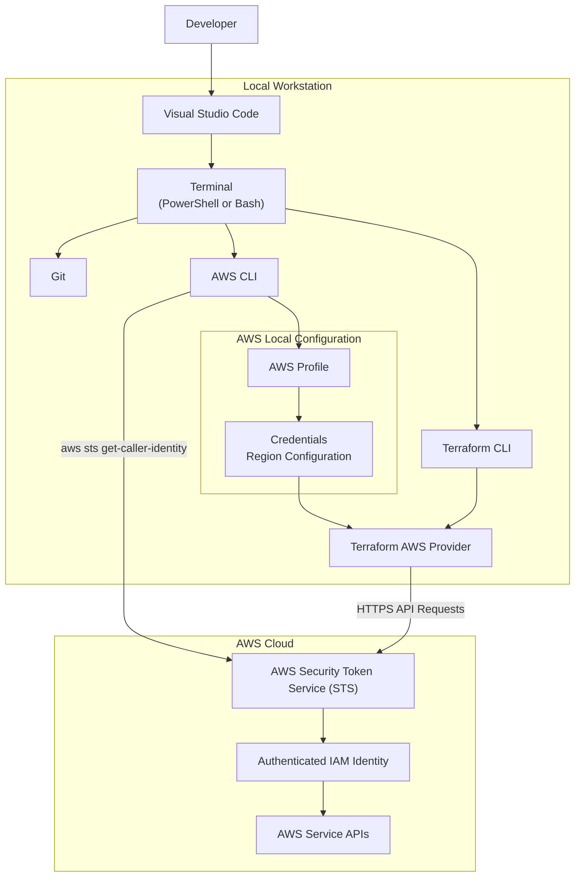

# Lab 00 — Terraform Workstation Setup and AWS Authentication

Prepare your local development environment to provision AWS infrastructure securely using Terraform.

---

## Overview

Before Terraform can provision infrastructure on AWS, your local workstation must be properly prepared. This laboratory guides you through the installation of the required tools, the configuration of AWS authentication, and the validation of your local environment.

Unlike the other laboratories in this repository, **Lab 00 does not create any AWS resources**. Its purpose is to establish a secure and reliable foundation for all subsequent Terraform laboratories.

By the end of this laboratory, your workstation will be fully configured to communicate securely with AWS using the AWS CLI and the Terraform AWS Provider.

---

## Learning Objectives

After completing this laboratory, you will be able to:

- Install and verify the required software for Terraform development.
- Understand the role of Git, Visual Studio Code, Terraform CLI, and AWS CLI.
- Configure a secure AWS CLI profile.
- Validate your AWS identity before provisioning infrastructure.
- Understand how Terraform authenticates with AWS.
- Apply security best practices when managing AWS credentials.
- Prepare your workstation for all subsequent laboratories in this repository.

---

## Laboratory Architecture

This laboratory focuses on preparing the local development environment. The following diagram illustrates how Terraform authenticates and communicates with AWS during infrastructure provisioning.

---

## Estimated Time

Approximately **30 to 45 minutes**.

The actual duration depends on whether the required software is already installed and whether an AWS account has already been configured.

---

## Estimated AWS Cost

**Estimated cost: USD $0.00**

This laboratory does **not** provision AWS infrastructure and therefore does not generate charges in your AWS account.

---

## Prerequisites

Before starting this laboratory, ensure that you have:

- An active AWS account.
- Permission to create or use an existing IAM user.
- Internet access.
- Administrative privileges on your local computer to install software.
- A GitHub account (recommended for future laboratories).
