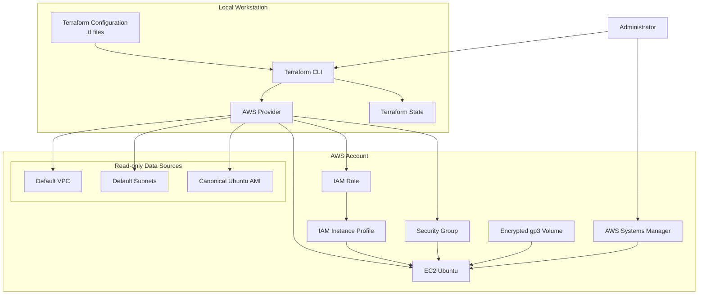
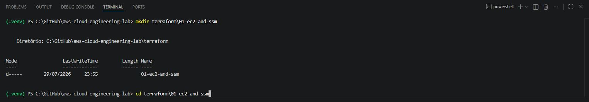
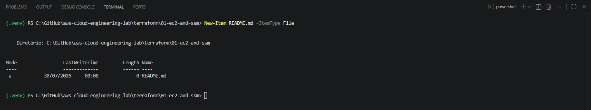
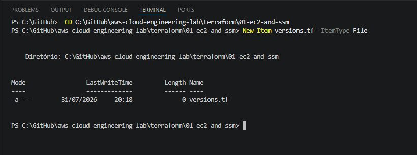
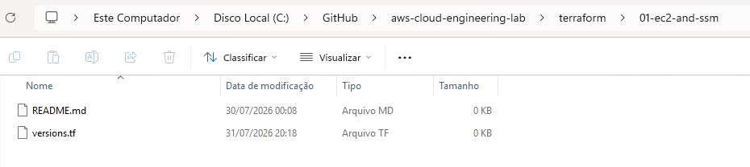
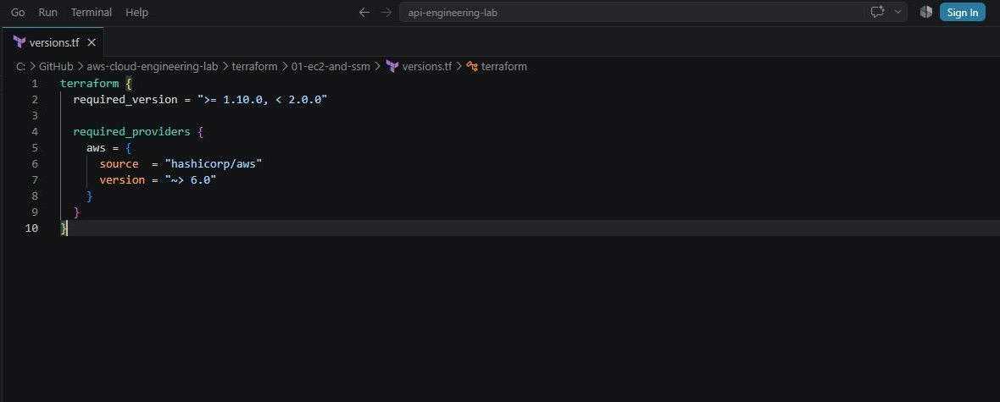
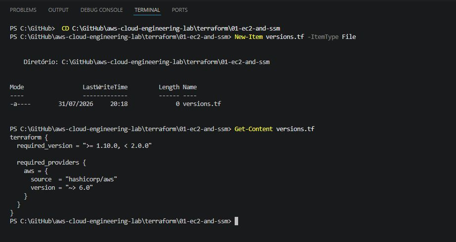
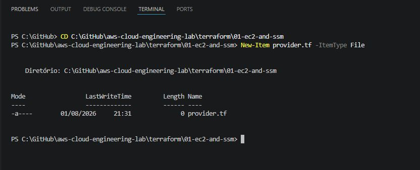
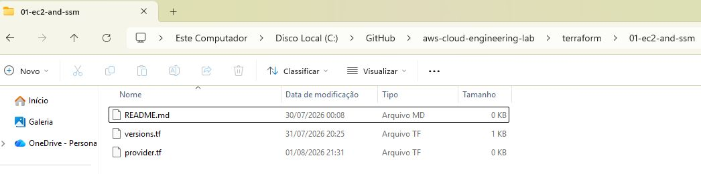
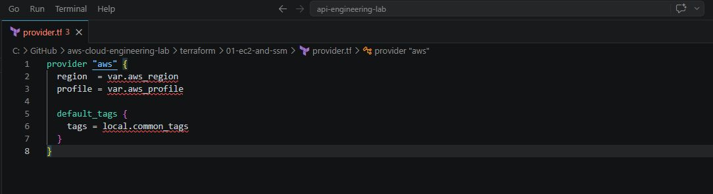

# Lab 01 — EC2 and SSM with Terraform

> Terraform implementation of the manual **Lab 01 — EC2 and SSM** from the AWS Cloud Engineering Lab repository.

---

## Overview

In the manual version of Lab 01, the infrastructure is created step by step using the AWS Management Console.

In this laboratory, the same architecture will be reproduced using **Terraform**, allowing the infrastructure to be provisioned, validated and destroyed through Infrastructure as Code (IaC).

Instead of simply executing ready-made Terraform files, this tutorial explains how each file is designed, why it exists, and how all Terraform components work together.

By the end of this lab you will understand not only **how to provision infrastructure with Terraform**, but also **how Terraform models AWS resources**, tracks infrastructure state and enables repeatable deployments.

---

## Target Audience

This laboratory is intended for:

- Students learning AWS and Infrastructure as Code.
- Beginners starting their DevOps or Cloud Engineering journey.
- Recruiters evaluating practical cloud engineering projects.
- Technical leaders reviewing Terraform organization, engineering decisions and documentation quality.

---

## Learning Objectives

After completing this laboratory, you will be able to:

- Understand the structure of a Terraform project.
- Organize Terraform configurations following good engineering practices.
- Provision AWS infrastructure using Infrastructure as Code.
- Compare manual provisioning with automated provisioning.
- Validate deployed resources.
- Destroy infrastructure safely.
- Understand the relationship between Terraform configuration, Terraform State and AWS resources.

---

## Relationship with the Manual Laboratory

This Terraform implementation reproduces the architecture created manually in:

➡️ **labs/01-ec2-and-ssm**

The manual implementation remains unchanged.

Terraform creates a second infrastructure using distinct resource names, making it possible to compare both implementations side by side before removing only the Terraform-managed resources.

---


## Laboratory Roadmap

This laboratory is divided into four stages.

### Stage 1 — Build the Terraform project

Create the project structure and understand the purpose of every Terraform file.

### Stage 2 — Provision infrastructure

Deploy an EC2 instance using Terraform.

### Stage 3 — Validate the infrastructure

Inspect the deployed resources using Terraform, AWS CLI and the AWS Console.

### Stage 4 — Destroy the infrastructure

Review a destroy plan and safely remove only the Terraform-managed resources.


---


## Before We Start

Terraform does not interact directly with your source code.

Instead, it compares:

- your Terraform configuration;
- its current state;
- the actual infrastructure running in AWS.

Whenever differences are detected, Terraform generates an execution plan describing which resources should be created, updated or destroyed.

Understanding this workflow is far more important than memorizing Terraform syntax.


---

## Architecture




This diagram adds three important concepts:

1. **Terraform Configuration** (the `.tf` files).
2. **Terraform State**, showing that it is part of the architecture.
3. **AWS Provider**, clarifying that it acts as the bridge between Terraform and AWS.

Additionally, it visually distinguishes between components that are merely queried (*Data Sources*) and those that are created (*Resources*).


---


# Stage 1 — Build the Terraform Project from Scratch

The following sections build the Terraform project incrementally.

Rather than copying a finished solution, each Terraform file will be created from scratch, explained in detail and validated before moving to the next stage.

This approach mirrors how infrastructure is developed, reviewed and maintained in professional engineering teams.


---


## Step 1 — Create the Project Directory

Before writing any Terraform code, create the directory that will contain the laboratory.

From the repository root:

```powershell
mkdir terraform\01-ec2-and-ssm
cd terraform\01-ec2-and-ssm
```




At this point, the directory should contain only:

```text
terraform/
└── 01-ec2-and-ssm/
    └── README.md
```




The remaining files will be created progressively throughout this laboratory.

> [!NOTE]
> Although the final repository already contains the completed Terraform files, this tutorial intentionally builds them from scratch so that every design decision can be understood before any infrastructure is provisioned.


---


## Step 2 — Create the First Terraform File (`versions.tf`)

The first file in this project will be `versions.tf`.


This file defines:

- which Terraform CLI versions can execute the configuration;
- which external providers the project requires;
- where Terraform must obtain those providers;
- which provider versions are considered compatible with the project.

Defining these requirements before creating AWS resources improves consistency and helps prevent the project from being executed with incompatible versions.

---

### Understanding Terraform Providers

Terraform itself does not contain native instructions for creating an EC2 instance, an IAM Role or a Security Group.

Instead, Terraform uses plugins called **providers** to communicate with external platforms and services.

In this laboratory, Terraform will use the AWS Provider:

```text
Terraform Configuration
        ↓
Terraform CLI
        ↓
AWS Provider
        ↓
AWS APIs
        ↓
AWS Resources
```

The AWS Provider translates the infrastructure declared in the `.tf` files into API requests understood by AWS.

> [!IMPORTANT]
> Declaring the AWS Provider as a project dependency is different from configuring it.
>
> In `versions.tf`, we declare which provider the project requires.
>
> In the next file, `provider.tf`, we will configure details such as the AWS Region and local AWS CLI profile.

---

### Create `versions.tf`

From the laboratory directory, create the file using PowerShell:

```powershell
New-Item versions.tf -ItemType File
```




Alternatively, create the file directly through the VS Code Explorer:

1. Right-click the `01-ec2-and-ssm` directory.
2. Select **New File**.
3. Enter:

```text
versions.tf
```




At this point, the project structure should be:

```text
terraform/
└── 01-ec2-and-ssm/
    ├── README.md
    └── versions.tf
```

---

### Add the Terraform Version Requirements

Open `versions.tf` and add:

```hcl
terraform {
  required_version = ">= 1.10.0, < 2.0.0"

  required_providers {
    aws = {
      source  = "hashicorp/aws"
      version = "~> 6.0"
    }
  }
}
```

Save the file.





---

### Understanding the `terraform` Block

The top-level `terraform` block configures the behavior and requirements of the Terraform project.

```hcl
terraform {
  # Terraform settings are declared here.
}
```

It does not create infrastructure in AWS.

Instead, it defines requirements that Terraform must evaluate before processing the resources declared in the remaining files.

Only constant values can be used inside this block. It cannot depend on resources, variables or values that Terraform would calculate later.

---

### Understanding `required_version`

The following line defines which versions of the Terraform CLI are allowed to execute this configuration:

```hcl
required_version = ">= 1.10.0, < 2.0.0"
```

It contains two constraints:

```text
>= 1.10.0
```

The installed Terraform CLI must be version `1.10.0` or newer.

```text
< 2.0.0
```

The installed version must remain below Terraform `2.0.0`.

Together, these constraints mean:

```text
Terraform 1.10.0 or newer
        AND
Terraform earlier than 2.0.0
```

Examples:

| Installed version | Accepted? | Reason |
|---|---:|---|
| `1.9.8` | No | Earlier than `1.10.0` |
| `1.10.0` | Yes | Meets both constraints |
| `1.12.3` | Yes | Within the accepted range |
| `2.0.0` | No | Excluded by `< 2.0.0` |

> [!NOTE]
> `required_version` applies to the Terraform CLI installed on the workstation. It does not define the version of the AWS Provider.

When an incompatible Terraform CLI version is used, Terraform stops before planning or modifying the infrastructure.

---

### Understanding `required_providers`

The `required_providers` block declares the external plugins required by the project:

```hcl
required_providers {
  aws = {
    source  = "hashicorp/aws"
    version = "~> 6.0"
  }
}
```

This project currently requires only one provider:

```text
aws
```

The name `aws` becomes the provider's local identifier inside this Terraform module.

Later, AWS resources will use this provider implicitly:

```hcl
resource "aws_instance" "lab01" {
  # EC2 configuration
}
```

The prefix `aws_` indicates that the resource type belongs to the AWS Provider.

---

### Understanding the Provider Source

The following declaration identifies where the provider comes from:

```hcl
source = "hashicorp/aws"
```

The address contains two parts:

```text
hashicorp / aws
    │        │
    │        └── Provider type
    │
    └── Provider namespace
```

Because no registry hostname is specified, Terraform uses the public Terraform Registry by default.

The full source address is effectively:

```text
registry.terraform.io/hashicorp/aws
```

This declaration prevents ambiguity and ensures Terraform knows which provider package must be installed.

---

### Understanding the AWS Provider Version Constraint

The following line defines the accepted AWS Provider versions:

```hcl
version = "~> 6.0"
```

The pessimistic constraint operator `~>` allows compatible updates within the same major version.

In this case:

```text
~> 6.0
```

is equivalent to:

```text
>= 6.0.0, < 7.0.0
```

Examples:

| AWS Provider version | Accepted? | Reason |
|---|---:|---|
| `5.100.0` | No | Earlier major version |
| `6.0.0` | Yes | Minimum accepted version |
| `6.8.0` | Yes | Compatible 6.x release |
| `6.99.0` | Yes | Still within the 6.x series |
| `7.0.0` | No | New major version |

Major provider releases can introduce breaking changes. Preventing an automatic upgrade to version `7.x` reduces the risk of an unexpected incompatibility.

---

### Why Not Use `latest`?

Terraform does not use a declaration such as:

```hcl
version = "latest"
```

Version constraints describe a range of acceptable versions.

During initialization, Terraform selects a provider version that satisfies the declared constraint. It then records the selected version in the dependency lock file:

```text
.terraform.lock.hcl
```

This produces an important combination:

```text
versions.tf
    ↓
Defines the acceptable version range

.terraform.lock.hcl
    ↓
Records the version actually selected
```

For example, the configuration may allow any provider in the `6.x` series, while the lock file records the exact version installed on the workstation.

The lock file should normally be committed to Git so that other contributors and automated environments can use the same selected provider version.

> [!IMPORTANT]
> The `.terraform.lock.hcl` file will be created later when `terraform init` is executed.
>
> Do not create this file manually.

---

### File Name and Terraform Loading Behavior

The name `versions.tf` is a project organization convention.

Terraform automatically reads all files ending in `.tf` from the current working directory and evaluates them together as a single module.

Therefore, Terraform does not execute files in this sequence:

```text
versions.tf
provider.tf
variables.tf
compute.tf
```

Instead, it loads their declarations together:

```text
All .tf files in the directory
              ↓
      One Terraform module
```

Splitting the configuration into multiple files improves navigation and maintenance, but it does not define an execution order.

> [!NOTE]
> The HashiCorp style guide commonly uses `terraform.tf` for the top-level `terraform` block. This laboratory uses `versions.tf`, another widely understood convention, because the file's responsibility is to centralize Terraform and provider version requirements.
>
> Consistency within the repository is more important than treating the filename as a Terraform requirement.

---

### Engineering Notes

**Purpose**

Define the compatible Terraform CLI versions and declare the AWS Provider dependency.

**Why this file exists**

Without explicit version requirements, different contributors could execute the same project using incompatible Terraform or provider versions.

Version constraints make compatibility expectations visible in the source code.

**Design decision**

This laboratory accepts:

```text
Terraform CLI >= 1.10.0 and < 2.0.0
AWS Provider >= 6.0.0 and < 7.0.0
```

The constraints allow compatible improvements while preventing automatic adoption of a new major release.

**Production considerations**

Production environments may use stricter constraints, automated dependency update tools and validation pipelines before adopting new Terraform or provider versions.

For example:

```hcl
version = "~> 6.3.0"
```

would allow updates in the `6.3.x` series but reject `6.4.0`.

An exact constraint such as:

```hcl
version = "= 6.3.0"
```

would accept only one provider version.

The appropriate strategy depends on the team's testing, upgrade and release processes.

---

### Verify the File

Confirm that `versions.tf` contains:

```hcl
terraform {
  required_version = ">= 1.10.0, < 2.0.0"

  required_providers {
    aws = {
      source  = "hashicorp/aws"
      version = "~> 6.0"
    }
  }
}
```

You can also display the file from PowerShell:

```powershell
Get-Content versions.tf
```

The expected output is:

```text
terraform {
  required_version = ">= 1.10.0, < 2.0.0"

  required_providers {
    aws = {
      source  = "hashicorp/aws"
      version = "~> 6.0"
    }
  }
}
```





At this stage:

- no AWS resource has been created;
- no provider has been downloaded;
- no Terraform State exists;
- no AWS credentials have been added to the project;
- `terraform init` has not been executed.

The project only declares its compatibility requirements and first external dependency.

> [!WARNING]
> Do not run `terraform init` yet.
>
> We will first create the remaining foundational files and then initialize the complete project in a controlled step.


---

### Why we haven't run `terraform fmt` yet

Although `terraform fmt` doesn't create resources, we’ll save its initial use for after a few files have been created. This way, we can demonstrate a real difference between:

```text
manually written code
    ↓
terraform fmt
    ↓
canonical formatting
```

We also haven't used `terraform validate` yet, because full validation typically depends on initializing the directory and installing the declared providers. Official documentation confirms that `required_version` controls the allowed CLI version, while `required_providers` declares the source and version range for plugins; `terraform init` will install the compatible version and update the dependency file.

With this Step 2, you already learn four fundamentals before creating any resources:

```text
Terraform CLI
Provider
Version constraint
Dependency lock file
```


---


---

## Step 3 — Configure the AWS Provider (`provider.tf`)

In the previous step, the `versions.tf` file declared that this project requires the AWS Provider.

The next step is to configure how Terraform will use that provider.

This configuration will define:

- the AWS Region where the laboratory will be deployed;
- an optional AWS CLI profile;
- common tags that will be automatically applied to supported AWS resources.

The provider configuration acts as the connection layer between the Terraform project and the AWS APIs.

```text
versions.tf
    ↓
Declares the AWS Provider dependency

provider.tf
    ↓
Configures how the AWS Provider will operate

AWS Provider
    ↓
Authenticates and sends requests to AWS APIs
```

> [!IMPORTANT]
> The provider configuration does not create an AWS resource.
>
> It defines how resources and data sources belonging to the AWS Provider will communicate with AWS.

---

### Declaring and Configuring a Provider

Declaring a provider and configuring a provider are related but separate operations.

In `versions.tf`, the project declares:

```hcl
required_providers {
  aws = {
    source  = "hashicorp/aws"
    version = "~> 6.0"
  }
}
```

This tells Terraform:

```text
Provider local name: aws
Provider source:     hashicorp/aws
Accepted versions:   6.x
```

In `provider.tf`, the project configures that provider:

```hcl
provider "aws" {
  # AWS Provider settings
}
```

This block answers operational questions such as:

```text
Which AWS Region should be used?

Should Terraform use a named AWS CLI profile?

Which common tags should be applied to supported resources?
```

The distinction can be summarized as:

| File | Responsibility |
|---|---|
| `versions.tf` | Declares the provider source and compatible versions |
| `provider.tf` | Configures how the provider communicates with AWS |

---

### Create `provider.tf`

From the laboratory directory, create the file using PowerShell:

```powershell
New-Item provider.tf -ItemType File
```




Alternatively, create it through the VS Code Explorer:

1. Right-click the `01-ec2-and-ssm` directory.
2. Select **New File**.
3. Enter:

```text
provider.tf
```




The directory should now contain:

```text
terraform/
└── 01-ec2-and-ssm/
    ├── README.md
    ├── provider.tf
    └── versions.tf
```

---

### Add the AWS Provider Configuration

Open `provider.tf` and add:

```hcl
provider "aws" {
  region  = var.aws_region
  profile = var.aws_profile

  default_tags {
    tags = local.common_tags
  }
}
```

Save the file.





> [!NOTE]
> This configuration references values that have not been declared yet:
>
> - `var.aws_region`;
> - `var.aws_profile`;
> - `local.common_tags`.
>
> These values will be created in the next steps through `variables.tf` and `locals.tf`.
>
> Terraform loads all `.tf` files in the working directory as one module. Therefore, referenced declarations do not need to be located in the same file or written before the provider configuration.

---

### Understanding the `provider` Block

The provider block begins with:

```hcl
provider "aws" {
}
```

The label:

```text
aws
```

refers to the local provider name declared earlier in `required_providers`:

```hcl
required_providers {
  aws = {
    source  = "hashicorp/aws"
    version = "~> 6.0"
  }
}
```

Together, the declarations mean:

```text
Local provider name
        ↓
       aws

Provider package
        ↓
registry.terraform.io/hashicorp/aws
```

The `provider "aws"` block configures the default AWS Provider instance for this Terraform module.

Later, resources beginning with `aws_` will use this default provider configuration automatically:

```hcl
resource "aws_instance" "lab01" {
  # This resource uses the default AWS Provider configuration.
}
```

Examples of other AWS resource types include:

```text
aws_iam_role
aws_security_group
aws_instance
aws_vpc_security_group_egress_rule
```

No provider **alias** is required in this laboratory because all resources will be created in one AWS Region using one provider configuration.

---

### Understanding the AWS Region

The first argument is:

```hcl
region = var.aws_region
```

An AWS Region is the geographic area in which the provider sends supported service requests and creates regional resources.

Examples include:

```text
us-east-1
us-east-2
us-west-2
sa-east-1
```

This laboratory will initially use:

```text
us-east-1
```

However, the Region is not written directly in `provider.tf`.

Instead, it is referenced through:

```hcl
var.aws_region
```

This expression means:

```text
var
 │
 └── Reference an input variable

aws_region
 │
 └── Name of the input variable
```

The corresponding variable will be declared later in `variables.tf`.

This design is preferable to writing:

```hcl
provider "aws" {
  region = "us-east-1"
}
```

Both forms are technically possible, but using an input variable makes the configuration easier to reuse in another Region without editing the provider file.

For example:

```text
Default execution
└── us-east-1

Alternative execution
└── sa-east-1
```

> [!IMPORTANT]
> The Region used by Terraform must contain or support the resources queried and created by the laboratory.
>
> This implementation expects a default VPC and default subnets in the selected Region.

---

### Understanding the Optional AWS CLI Profile

The second argument is:

```hcl
profile = var.aws_profile
```

An AWS profile is a named collection of AWS CLI and SDK configuration values.

For example, a workstation could contain:

```text
default
personal-lab
development
production-read-only
```

A named profile can help separate:

- different AWS accounts;
- different roles;
- different authentication methods;
- different development environments.

The provider will receive the profile name from:

```hcl
var.aws_profile
```

The variable will initially use:

```hcl
default = null
```

When its value is `null`, the configuration does not force a specific named profile. The AWS Provider can then use the available AWS credential mechanisms in the execution environment.

When a profile is required, a local value can later be supplied through `terraform.tfvars`:

```hcl
aws_profile = "personal-lab"
```

> [!CAUTION]
> A profile name is not a credential.
>
> It is only a reference to configuration available in the local AWS environment.
>
> Files containing AWS credentials must never be committed to the repository.

---

### Understanding the AWS Credential Provider Chain

Terraform must authenticate before it can read or modify resources in an AWS account.

The AWS Provider can obtain credentials through supported mechanisms such as:

- environment variables;
- shared AWS credentials files;
- shared AWS configuration files;
- AWS CLI profiles;
- IAM roles attached to AWS compute environments;
- container credentials;
- temporary role credentials.

Conceptually:

```text
Terraform
    ↓
AWS Provider
    ↓
Searches supported credential sources
    ↓
Finds valid credentials
    ↓
Authenticates with AWS APIs
```

The provider stops using the search process when it finds a valid credential source accepted for that execution environment.

This behavior allows the same Terraform configuration to be used in different contexts:

```text
Developer workstation
└── AWS CLI profile or environment authentication

CI/CD pipeline
└── Temporary federated credentials

EC2 execution environment
└── IAM role credentials

Container workload
└── Container credential provider
```

The Terraform source code does not need to contain permanent credentials for these scenarios.

---

### Never Hardcode AWS Credentials

Do not write credentials directly in `provider.tf`.

The following is an insecure example and must not be used:

```hcl
provider "aws" {
  region     = "us-east-1"
  access_key = "EXAMPLE_ACCESS_KEY"
  secret_key = "EXAMPLE_SECRET_KEY"
}
```

Problems with this approach include:

- credentials may be committed to Git;
- repository history can preserve deleted secrets;
- screenshots may expose them;
- copied projects may distribute them;
- multiple users may begin sharing one identity;
- credential rotation becomes harder;
- long-lived credentials increase the impact of accidental exposure.

The laboratory therefore uses:

```hcl
provider "aws" {
  region  = var.aws_region
  profile = var.aws_profile
}
```

Authentication remains outside the Terraform source code.

> [!WARNING]
> Never include the following values in Terraform files, Markdown documentation, screenshots or Git commits:
>
> ```text
> AWS_ACCESS_KEY_ID
> AWS_SECRET_ACCESS_KEY
> AWS_SESSION_TOKEN
> access_key
> secret_key
> session_token
> ```

---

### Validate the Active AWS Identity Before Provisioning

Before any infrastructure is created, the active AWS identity should be checked with the AWS CLI:

```powershell
aws sts get-caller-identity
```

The response identifies the active:

```text
AWS account
AWS principal
AWS ARN
```

A simplified response resembles:

```json
{
  "UserId": "EXAMPLE",
  "Account": "123456789012",
  "Arn": "arn:aws:iam::123456789012:user/example"
}
```

This command does not create resources.

It helps prevent Terraform from being executed against the wrong AWS account.

> [!CAUTION]
> Mask account IDs, user identifiers and ARNs before publishing screenshots unless they are intentionally required as evidence.

To list available local profiles:

```powershell
aws configure list-profiles
```

To inspect the active AWS CLI configuration:

```powershell
aws configure list
```

These commands will be executed later during the environment-validation stage.

---

### Understanding `default_tags`

The provider configuration also contains:

```hcl
default_tags {
  tags = local.common_tags
}
```

The AWS Provider can automatically apply default tags to resources that support tagging.

Instead of repeating a common set of tags in every resource:

```hcl
resource "aws_instance" "example" {
  tags = {
    Project     = "aws-cloud-engineering-lab"
    Environment = "lab"
    ManagedBy   = "Terraform"
  }
}
```

the provider can centralize them:

```hcl
provider "aws" {
  default_tags {
    tags = local.common_tags
  }
}
```

The common tags will later be defined in `locals.tf`.

The intended tag set will include information such as:

```text
Project
Environment
Lab
ManagedBy
Provisioning
Implementation
Repository
```

Conceptually:

```text
local.common_tags
        ↓
provider default_tags
        ↓
Supported Terraform-managed AWS resources
```

This improves:

- resource identification;
- ownership visibility;
- cost allocation preparation;
- inventory searches;
- operational organization;
- cleanup verification.

> [!NOTE]
> Default tags are applied only to resources supported by the AWS Provider's tagging behavior.
>
> They do not automatically tag data sources or AWS objects that Terraform only reads.

---

### Why Use `local.common_tags`?

The following expression:

```hcl
tags = local.common_tags
```

references a local value.

A local value allows an expression to be defined once and reused throughout the module.

Without a local value, common tags could be duplicated:

```hcl
tags = {
  Project     = "aws-cloud-engineering-lab"
  Environment = "lab"
  ManagedBy   = "Terraform"
}
```

Repeated in several places, duplicated tags become harder to maintain.

With a local value:

```hcl
locals {
  common_tags = {
    Project     = "aws-cloud-engineering-lab"
    Environment = "lab"
    ManagedBy   = "Terraform"
  }
}
```

the provider can reference:

```hcl
local.common_tags
```

If a common tag changes, it can be updated in one location.

The complete local value will be created in a later step.

---

### Provider Configuration and Dependency Order

The provider configuration references:

```hcl
var.aws_region
var.aws_profile
local.common_tags
```

Those declarations will exist in separate files:

```text
provider.tf
├── var.aws_region
├── var.aws_profile
└── local.common_tags

variables.tf
├── variable "aws_region"
└── variable "aws_profile"

locals.tf
└── locals {
      common_tags = ...
    }
```

Terraform does not depend on filenames to establish an execution sequence.

It loads all `.tf` files in the directory and constructs one configuration:

```text
versions.tf
provider.tf
variables.tf
locals.tf
data.tf
iam.tf
network.tf
compute.tf
outputs.tf
        ↓
One Terraform root module
```

Terraform then analyzes references and constructs its dependency graph.

Therefore:

```text
provider.tf does not need to appear after variables.tf
```

and:

```text
variables.tf does not need to be named before provider.tf
```

The files are separated for human readability and maintenance.

---

### Why We Use a Default Provider Configuration

The block:

```hcl
provider "aws" {
}
```

has no `alias`.

It is therefore the default AWS Provider configuration in this module.

Resources such as:

```hcl
resource "aws_instance" "lab01" {
}
```

will use it automatically.

A provider alias would be useful in a multi-region or multi-account design:

```hcl
provider "aws" {
  region = "us-east-1"
}

provider "aws" {
  alias  = "secondary"
  region = "us-west-2"
}
```

A resource could then explicitly select:

```hcl
provider = aws.secondary
```

This laboratory intentionally uses only one provider configuration because its goal is to reproduce one EC2 and SSM architecture in a single Region.

Introducing aliases here would add complexity without supporting the current learning objective.

---

### Engineering Notes

**Purpose**

Configure how the AWS Provider selects a Region, obtains authentication information and applies common tags.

**Why this file exists**

The provider declaration in `versions.tf` tells Terraform which plugin to install.

The configuration in `provider.tf` tells that plugin how it should operate.

**Security decision**

No access key, secret key or session token is stored in the Terraform configuration.

Authentication remains external to the version-controlled source code.

**Reusability decision**

The Region and optional profile are represented by input variables instead of fixed values.

This allows the same project to be executed in different approved environments without editing `provider.tf`.

**Tagging decision**

Common tags are centralized through `default_tags` and `local.common_tags`.

This creates a consistent ownership and identification baseline for supported resources.

**Scope decision**

This laboratory uses one default AWS Provider configuration.

Provider aliases and multi-region configurations will be introduced only when a later architecture requires them.

**Production considerations**

Production environments commonly use short-lived credentials, role assumption, workload identity or federated authentication rather than permanent IAM user access keys.

Automated environments should also separate deployment permissions by environment and apply least-privilege policies.

---

### Verify `provider.tf`

Confirm that the file contains:

```hcl
provider "aws" {
  region  = var.aws_region
  profile = var.aws_profile

  default_tags {
    tags = local.common_tags
  }
}
```

Display the file with PowerShell:

```powershell
Get-Content provider.tf
```

Expected output:

```text
provider "aws" {
  region  = var.aws_region
  profile = var.aws_profile

  default_tags {
    tags = local.common_tags
  }
}
```

The project structure should now be:

```text
terraform/
└── 01-ec2-and-ssm/
    ├── README.md
    ├── provider.tf
    └── versions.tf
```

At this stage:

- the AWS Provider has been declared;
- its configuration has been written;
- the AWS Region variable has not yet been declared;
- the AWS profile variable has not yet been declared;
- the common tags have not yet been defined;
- no provider has been downloaded;
- no AWS authentication request has been made by Terraform;
- no Terraform State exists;
- no AWS resource has been created.

> [!WARNING]
> Do not run `terraform init`, `terraform validate`, `terraform plan` or `terraform apply` yet.
>
> The provider configuration still references input variables and local values that will be created in the next steps.

---

### Concepts Learned in Step 3

```text
Provider declaration versus provider configuration
AWS Region selection
Optional AWS CLI profiles
AWS credential provider chain
Externalized authentication
Default provider configuration
Default resource tags
Input-variable references
Local-value references
Terraform module loading behavior
```


