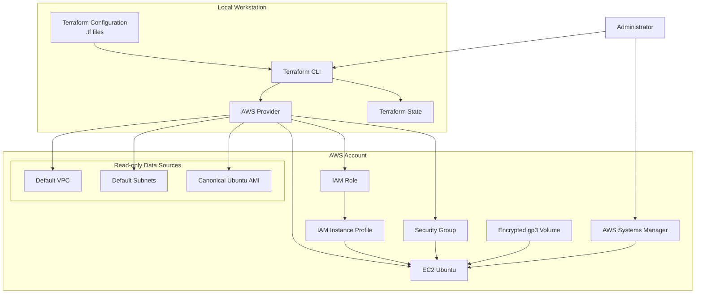

# Lab 01 — EC2 and SSM with Terraform

> Terraform implementation of the manual **Lab 01 — EC2 and SSM** from the AWS Cloud Engineering Lab repository.

---

## Overview

In the manual version of Lab 01, the infrastructure is created step by step using the AWS Management Console.

In this laboratory, the same architecture will be reproduced using **Terraform**, allowing the infrastructure to be provisioned, validated and destroyed through Infrastructure as Code (IaC).

Instead of simply executing ready-made Terraform files, this tutorial explains how each file is designed, why it exists, and how all Terraform components work together.

By the end of this lab you will understand not only **how to provision infrastructure with Terraform**, but also **how Terraform models AWS resources**, tracks infrastructure state and enables repeatable deployments.

---

## Target Audience

This laboratory is intended for:

- Students learning AWS and Infrastructure as Code.
- Beginners starting their DevOps or Cloud Engineering journey.
- Recruiters evaluating practical cloud engineering projects.
- Technical leaders reviewing Terraform organization, engineering decisions and documentation quality.

---

## Learning Objectives

After completing this laboratory, you will be able to:

- Understand the structure of a Terraform project.
- Organize Terraform configurations following good engineering practices.
- Provision AWS infrastructure using Infrastructure as Code.
- Compare manual provisioning with automated provisioning.
- Validate deployed resources.
- Destroy infrastructure safely.
- Understand the relationship between Terraform configuration, Terraform State and AWS resources.

---

## Relationship with the Manual Laboratory

This Terraform implementation reproduces the architecture created manually in:

➡️ **labs/01-ec2-and-ssm**

The manual implementation remains unchanged.

Terraform creates a second infrastructure using distinct resource names, making it possible to compare both implementations side by side before removing only the Terraform-managed resources.

---


## Laboratory Roadmap

This laboratory is divided into four stages.

### Stage 1 — Build the Terraform project

Create the project structure and understand the purpose of every Terraform file.

### Stage 2 — Provision infrastructure

Deploy an EC2 instance using Terraform.

### Stage 3 — Validate the infrastructure

Inspect the deployed resources using Terraform, AWS CLI and the AWS Console.

### Stage 4 — Destroy the infrastructure

Review a destroy plan and safely remove only the Terraform-managed resources.


---


## Before We Start

Terraform does not interact directly with your source code.

Instead, it compares:

- your Terraform configuration;
- its current state;
- the actual infrastructure running in AWS.

Whenever differences are detected, Terraform generates an execution plan describing which resources should be created, updated or destroyed.

Understanding this workflow is far more important than memorizing Terraform syntax.


---

## Architecture




This diagram adds three important concepts:

1. **Terraform Configuration** (the `.tf` files).
2. **Terraform State**, showing that it is part of the architecture.
3. **AWS Provider**, clarifying that it acts as the bridge between Terraform and AWS.

Additionally, it visually distinguishes between components that are merely queried (*Data Sources*) and those that are created (*Resources*).


---


# Stage 1 — Build the Terraform Project from Scratch

The following sections build the Terraform project incrementally.

Rather than copying a finished solution, each Terraform file will be created from scratch, explained in detail and validated before moving to the next stage.

This approach mirrors how infrastructure is developed, reviewed and maintained in professional engineering teams.


---


## Step 1 — Create the Project Directory

Before writing any Terraform code, create the directory that will contain the laboratory.

From the repository root:

```powershell
mkdir terraform\01-ec2-and-ssm
cd terraform\01-ec2-and-ssm
```


At this point, the directory should contain only:

```text
terraform/
└── 01-ec2-and-ssm/
    └── README.md
```


The remaining files will be created progressively throughout this laboratory.

> [!NOTE]
> Although the final repository already contains the completed Terraform files, this tutorial intentionally builds them from scratch so that every design decision can be understood before any infrastructure is provisioned.


---


## Step 2 — Create the first Terraform file (versions.tf)

The first file in this project will be `versions.tf`.


This file defines:

- which Terraform CLI versions can execute the configuration;
- which external providers the project requires;
- where Terraform must obtain those providers;
- which provider versions are considered compatible with the project.

Defining these requirements before creating AWS resources improves consistency and helps prevent the project from being executed with incompatible versions.

---

### Understanding Terraform Providers

Terraform itself does not contain native instructions for creating an EC2 instance, an IAM Role or a Security Group.

Instead, Terraform uses plugins called **providers** to communicate with external platforms and services.

In this laboratory, Terraform will use the AWS Provider:

```text
Terraform Configuration
        ↓
Terraform CLI
        ↓
AWS Provider
        ↓
AWS APIs
        ↓
AWS Resources
```

The AWS Provider translates the infrastructure declared in the `.tf` files into API requests understood by AWS.

> [!IMPORTANT]
> Declaring the AWS Provider as a project dependency is different from configuring it.
>
> In `versions.tf`, we declare which provider the project requires.
>
> In the next file, `provider.tf`, we will configure details such as the AWS Region and local AWS CLI profile.

---

### Create `versions.tf`

From the laboratory directory, create the file using PowerShell:

```powershell
New-Item versions.tf -ItemType File
```


Alternatively, create the file directly through the VS Code Explorer:

1. Right-click the `01-ec2-and-ssm` directory.
2. Select **New File**.
3. Enter:

```text
versions.tf
```


At this point, the project structure should be:

```text
terraform/
└── 01-ec2-and-ssm/
    ├── README.md
    └── versions.tf
```

---

### Add the Terraform Version Requirements

Open `versions.tf` and add:

```hcl
terraform {
  required_version = ">= 1.10.0, < 2.0.0"

  required_providers {
    aws = {
      source  = "hashicorp/aws"
      version = "~> 6.0"
    }
  }
}
```

Save the file.


---

### Understanding the `terraform` Block

The top-level `terraform` block configures the behavior and requirements of the Terraform project.

```hcl
terraform {
  # Terraform settings are declared here.
}
```

It does not create infrastructure in AWS.

Instead, it defines requirements that Terraform must evaluate before processing the resources declared in the remaining files.

Only constant values can be used inside this block. It cannot depend on resources, variables or values that Terraform would calculate later.

---

### Understanding `required_version`

The following line defines which versions of the Terraform CLI are allowed to execute this configuration:

```hcl
required_version = ">= 1.10.0, < 2.0.0"
```

It contains two constraints:

```text
>= 1.10.0
```

The installed Terraform CLI must be version `1.10.0` or newer.

```text
< 2.0.0
```

The installed version must remain below Terraform `2.0.0`.

Together, these constraints mean:

```text
Terraform 1.10.0 or newer
        AND
Terraform earlier than 2.0.0
```

Examples:

| Installed version | Accepted? | Reason |
|---|---:|---|
| `1.9.8` | No | Earlier than `1.10.0` |
| `1.10.0` | Yes | Meets both constraints |
| `1.12.3` | Yes | Within the accepted range |
| `2.0.0` | No | Excluded by `< 2.0.0` |

> [!NOTE]
> `required_version` applies to the Terraform CLI installed on the workstation. It does not define the version of the AWS Provider.

When an incompatible Terraform CLI version is used, Terraform stops before planning or modifying the infrastructure.

---

### Understanding `required_providers`

The `required_providers` block declares the external plugins required by the project:

```hcl
required_providers {
  aws = {
    source  = "hashicorp/aws"
    version = "~> 6.0"
  }
}
```

This project currently requires only one provider:

```text
aws
```

The name `aws` becomes the provider's local identifier inside this Terraform module.

Later, AWS resources will use this provider implicitly:

```hcl
resource "aws_instance" "lab01" {
  # EC2 configuration
}
```

The prefix `aws_` indicates that the resource type belongs to the AWS Provider.

---

### Understanding the Provider Source

The following declaration identifies where the provider comes from:

```hcl
source = "hashicorp/aws"
```

The address contains two parts:

```text
hashicorp / aws
    │        │
    │        └── Provider type
    │
    └── Provider namespace
```

Because no registry hostname is specified, Terraform uses the public Terraform Registry by default.

The full source address is effectively:

```text
registry.terraform.io/hashicorp/aws
```

This declaration prevents ambiguity and ensures Terraform knows which provider package must be installed.

---

### Understanding the AWS Provider Version Constraint

The following line defines the accepted AWS Provider versions:

```hcl
version = "~> 6.0"
```

The pessimistic constraint operator `~>` allows compatible updates within the same major version.

In this case:

```text
~> 6.0
```

is equivalent to:

```text
>= 6.0.0, < 7.0.0
```

Examples:

| AWS Provider version | Accepted? | Reason |
|---|---:|---|
| `5.100.0` | No | Earlier major version |
| `6.0.0` | Yes | Minimum accepted version |
| `6.8.0` | Yes | Compatible 6.x release |
| `6.99.0` | Yes | Still within the 6.x series |
| `7.0.0` | No | New major version |

Major provider releases can introduce breaking changes. Preventing an automatic upgrade to version `7.x` reduces the risk of an unexpected incompatibility.

---

### Why Not Use `latest`?

Terraform does not use a declaration such as:

```hcl
version = "latest"
```

Version constraints describe a range of acceptable versions.

During initialization, Terraform selects a provider version that satisfies the declared constraint. It then records the selected version in the dependency lock file:

```text
.terraform.lock.hcl
```

This produces an important combination:

```text
versions.tf
    ↓
Defines the acceptable version range

.terraform.lock.hcl
    ↓
Records the version actually selected
```

For example, the configuration may allow any provider in the `6.x` series, while the lock file records the exact version installed on the workstation.

The lock file should normally be committed to Git so that other contributors and automated environments can use the same selected provider version.

> [!IMPORTANT]
> The `.terraform.lock.hcl` file will be created later when `terraform init` is executed.
>
> Do not create this file manually.

---

### File Name and Terraform Loading Behavior

The name `versions.tf` is a project organization convention.

Terraform automatically reads all files ending in `.tf` from the current working directory and evaluates them together as a single module.

Therefore, Terraform does not execute files in this sequence:

```text
versions.tf
provider.tf
variables.tf
compute.tf
```

Instead, it loads their declarations together:

```text
All .tf files in the directory
              ↓
      One Terraform module
```

Splitting the configuration into multiple files improves navigation and maintenance, but it does not define an execution order.

> [!NOTE]
> The HashiCorp style guide commonly uses `terraform.tf` for the top-level `terraform` block. This laboratory uses `versions.tf`, another widely understood convention, because the file's responsibility is to centralize Terraform and provider version requirements.
>
> Consistency within the repository is more important than treating the filename as a Terraform requirement.

---

### Engineering Notes

**Purpose**

Define the compatible Terraform CLI versions and declare the AWS Provider dependency.

**Why this file exists**

Without explicit version requirements, different contributors could execute the same project using incompatible Terraform or provider versions.

Version constraints make compatibility expectations visible in the source code.

**Design decision**

This laboratory accepts:

```text
Terraform CLI >= 1.10.0 and < 2.0.0
AWS Provider >= 6.0.0 and < 7.0.0
```

The constraints allow compatible improvements while preventing automatic adoption of a new major release.

**Production considerations**

Production environments may use stricter constraints, automated dependency update tools and validation pipelines before adopting new Terraform or provider versions.

For example:

```hcl
version = "~> 6.3.0"
```

would allow updates in the `6.3.x` series but reject `6.4.0`.

An exact constraint such as:

```hcl
version = "= 6.3.0"
```

would accept only one provider version.

The appropriate strategy depends on the team's testing, upgrade and release processes.

---

### Verify the File

Confirm that `versions.tf` contains:

```hcl
terraform {
  required_version = ">= 1.10.0, < 2.0.0"

  required_providers {
    aws = {
      source  = "hashicorp/aws"
      version = "~> 6.0"
    }
  }
}
```

You can also display the file from PowerShell:

```powershell
Get-Content versions.tf
```

The expected output is:

```text
terraform {
  required_version = ">= 1.10.0, < 2.0.0"

  required_providers {
    aws = {
      source  = "hashicorp/aws"
      version = "~> 6.0"
    }
  }
}
```


At this stage:

- no AWS resource has been created;
- no provider has been downloaded;
- no Terraform State exists;
- no AWS credentials have been added to the project;
- `terraform init` has not been executed.

The project only declares its compatibility requirements and first external dependency.

> [!WARNING]
> Do not run `terraform init` yet.
>
> We will first create the remaining foundational files and then initialize the complete project in a controlled step.


---

### Why we haven't run `terraform fmt` yet

Although `terraform fmt` doesn't create resources, we’ll save its initial use for after a few files have been created. This way, we can demonstrate a real difference between:

```text
manually written code
    ↓
terraform fmt
    ↓
canonical formatting
```

We also haven't used `terraform validate` yet, because full validation typically depends on initializing the directory and installing the declared providers. Official documentation confirms that `required_version` controls the allowed CLI version, while `required_providers` declares the source and version range for plugins; `terraform init` will install the compatible version and update the dependency file.

With this Step 2, you already learn four fundamentals before creating any resources:

```text
Terraform CLI
Provider
Version constraint
Dependency lock file
```


