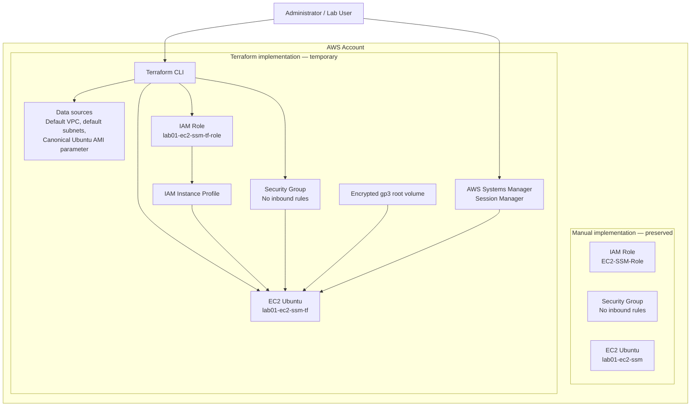

# Lab 01 — EC2 and SSM with Terraform

> Terraform implementation of the manual [Lab 01 — EC2 Instance with SSM Access](../../labs/01-ec2-and-ssm/).

## Overview

This laboratory reproduces the infrastructure created manually in Lab 01 by using Terraform and the AWS provider.

The manual infrastructure is preserved. Terraform creates a second, clearly identified copy with the `-tf` suffix. After validation, the Terraform-managed copy is removed through a reviewed and automated destroy workflow.

The lab demonstrates the complete Infrastructure as Code lifecycle:

```text
Write
  ↓
Format
  ↓
Initialize
  ↓
Validate
  ↓
Plan
  ↓
Apply
  ↓
Verify
  ↓
Destroy plan
  ↓
Destroy
  ↓
Post-destroy verification
```

---

## Intended audience

This tutorial is written for:

- beginners learning DevOps and Infrastructure as Code;
- recruiters reviewing practical cloud-engineering skills;
- technical leaders evaluating structure, security decisions, repeatability, and cleanup discipline.

---

## Learning objectives

After completing this lab, you will be able to:

- translate a manually created AWS architecture into Terraform;
- configure an AWS provider without hardcoding credentials;
- query existing AWS infrastructure with data sources;
- create an IAM role and instance profile for EC2;
- attach `AmazonSSMManagedInstanceCore`;
- launch an Ubuntu EC2 instance without an SSH key pair;
- create a security group with no inbound rules;
- require IMDSv2;
- encrypt the root EBS volume;
- inspect Terraform state and outputs;
- create and review saved execution plans;
- destroy only the Terraform-managed copy;
- verify that the manual infrastructure remains untouched.

---

## Architecture



The default VPC and default subnets are queried as data sources. Terraform does not create or own them in this laboratory.

---

## Manual and Terraform resource names

| Component | Manual implementation | Terraform implementation |
|---|---|---|
| EC2 instance | `lab01-ec2-ssm` | `lab01-ec2-ssm-tf` |
| IAM role | `EC2-SSM-Role` | `lab01-ec2-ssm-tf-role` |
| Instance profile | Manual Lab 01 profile | `lab01-ec2-ssm-tf-instance-profile` |
| Security group | `lab01-ssm-sg` | `lab01-ec2-ssm-tf-sg` |
| Root EBS tag | Manual instance volume | `lab01-ec2-ssm-tf-root` |
| Provisioning method | AWS Console | Terraform |

Distinct names and tags make the ownership boundary easy to inspect before applying or destroying infrastructure.

---

## Resources managed by Terraform

Terraform creates and manages:

- one IAM role trusted by EC2;
- one attachment of `AmazonSSMManagedInstanceCore`;
- one IAM instance profile;
- one security group;
- one outbound security-group rule;
- one EC2 instance;
- one encrypted root EBS volume as part of the instance.

Terraform only reads:

- the current AWS account identity;
- the default VPC;
- the default subnets;
- Canonical's public SSM parameter for the Ubuntu AMI.

---

## Security decisions

This lab intentionally applies the following controls:

| Control | Implementation |
|---|---|
| No static AWS credentials in code | Standard AWS credential chain |
| No SSH key pair | No `key_name` argument |
| No inbound SSH | Security group contains no ingress rule |
| Temporary EC2 credentials | IAM role and instance profile |
| Systems Manager permissions | `AmazonSSMManagedInstanceCore` |
| Root-volume encryption | `encrypted = true` |
| Instance Metadata Service | IMDSv2 tokens required |
| Resource ownership | `ManagedBy = Terraform` tag |
| AMI selection | Dynamic SSM Parameter Store lookup |
| Cleanup | Reviewed destroy plan |

> [!NOTE]
> The public IPv4 address and default VPC reproduce the original learning architecture. A production-oriented evolution should use purpose-built networking, private subnets, restricted egress, VPC endpoints for Systems Manager, centralized logging, and a remote state backend with locking and access controls.

---

## Repository files

```text
terraform/01-ec2-and-ssm/
├── images/
├── .gitignore
├── README.md
├── compute.tf
├── data.tf
├── iam.tf
├── locals.tf
├── network.tf
├── outputs.tf
├── provider.tf
├── terraform.tfvars.example
├── variables.tf
└── versions.tf
```

| File | Responsibility |
|---|---|
| `versions.tf` | Terraform and provider constraints |
| `provider.tf` | AWS provider and default tags |
| `variables.tf` | Configurable inputs and validation |
| `locals.tf` | Naming convention, AMI parameter path, and shared tags |
| `data.tf` | Queries existing AWS information |
| `iam.tf` | IAM trust policy, role, policy attachment, and profile |
| `network.tf` | Security group and outbound rule |
| `compute.tf` | EC2 instance, EBS configuration, and IMDSv2 |
| `outputs.tf` | IDs, addresses, and validation commands |
| `terraform.tfvars.example` | Safe configuration example |
| `.gitignore` | Prevents state, plans, and local values from being committed |

---

# Step-by-step tutorial

## Step 1 — Prerequisites

Install and configure:

- Terraform CLI;
- AWS CLI;
- Session Manager plugin for AWS CLI if command-line sessions will be used;
- Git;
- Visual Studio Code with the HashiCorp Terraform extension;
- an AWS identity with the permissions required to create the lab resources.

Check the tools:

```powershell
terraform version
aws --version
git --version
```

Check the AWS identity before provisioning:

```powershell
aws sts get-caller-identity
```

Confirm the selected Region:

```powershell
aws configure get region
```

> [!CAUTION]
> Do not place AWS access keys in `.tf` files, `terraform.tfvars`, source code, screenshots, or commits.

---

## Step 2 — Open the laboratory directory

From the repository root:

```powershell
cd terraform\01-ec2-and-ssm
```

Confirm the location:

```powershell
Get-Location
Get-ChildItem
```

---

## Step 3 — Review the configuration

Before running Terraform, review:

```powershell
code versions.tf
code provider.tf
code variables.tf
code locals.tf
code data.tf
code iam.tf
code network.tf
code compute.tf
code outputs.tf
```

Important observations:

1. The AWS provider does not contain access keys.
2. The AMI ID is not hardcoded.
3. The security group has no ingress rule.
4. The instance has no `key_name`.
5. The EBS root volume is encrypted.
6. IMDSv2 tokens are required.
7. Terraform names use the `lab01-ec2-ssm-tf` prefix.

---

## Step 4 — Optional local variables file

Copy the example:

```powershell
Copy-Item terraform.tfvars.example terraform.tfvars
```

The local `terraform.tfvars` file is ignored by Git.

Example:

```hcl
aws_region          = "us-east-1"
aws_profile         = null
instance_type       = "t2.micro"
ubuntu_release      = "26.04"
root_volume_size    = 8
associate_public_ip = true
```

Use `aws_profile = null` to rely on the standard AWS credential chain. Set a profile name only when your local environment requires one.

---

## Step 5 — Format the configuration

```powershell
terraform fmt -recursive
```

Check formatting without modifying files:

```powershell
terraform fmt -check -recursive
```

Expected result: no files listed after the check.

---

## Step 6 — Initialize Terraform

```powershell
terraform init
```

Terraform initializes the working directory and installs the required AWS provider.

Expected local artifacts:

```text
.terraform/
.terraform.lock.hcl
```

Commit `.terraform.lock.hcl` to version control. Do not commit `.terraform/`.

---

## Step 7 — Validate the configuration

```powershell
terraform validate
```

Expected result:

```text
Success! The configuration is valid.
```

Validation checks the internal consistency of the configuration, but it does not prove that the AWS identity has permission to create every resource.

---

## Step 8 — Preview the infrastructure

Create a saved plan:

```powershell
terraform plan -out=tfplan
```

Review it:

```powershell
terraform show tfplan
```

The summary should indicate resources to add and no resources to destroy:

```text
Plan: 6 to add, 0 to change, 0 to destroy.
```

The exact count can vary with provider implementation details, but the plan must contain only the Terraform-prefixed resources.

Confirm that the plan does not contain the manual resource names:

```text
lab01-ec2-ssm
EC2-SSM-Role
lab01-ssm-sg
```

The Terraform resources must use names such as:

```text
lab01-ec2-ssm-tf
lab01-ec2-ssm-tf-role
lab01-ec2-ssm-tf-instance-profile
lab01-ec2-ssm-tf-sg
```

---

## Step 9 — Apply the reviewed plan

```powershell
terraform apply tfplan
```

Expected result:

```text
Apply complete! Resources: 6 added, 0 changed, 0 destroyed.
```

Use the saved plan instead of running `terraform apply` without a plan because the saved plan applies the exact actions that were reviewed.

---

## Step 10 — Inspect outputs and state

Display outputs:

```powershell
terraform output
```

Display the managed resources:

```powershell
terraform state list
```

Expected resources include:

```text
aws_iam_instance_profile.ec2_ssm
aws_iam_role.ec2_ssm
aws_iam_role_policy_attachment.ssm_core
aws_instance.lab01
aws_security_group.ec2_ssm
aws_vpc_security_group_egress_rule.https_and_updates
```

The manual EC2 instance, manual role, and manual security group must not appear in this state.

Store the Terraform instance ID:

```powershell
$InstanceId = terraform output -raw instance_id
```

---

## Step 11 — Validate the EC2 instance

Check the instance:

```powershell
aws ec2 describe-instances `
  --region us-east-1 `
  --instance-ids $InstanceId `
  --query "Reservations[0].Instances[0].{Name:Tags[?Key=='Name']|[0].Value,State:State.Name,PrivateIp:PrivateIpAddress,PublicIp:PublicIpAddress,IamProfile:IamInstanceProfile.Arn}" `
  --output table
```

Wait for the EC2 status checks:

```powershell
aws ec2 wait instance-status-ok `
  --region us-east-1 `
  --instance-ids $InstanceId
```

Confirm there are no inbound security-group permissions:

```powershell
$SecurityGroupId = terraform output -raw security_group_id

aws ec2 describe-security-groups `
  --region us-east-1 `
  --group-ids $SecurityGroupId `
  --query "SecurityGroups[0].IpPermissions"
```

Expected output:

```json
[]
```

---

## Step 12 — Validate Systems Manager registration

Systems Manager registration can take a few minutes.

```powershell
aws ssm describe-instance-information `
  --region us-east-1 `
  --filters "Key=InstanceIds,Values=$InstanceId" `
  --query "InstanceInformationList[0].{InstanceId:InstanceId,PingStatus:PingStatus,Platform:PlatformName,AgentVersion:AgentVersion}" `
  --output table
```

Expected status:

```text
PingStatus = Online
```

An online status confirms that:

- the EC2 instance is running;
- the SSM Agent is operational;
- the IAM role is attached;
- the managed policy provides the required permissions;
- the node has outbound connectivity to Systems Manager endpoints.

---

## Step 13 — Connect through Session Manager

Using the AWS CLI:

```powershell
aws ssm start-session `
  --target $InstanceId `
  --region us-east-1
```

Alternatively, print the generated command:

```powershell
terraform output -raw session_manager_command
```

Inside the instance, run:

```bash
whoami
hostname
uname -a
cat /etc/os-release
df -h
free -m
uptime
```

No SSH key pair and no inbound port 22 are required.

---

## Step 14 — Compare the two implementations

At this point, the AWS account should contain:

```text
Manual infrastructure — preserved
└── lab01-ec2-ssm

Terraform infrastructure — temporary
└── lab01-ec2-ssm-tf
```

Compare:

- names;
- tags;
- IAM roles;
- security-group ingress rules;
- instance profiles;
- AMIs;
- EBS encryption;
- metadata options;
- Systems Manager registration.

This comparison demonstrates that the same architectural objective can be achieved manually and declaratively.

---

# Automated cleanup

## Step 15 — Create a destroy plan

Never destroy the lab without reviewing the intended changes.

```powershell
terraform plan -destroy -out=destroy.tfplan
```

Review the destroy plan:

```powershell
terraform show destroy.tfplan
```

Expected summary:

```text
Plan: 0 to add, 0 to change, 6 to destroy.
```

Confirm that every resource belongs to the Terraform copy.

---

## Step 16 — Verify the current state before destruction

```powershell
terraform state list
```

The state must not contain the manual resource names.

Check the current workspace:

```powershell
terraform workspace show
```

Expected value:

```text
default
```

---

## Step 17 — Destroy the Terraform-managed copy

Apply the reviewed destroy plan:

```powershell
terraform apply destroy.tfplan
```

Expected result:

```text
Destroy complete! Resources: 6 destroyed.
```

The equivalent interactive command is:

```powershell
terraform destroy
```

The saved destroy-plan workflow is used here because it makes review explicit.

---

## Step 18 — Post-destroy verification

Terraform state should contain no managed resources:

```powershell
terraform state list
```

Confirm the Terraform EC2 instance is no longer active:

```powershell
aws ec2 describe-instances `
  --region us-east-1 `
  --filters `
    "Name=tag:Name,Values=lab01-ec2-ssm-tf" `
    "Name=instance-state-name,Values=pending,running,stopping,stopped" `
  --query "Reservations[].Instances[].{InstanceId:InstanceId,State:State.Name}" `
  --output table
```

Confirm the Terraform security group is gone:

```powershell
aws ec2 describe-security-groups `
  --region us-east-1 `
  --filters "Name=group-name,Values=lab01-ec2-ssm-tf-sg"
```

Confirm the Terraform IAM role is gone:

```powershell
aws iam get-role `
  --role-name lab01-ec2-ssm-tf-role
```

An IAM `NoSuchEntity` response is expected after successful destruction.

Finally, confirm that the manual instance still exists:

```powershell
aws ec2 describe-instances `
  --region us-east-1 `
  --filters `
    "Name=tag:Name,Values=lab01-ec2-ssm" `
    "Name=instance-state-name,Values=pending,running,stopping,stopped" `
  --query "Reservations[].Instances[].{Name:Tags[?Key=='Name']|[0].Value,InstanceId:InstanceId,State:State.Name}" `
  --output table
```

Expected final state:

```text
Manual implementation: preserved
Terraform implementation: destroyed
Terraform state: empty
```

---

## Cost considerations

This lab can generate charges for:

- EC2 runtime;
- EBS storage;
- public IPv4 usage, depending on current AWS pricing and account conditions;
- data transfer.

Run the destroy workflow immediately after collecting the required evidence.

Stopping an EC2 instance can stop compute charges, but attached EBS volumes and other billable resources can continue generating costs. `terraform destroy` is the intended cleanup method for the temporary Terraform copy.

---

## Troubleshooting

### Error: default VPC not found

The selected Region does not have a default VPC.

Options:

1. choose a Region with a default VPC;
2. recreate the default VPC through AWS tooling;
3. evolve the lab to create a dedicated VPC in Terraform.

### Error: SSM AMI parameter not found

Confirm the selected Ubuntu release and Region. Temporarily set:

```hcl
ubuntu_release = "24.04"
```

Then run:

```powershell
terraform plan
```

### Managed node does not become Online

Check:

- EC2 instance state;
- IAM instance profile;
- `AmazonSSMManagedInstanceCore` attachment;
- SSM Agent status;
- outbound HTTPS connectivity;
- selected Region;
- Systems Manager endpoint access.

### Error creating the IAM role

A resource with the same Terraform role name may already exist from an earlier incomplete run.

Check:

```powershell
aws iam get-role --role-name lab01-ec2-ssm-tf-role
terraform state list
```

Do not manually delete or import anything until the difference between AWS and Terraform state is understood.

### Saved plan is stale

A saved plan can become invalid if the configuration, state, provider selections, or infrastructure changes.

Create a new plan:

```powershell
Remove-Item tfplan -ErrorAction SilentlyContinue
terraform plan -out=tfplan
```

---

## Evidence recommended for the repository

Capture screenshots or command outputs for:

1. `terraform version`;
2. successful `terraform init`;
3. successful `terraform validate`;
4. reviewed `terraform plan`;
5. successful `terraform apply`;
6. Terraform outputs;
7. two parallel EC2 instances;
8. Terraform security group with zero inbound rules;
9. Terraform IAM role and managed policy;
10. managed node with `PingStatus = Online`;
11. Session Manager shell;
12. reviewed destroy plan;
13. successful destruction;
14. empty Terraform state;
15. manual EC2 instance preserved.

Do not expose:

- AWS account IDs without masking;
- access keys;
- session tokens;
- personal data;
- sensitive ARNs when unnecessary;
- public IP addresses when they are not required for the explanation.

---

## Engineering decisions and trade-offs

### Why use the default VPC?

The manual lab uses the default VPC and a default subnet. This implementation preserves that behavior to make the comparison direct.

A future VPC lab should replace this dependency with a purpose-built network.

### Why use a public IPv4 address?

The public address provides outbound internet connectivity through the default VPC architecture and helps the instance reach AWS endpoints and package repositories.

A hardened design should place the instance in a private subnet and use Systems Manager VPC endpoints.

### Why no Terraform module?

This is the first Terraform laboratory. Explicit resources make the dependency graph easier for beginners to understand.

Reusable modules should be introduced only after repetition creates a clear abstraction opportunity.

### Why local state?

Local state keeps the first laboratory understandable and avoids introducing an S3 state backend, state locking, and access-control design before the learner understands the core workflow.

A later lab should migrate state to a secured remote backend.

### Why preserve the manual infrastructure?

Keeping both implementations temporarily allows visual and technical comparison. Unique names, tags, and separate state prevent the Terraform cleanup from targeting the manual resources.

---

## Skills demonstrated

This lab provides evidence of practical experience with:

- Terraform configuration language;
- provider version constraints;
- AWS provider authentication;
- data sources;
- dependency management;
- Terraform state;
- saved execution plans;
- EC2;
- IAM roles and instance profiles;
- AWS managed policies;
- Systems Manager;
- Session Manager;
- security groups;
- EBS encryption;
- IMDSv2;
- tagging;
- infrastructure validation;
- automated cleanup;
- technical documentation.

---

## Lessons learned

1. Terraform state defines the ownership boundary between configuration and real infrastructure.
2. `data` blocks query infrastructure without creating it.
3. Resource names and tags are operational controls, not merely cosmetic labels.
4. A saved plan improves reviewability before creation or destruction.
5. Session Manager removes the need for inbound SSH access but still requires correct IAM, agent, and network configuration.
6. Cleanup is part of infrastructure engineering, not an optional final task.
7. A laboratory design can intentionally differ from a production architecture when the trade-off is clearly documented.

---

## Official references

- AWS Systems Manager Session Manager prerequisites  
  https://docs.aws.amazon.com/systems-manager/latest/userguide/session-manager-prerequisites.html
- AWS managed policy: `AmazonSSMManagedInstanceCore`  
  https://docs.aws.amazon.com/aws-managed-policy/latest/reference/AmazonSSMManagedInstanceCore.html
- Amazon EC2 Instance Metadata Service  
  https://docs.aws.amazon.com/AWSEC2/latest/UserGuide/configuring-instance-metadata-service.html
- Terraform language style guide  
  https://developer.hashicorp.com/terraform/language/style
- Terraform dependency lock file  
  https://developer.hashicorp.com/terraform/language/files/dependency-lock
- Terraform state  
  https://developer.hashicorp.com/terraform/language/state
- Terraform plan command  
  https://developer.hashicorp.com/terraform/cli/commands/plan
- Terraform apply command  
  https://developer.hashicorp.com/terraform/cli/commands/apply
- Terraform destroy command  
  https://developer.hashicorp.com/terraform/cli/commands/destroy

