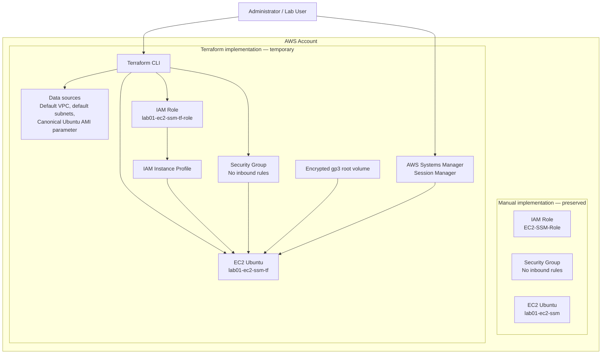

# Lab 01 — EC2 and SSM with Terraform

> Terraform implementation of the manual **Lab 01 — EC2 and SSM** from the AWS Cloud Engineering Lab repository.

---

## Overview

In the manual version of Lab 01, the infrastructure is created step by step using the AWS Management Console.

In this laboratory, the same architecture will be reproduced using **Terraform**, allowing the infrastructure to be provisioned, validated and destroyed through Infrastructure as Code (IaC).

Instead of simply executing ready-made Terraform files, this tutorial explains how each file is designed, why it exists, and how all Terraform components work together.

By the end of this lab you will understand not only **how to provision infrastructure with Terraform**, but also **how Terraform models AWS resources**, tracks infrastructure state and enables repeatable deployments.

---

## Target Audience

This laboratory is intended for:

- Students learning AWS and Infrastructure as Code.
- Beginners starting their DevOps or Cloud Engineering journey.
- Recruiters evaluating practical cloud engineering projects.
- Technical leaders reviewing Terraform organization, engineering decisions and documentation quality.

---

## Learning Objectives

After completing this laboratory, you will be able to:

- Understand the structure of a Terraform project.
- Organize Terraform configurations following good engineering practices.
- Provision AWS infrastructure using Infrastructure as Code.
- Compare manual provisioning with automated provisioning.
- Validate deployed resources.
- Destroy infrastructure safely.
- Understand the relationship between Terraform configuration, Terraform State and AWS resources.

---

## Relationship with the Manual Laboratory

This Terraform implementation reproduces the architecture created manually in:

➡️ **labs/01-ec2-and-ssm**

The manual implementation remains unchanged.

Terraform creates a second infrastructure using distinct resource names, making it possible to compare both implementations side by side before removing only the Terraform-managed resources.

---

## Laboratory Roadmap

This laboratory is divided into four stages.

### Stage 1 — Build the Terraform project

Create the project structure and understand the purpose of every Terraform file.

### Stage 2 — Provision infrastructure

Deploy an EC2 instance using Terraform.

### Stage 3 — Validate the infrastructure

Inspect the deployed resources using Terraform, AWS CLI and the AWS Console.

### Stage 4 — Destroy the infrastructure

Review a destroy plan and safely remove only the Terraform-managed resources.

---

## Before We Start

Terraform does not interact directly with your source code.

Instead, it compares:

- your Terraform configuration;
- its current state;
- the actual infrastructure running in AWS.

Whenever differences are detected, Terraform generates an execution plan describing which resources should be created, updated or destroyed.

Understanding this workflow is far more important than memorizing Terraform syntax.

---

## Architecture

